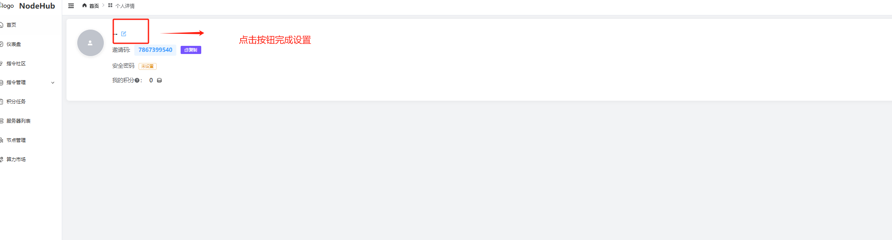

# NodeHub Creator Command Guide

#### About NodeHub

NodeHub is a decentralized computing platform dedicated to building a globally collaborative ecosystem for node instruction creation. By publishing and sharing high-quality deployment and maintenance scripts, you can become a contributor to the Web3 infrastructure and gain platform rewards and exposure.

***

#### 1. Who Can Become a NodeHub Creator?

We welcome technical enthusiasts and experienced developers to join the NodeHub community and contribute to the development of decentralized technology:

* **Node Operators**: Experienced in deploying nodes, familiar with runtime logic, and skilled in summarizing and optimizing deployment processes.
* **Script Experts**: Skilled in writing command-line instructions, deployment scripts, and automation workflows to enhance efficiency and reliability.
* **Automation Tool Developers**: With DevOps experience, capable of building scripts for deployment and operation.
* **Web3 Engineers**: Experienced in multi-chain node deployments and knowledgeable about various chains' deployment features, able to optimize documentation and scripts.

***

#### 2. What Can NodeHub Creators Do?

As a creator, you will contribute practical content to support the global Web3 node ecosystem:

* Publish node deployment scripts (including installation, initialization, and startup)
* Write auxiliary operation commands (e.g., health checks, status queries, log reviews)
* Maintain and optimize existing instructions (add functionality, improve configurability, refactor variables)

***

#### 3. Platform Support & Incentive Mechanism

NodeHub provides creators with the following resources and benefits:

* **Revenue Sharing**: Earnings based on script invocation volume, enabling passive income.
* **Official Exposure**: Quality scripts will be promoted on the homepage.
* **Creator Channel**: Access to exclusive creator groups, early information, and collaboration opportunities.
* **Airdrop Priority**: Active creators will be prioritized for NodeHub incentive airdrops.
* **Script Protection**: Scripts are private by default, accessible only via platform commands to prevent unauthorized copying.

***

#### 4. Script Submission Requirements

**General Guidelines**

* **Language**: Use Bash/Shell or the designated language (Bash recommended).
* **Clarity**: Clear functionality and well-structured logic with no redundant code.
* **Documentation**: Comment on key logic; use clear and readable variable names.
* **Configurability**: Allow customization via parameters or configuration files.
* **Compliance**: Do not include sensitive content; include project source and purpose.

**Command Type Standards**

**Custom Commands (Non-persistent Tasks)**

* Use Case: One-time tasks like key generation or registration
* Requirements: No uninstall/status/health check scripts needed
* Must Include: Project name, type, and purpose ✅ Example: Generate a pubkey to register with the official platform

**Persistent Services (e.g., Nodes)**

* Use Case: Long-running services like blockchain nodes
* Must Include:
  * Uninstall script
  * Status check script
  * Health check script (based on project-specific standards)
  * Log viewer script ✅ Example: Deploying a blockchain node

***

#### 5. Recommended Script Modules

Include the following to enhance completeness and usability:

* Script introduction (function & use case)
* Environment dependencies (OS version, required components)
* Installation and configuration commands
* Startup and initialization operations
* Status/log/error troubleshooting commands
* Stop/restart/uninstall commands
* Variable explanations and configurable items
* Usage tips or common issues

***

#### 6. How to Become a NodeHub Creator?

Whether you're a seasoned pro or new to scripting, NodeHub offers a clear creator journey:

**Step 1: Submit Your Creator Application**

* Register an account on NodeHub
* Click on your profile and complete the application form
* Provide your technical background and scripting experience
* Link a valid GitHub account

**Step 2: Enter the 7-Day Trial Period**

* After approval, enter a 7-day observation phase
  * This is a mutual exploration period for you and the platform
  * You can upload scripts and explore features, but incentives are not yet enabled

**Step 3: Choose a Creator Mode**

**Certified Creator (Recommended):**

* Ideal for building personal brand and receiving platform rewards
* Requires KYC verification
* Scripts can be open or private
* Eligible for incentive plans and featured exposure

**Open Source Creator (Free Mode):**

* Ideal for those who prefer open collaboration and fast publishing
* No KYC required
* Scripts are open by default
* Not eligible for rewards

✅ Once You Become a NodeHub Creator

* Upload scripts and enjoy platform support
* Participate in tasks, grow your influence, and earn incentives

Illustration：

<figure><figcaption>
Sign up
</figcaption></figure>

<figure><figcaption>
Signup Details
</figcaption></figure>

<figure><figcaption>
<strong>Two Ways to Log In</strong>
</figcaption></figure>

<figure><figcaption>
<strong>Personal Information Settings</strong>
</figcaption></figure>

<figure><figcaption>
Fill in Information
</figcaption></figure>

<figure><figcaption>
Complete the Form
</figcaption></figure>

<figure><figcaption>
Fill in the Application Reason
</figcaption></figure>

<figure><figcaption>
Obtain Eligibility
</figcaption></figure>
