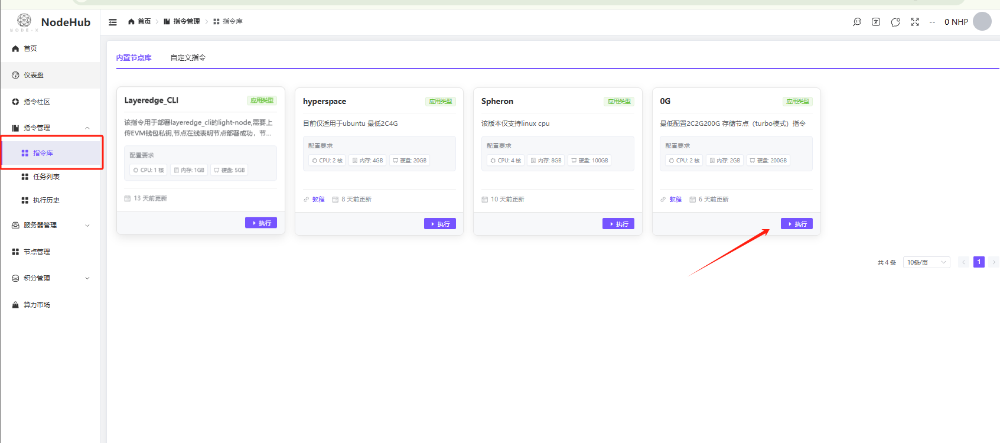
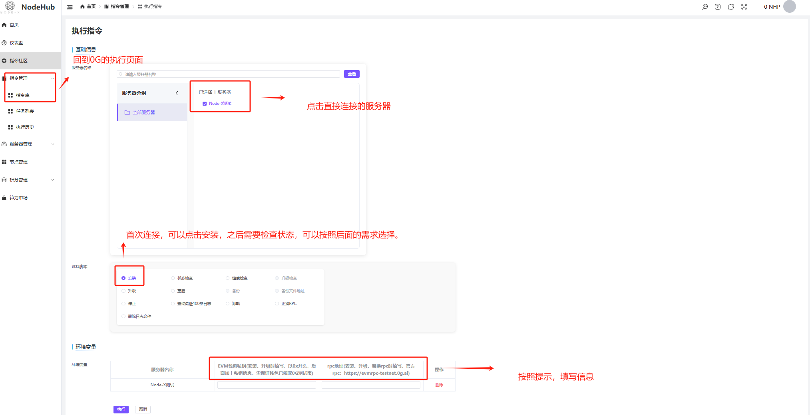
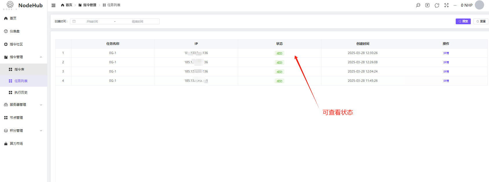
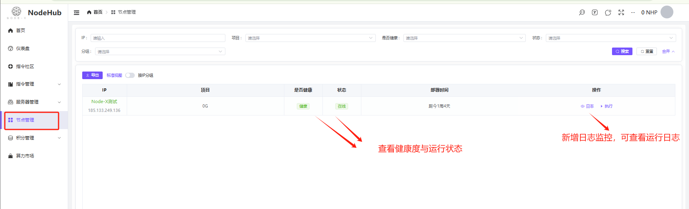

# NODEHUB Node Operation Guide

## **1.Node Operation Manual**

The following steps assume that a server has already been added.\
If not, or if you have any questions, please refer to =⇒[**User Manual**](https://docs.node-x.xyz/chan-pin-shou-ce/nodehub/cao-zuo-shou-ce)

First, navigate to **Console → Command Management → Command Library**, and click **Execute** under the node you want to deploy (using 0G as an example).

After entering the execution command page, first select the server you wish to install on, then choose **Install**. Follow the on-screen instructions to obtain the required parameters.\
You will need to enter your **wallet private key** (make sure your wallet contains tokens), as well as the **RPC**. Once all fields are filled in, click **Confirm** to start executing the command.

<figure><figcaption>
Command Execution
</figcaption></figure>

<figure><figcaption>
Command Run
</figcaption></figure>

After clicking **Execute**, you can check the execution status by going to **Command Management → Task List**. When the execution status changes to **Success**, the command has been successfully run. You can then check the node's status and health in the **Node Management** section. The status update interval is 20 seconds.

1. **If the status shows Offline and Unhealthy for a long time:**\
   **Solution:**\
   Click **Command Library**, then click the command for the project you are executing. Select the problematic server, choose **Uninstall**, and click **Execute**. After the uninstallation completes successfully, try reinstalling. If it still fails, check if the configuration is correct and review the logs in the **Task List**.
2. **If the status shows Online but Unhealthy:**\
   **Solution:**\
   It is recommended to first check if there are enough tokens in your wallet, if the RPC request limit has been reached, or if the configuration is sufficient. There are many factors that could cause this issue, so we won’t list them all. If the issue persists, you can follow the reinstallation steps as mentioned above.

If the execution fails, try executing it again. If it continues to fail, it might be that the server you installed on cannot connect to NodeHub.

<figure><figcaption>
Task List
</figcaption></figure>

<figure><figcaption>
Status Query
</figcaption></figure>

## **2.Project Dashboard Collection**

If the project has a node dashboard, we will include it here:

HYPERSPACE：[https://node.hyper.space/](https://node.hyper.space/)

0G：[https://chainscan-newton.0g.ai/](https://chainscan-newton.0g.ai/)

Layeredge：[https://dashboard.layeredge.io/](https://dashboard.layeredge.io/)

## 3. Summary

With the above features, NODEHUB can help you:

* Manage multiple servers in a unified way and group them, improving operation and maintenance efficiency.
* Quickly write and execute commands, and view execution results and historical records.
* Share commands with the community to receive feedback and engage in discussions.
* Monitor node status and overall system performance, allowing for timely optimization and maintenance.

The documentation is not yet complete and will be updated later. If you have any questions or encounter technical issues, we recommend asking in the community or contacting the NODEHUB official support team for assistance.

***

## **Thank you for using NODEHUB! Enjoy your experience! 🎉**
