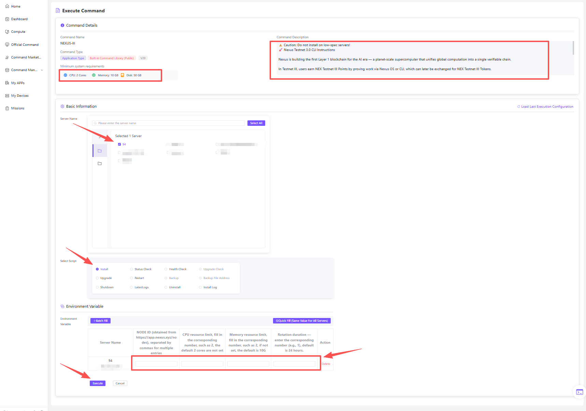

# User Manual

### **1. Overview**

This user manual will guide you through the process of logging in, registering, managing servers, editing and executing commands, managing nodes, and monitoring dashboards. It will help you quickly get started and efficiently use NODEHUB.

***

### **2. Login and Registration**

#### **2.1 Login Link**

* &#x20;login address: [https://hub.node-x.xyz/](https://hub.node-x.xyz/)

#### **2.2 Login Process**

NODEHUB supports two login methods:

* **Username & Password Login**
  * Log in using your registered username and password.
* **Email Login**
  * Log in using your registered email address and password.

#### **2.3 Registration Process**

**Registration Method:** Sign up using an email address.

**Registration Steps:**

1. Enter a valid email address and set a password.
2. After successful registration, the system will send a confirmation email to your inbox.
3. Click the link in the confirmation email to activate your account and start using NODEHUB.

> _Example page illustration_

<figure><figcaption></figcaption></figure>

&#x20;                                                   Fill in the required information

<figure><figcaption></figcaption></figure>

&#x20;                                                                    Login to NodeHub

### **3. Personal Information & Creator Page**

#### **3.1 Personal Details**

The personal profile page displays the user's basic information.\
In the updated version

1. users can upload a profile picture,
2. set a nickname,
3. add their social media links and personal bio
4. Link Telegram (Get the Latest Status of Deployed Nodes)
5. Set or Reset Security Password
6. View Points Details
7. Manage Account Balance (including Recharge, Refresh, View Balance Details, Withdraw, Withdrawal Records)
8. Apply to Become a Creator

#### **3.2 Creator Page**

Creator Page Displays Basic Information of Creators\
In the new system version, you can perform the following operations:

1. Get Invitation Code
2. Personal Information Settings (same as personal details)
3. Link Telegram to Receive Important Notifications
4. Set Security Password
5. View Points Details
6. Personal Wallet (including referral, creator earnings, etc.)
7. View Public Command Details (including execution count, server count, total income, order count, etc.)
8. View Authorization Records for Paid Commands

> Example page illustration

<figure><figcaption></figcaption></figure>

<figure><figcaption></figcaption></figure>

<figure><figcaption></figcaption></figure>

<figure><figcaption></figcaption></figure>

Click on your profile, fill in accurate and complete information, provide your reason for applying as a creator, and submit. Once approved, the process will be complete.

***

### **4. Server Management**

#### **4.1 Server List**

* The server list page displays all servers managed by the user.
* Users can view detailed information about each server, such as:
  * IP Address\
    Server Name\
    Port\
    Status (Online / Offline / Running, etc.)\
    Memory & Disk Size\
    ST (Allows you to check whether your computing power is being hijacked by the operator)

> Example page illustration

<figure><figcaption></figcaption></figure>

&#x20;                                                                      Import Server Dashboard to View

#### **4.2 Import Servers**

Users can add external servers to NODEHUB via the **"Import Server"** function.

Server sources are divided into 3 types:

* Renting servers from other service providers (usually Linux systems)
* Personal servers/PCs
* Servers rented directly through NodeHub's compute market

**1.If importing external servers, the required information includes:**

* **Server IP Address**
* **Port**
* **Username / Password**

If there are too many servers, you can choose batch import by downloading a template, filling in the info, then importing (currently not supported).

> Example page illustration

<figure><figcaption></figcaption></figure>

&#x20;                                                               Add New Server

**2.To import personal servers or PCs, you need to execute the corresponding installation commands in the terminal:**

Based on the system of the device being connected, execute the installation commands.

> Example page illustration

<figure><figcaption></figcaption></figure>

**3.Purchase NodeHub Compute Market Servers Directly**

The server will automatically connect to NodeHub for management.

#### 4.3 Webshell

After connecting to NodeHub, you can directly click WebShell to connect and operate on the device terminal without downloading additional management tools. The interface can be set as a floating window for easier testing.

> Example page illustration

<figure><figcaption></figcaption></figure>

#### **4.4 Server Grouping**

* Users can create multiple groups and categorize servers into different groups for efficient management.
* This helps in quickly locating and maintaining servers when dealing with a large number of them.

> Example page illustration

<figure><figcaption></figcaption></figure>

<figure><figcaption></figcaption></figure>

&#x20;                                                                   Group Server Management

***

### **5.** Official Commands, Community Commands, and Command Management

#### **5.1** Official Commands & Community Commands

* The official commands page displays commands released by NodeHub officially.The official commands page displays commands released by NodeHub officially.
* The community commands page shows commands shared by community creators, making it easy for users to browse and select.

In the community, you can directly comment, like, or dislike on public commands, and communicate directly with command creators.

On this page, you can:

* View command names
* Understand command purposes and brief descriptions
* Filter commands by category or keywords
* Execute commands or go to command details pages for detailed operation guides

> Example page illustration

<figure><figcaption></figcaption></figure>

<figure><figcaption></figcaption></figure>

<figure><figcaption></figcaption></figure>

&#x20;                                                                 Official Command Execution

#### **5.2** Command Management

* Users can create, edit, or modify command scripts on the NodeHub platform, flexibly adapting to different deployment needs.
* Creators can publish scripts to the community.
* Main operations:
  * **Fill in Command Name**\
    Enter a clear and concise command name for easy recognition and management.
  * **Describe Command Purpose**\
    Briefly explain the command's function for user understanding.
  * **Set Parameters**\
    Define configurable options like node ID, network type, wallet address, etc., based on the command's needs.
  * **Edit Command**\
    Edit commands, referencing examples. When editing, pressing Tab enables auto-completion to improve efficiency and accuracy.
  * **Publish Command (Creators)**\
    After editing and testing, commands can be published to the community. You can choose to hide commands or set a charge amount. Click confirm, and the command will undergo AI and manual review before being publicly available.

> Example page illustration

<figure><figcaption></figcaption></figure>

&#x20;                                                                    Custom Command Editing

***

### **6. Command Execution & Task Management**

#### **6.1 Executing Commands**

* Users can select one or multiple servers and specify a command to execute.
* Click the **"Execute"** button to start execution, and the system will provide real-time feedback on execution status.

> Example page illustration

<figure><figcaption></figcaption></figure>

&#x20;                                                         Add a New Server for Installation

#### **6.2 Execution Task List**

* Displays all ongoing tasks, including:
  * **Task Name**
  * **Start Time**
  * **Execution Status**

> Example page illustration

<figure><figcaption></figcaption></figure>

&#x20;                                             New Log Feature Added, Click to View Run Logs

#### **6.3 Execution History**

* Displays all completed tasks, including:
  * **Execution Time**
  * **Output Results**
  * **Execution Status**
* Useful for auditing or reviewing past executions.

> Example page illustration

<figure><figcaption></figcaption></figure>

***

### **7. Node Management**

* Node Management Page Displays Details of All NodesNode Management Page Displays Details of All Nodes
* View node status (online/offline) and performance metrics (CPU, memory, etc.)
* Support operations like start, stop, upgrade, or maintenance
* Filter nodes by IP, command execution, health status, online status, or group; can also group by IP
* Click logs to view specific node operation status; click execute to automatically navigate to the command execution page

> Example page illustration

<figure><figcaption></figcaption></figure>

&#x20;                                                        View the Status and Logs of Each Server

***

### **8. Dashboard**

* The dashboard provides an overview of the system's overall operational status and real-time performance metrics.
* Users can monitor key statistics such as:
  * **CPU Usage**
  * **Memory Usage**
* Enables real-time monitoring and quick adjustments.

> Example page illustration

<figure><figcaption></figcaption></figure>

&#x20;                                                    Quickly View Device Resource Utilization

***

### **9.** Compute Market

The compute market provides users with discounted compute resources and a channel to purchase such resources.

Currently connected providers include Tencent Cloud, Aliyun, and GPU resources.

#### **9.1. Ordering Process:**

* Select target server in the compute market
* Check the price
* Verify if the balance is sufficient; if not, connect wallet to recharge
* Click Buy Now to complete the purchase

> Example page illustration

<figure><figcaption></figcaption></figure>

<figure><figcaption></figcaption></figure>

<figure><figcaption></figcaption></figure>

### **10. Summary**

With NODEHUB, you can:

✅ **Manage multiple servers** in a unified platform with categorized grouping for better organization.\
✅ **Quickly write and execute commands**, with real-time feedback on execution results.\
✅ **Share commands with the community** and receive feedback from other users.\
✅ **Monitor node status and overall system performance**, ensuring timely optimizations and maintenance.

If you have any questions or encounter technical issues, feel free to ask in the community or contact the NODEHUB support team.

***

#### **Thank you for using NODEHUB! Enjoy your experience!** 🎉
