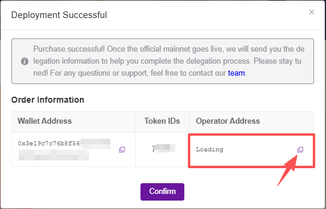

# 0G Alignment Node

<a href="https://docs.node-x.xyz/chan-pin-shou-ce/yi-jian-bu-shu/0g-alignment-node"> <strong>中文</strong></a>

## How to deploy a 0G Alignment node via the Node-X platform?

### 1.Obtain a Node-X account and deploy a node

First, you need a Node-X account. If you don’t have one, please go to [the Node-X registration page](https://node-x.xyz/) to register. After registration, follow the steps below to purchase and upload resources to deploy the node. The ordering process is as follows:

<figure><figcaption></figcaption></figure>

<figure><figcaption></figcaption></figure>

<figure><figcaption></figcaption></figure>

<figure><figcaption></figcaption></figure>

### 2.Fill in the parameters

#### Upload EVM address and NFT TOKEN IDS

* **Upload the information and make a purchase:**\
  You need to upload the EVM address (with NFT in the wallet). One NFT corresponds to one transaction, so follow the prompts to fill in the details, and then enter the TOKEN IDS of the NFTs in the corresponding wallet. If the TOKEN IDS you enter are not correct, they will be flagged.
* **Obtain the delegation address and delegate：**\
  After a successful order, a pop-up will appear with your node information, including the wallet address, TOKEN ID, and delegation address. Then, go to the official 0G website to delegate.

<figure><figcaption></figcaption></figure>

### 3.Wait for service and check the official dashboard

After a successful purchase, Node-X will deploy the 0G Alignment node for you. This process usually takes place within 24 hours. You can instantly check the node status via the following methods:

1. **Check node status:**\
   In the Node-X platform user panel, you can view all the purchased nodes and their current status.
2. **After successful deployment, you can check the node status on the official website:**\
   Go to the official website to check the node status. The node should be online as shown in the image below:\

## **Conclusion**

Deploying a 0G Alignment node via the Node-X platform is that simple! Hope this guide is helpful to you.\
If you have any questions or need further guidance, feel free to leave a message or DM me. Good luck! Let’s explore the world of blockchain together!🚀

