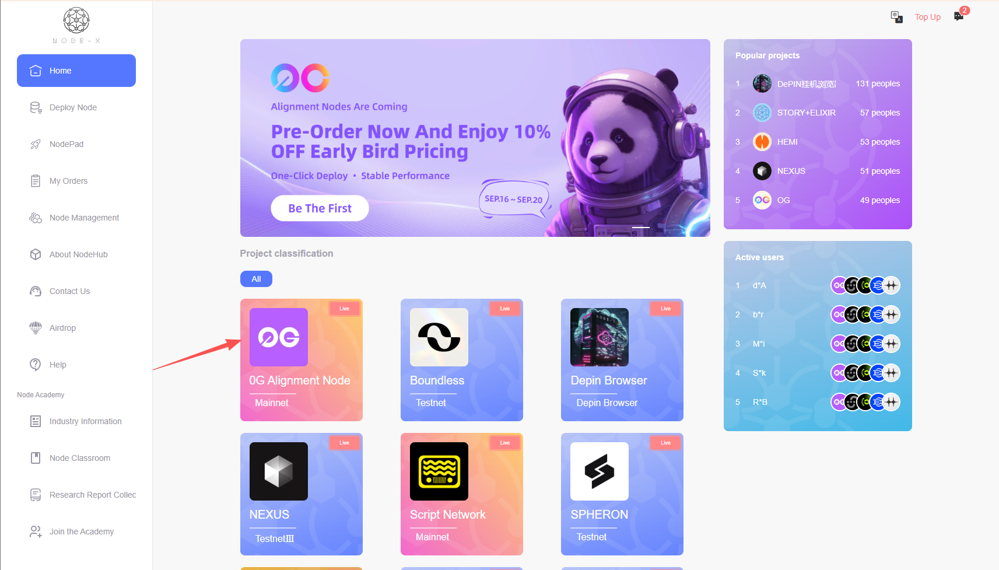
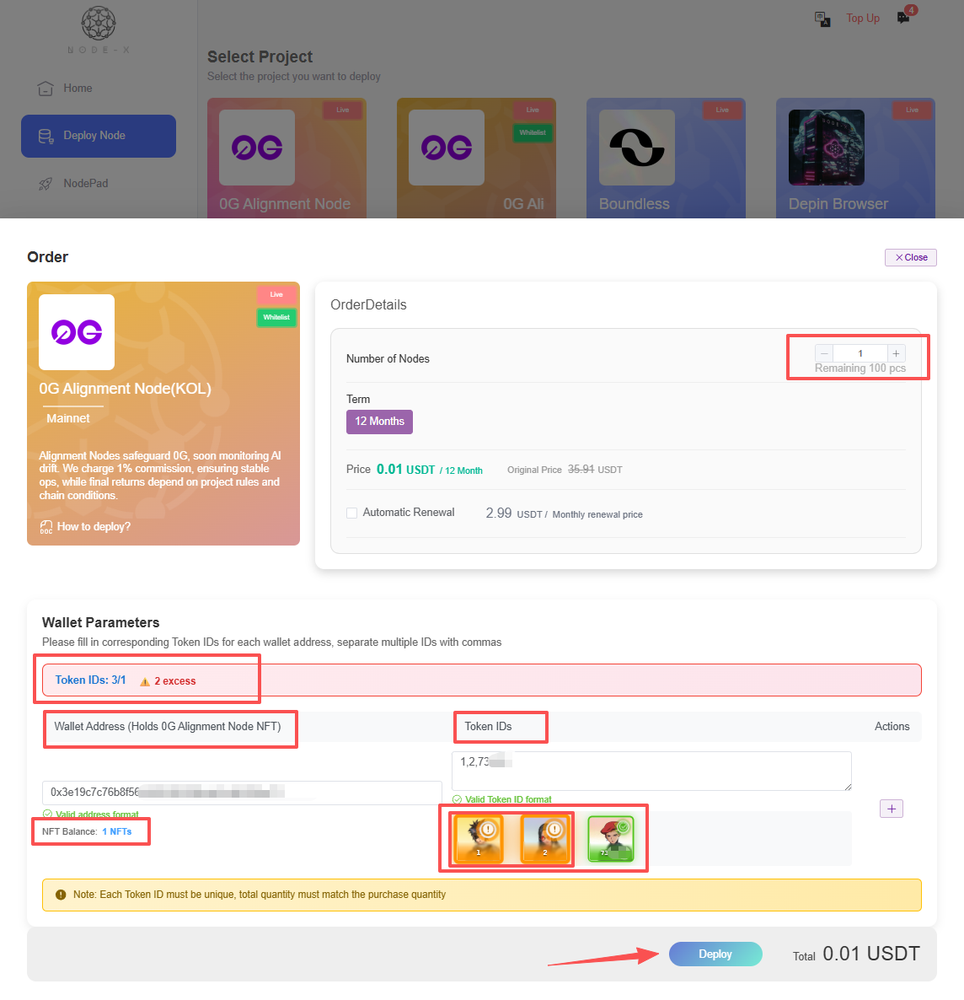
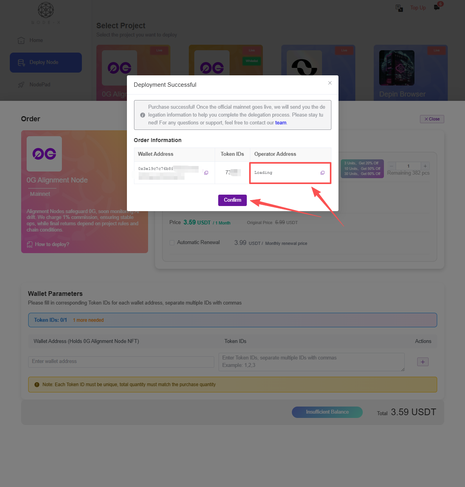
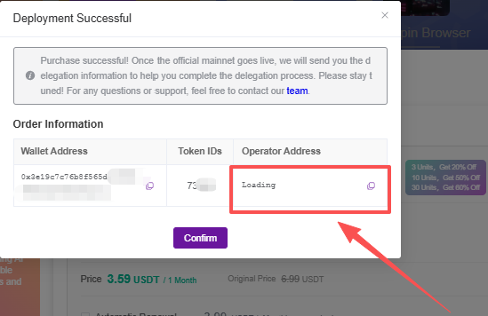

# 0G Alignment Node

## **How to deploy a 0G Alignment node through the Node-X platform?**

### 1.Obtain a Node-X account and deploy a node

First, you need a Node-X account. If you don't have one yet, please visit [the Node-X registration page](https://node-x.xyz/) to register. After successfully registering, follow the steps below to purchase and upload resources to deploy a node. Here's an example:

<figure><figcaption></figcaption></figure>

<figure><figcaption></figcaption></figure>

<figure><figcaption></figcaption></figure>

<figure><figcaption></figcaption></figure>

\

### 2.Parameter upload

#### Upload EVM address and upload NFT TOKEN IDS

* **Purchase and upload information:**\
  You need to upload the EVM address (the wallet must contain NFT). One NFT corresponds to one node. Fill in the wallet address in the front and the TOKEN ID of the NFT in the corresponding wallet in the back.
* **Get the delegate address for delegation：**\
  After the order is successfully placed, a pop-up window will appear, returning your node information, namely the corresponding wallet address, TOKEN ID, and delegation address. Then you can go to the 0G official website to make the delegation.

<figure><figcaption></figcaption></figure>

\

### 3.Waiting for service and viewing the official panel

After your purchase is complete, Node-X will deploy a 0G Alignment node for you. This process typically takes 24 hours. You can monitor the node's status in real time via:

1. **View node status:**\
   In the Node-X platform user panel, you can see all purchased nodes and their current status.
2. **After successful deployment, you can go to the official website to check the node status:**\
   Go to the official website to check the node status. The node is online normally as shown in the figure below:\

## ConclusionConclusion

Deploying a 0G Alignment node through the Node-X platform is that simple! We hope this guide was helpful.\
If you have any questions or need further guidance, please leave a comment or send me a private message. Come on! Let's explore the world of blockchain together!🚀

