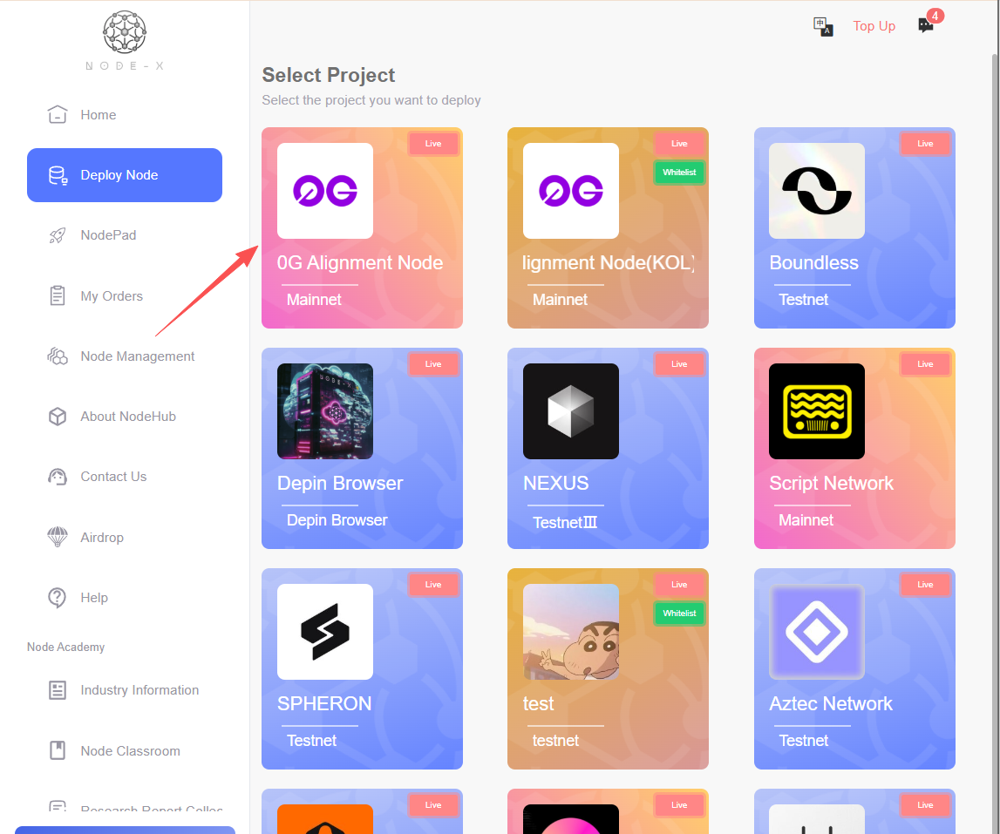
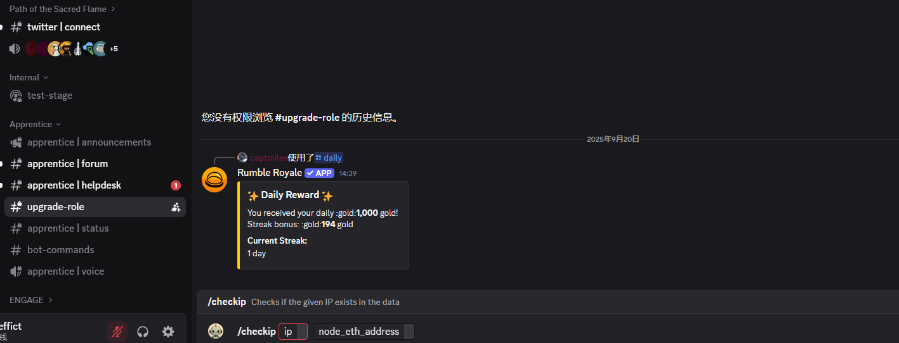
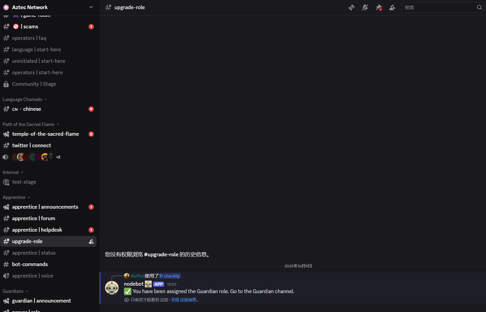

# Aztec\_Fullnode

 <a href="https://docs.node-x.xyz/chan-pin-shou-ce/yi-jian-bu-shu/boundless-network"><strong>中文</strong></a>

## How to deploy a Aztec Full node via the Node-X platform?

<mark style="color:red;">Note: Aztec officials have not yet announced incentive rules for this node. Please use your own judgment.</mark>

### 1.Obtain a Node-X account and deploy a node

First, you need a Node-X account. If you don’t have one, please go to [the Node-X registration page](https://node-x.xyz/) to register. After registration, follow the steps below to purchase and upload resources to deploy the node. The following is the order placement process using the 0G Alignment Node as an example:

<figure><figcaption></figcaption></figure>

<figure><figcaption></figcaption></figure>

<figure><figcaption></figcaption></figure>

<figure><figcaption></figcaption></figure>

### 2.Fill in the parameters

1. **Required: Enter your EVM wallet private key**

This wallet must contain a certain amount of Sepolia ETH to pay for gas fees.

Paid RPC endpoints are required if free RPC request limits are exceeded.\
You can obtain RPC endpoints for both the Sepolia Beacon chain and the Sepolia chain from [znkr.](https://www.ankr.com/)

### 3.Assist with deployment

After deploying the node and completing block synchronization, you need to register at [Aztec DC.](https://discord.com/invite/aztec) Once deployment is complete, we will provide you with the server IP where the node is deployed and coordinate the wallet address.

<figure><figcaption></figcaption></figure>

Once inside Aztec's DC, find the [#upgrade-role ](https://discord.gg/aztec)channel. In this channel, you can enter /checkip, which will prompt you to input the relevant information. Fill it out and send.

<figure><figcaption></figcaption></figure>

### 3.Wait for service and check the official dashboard

After a successful purchase, Node-X will deploy the Aztec Fullnode node for you. This process usually takes place within 24 hours. You can instantly check the node status via the following methods:

1. **Check node status:**\
   In the Node-X platform user panel, you can view all the purchased nodes and their current status.

## **Conclusion**

Deploying a Aztec Full node via the Node-X platform is that simple! Hope this guide is helpful to you.\
If you have any questions or need further guidance, feel free to leave a message or DM me. Good luck! Let’s explore the world of blockchain together!🚀

