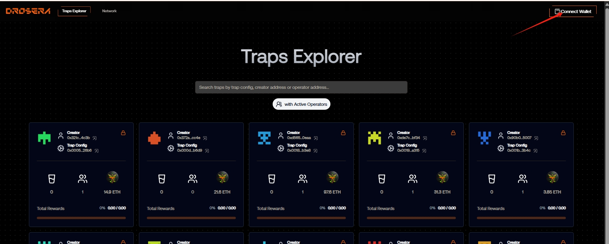
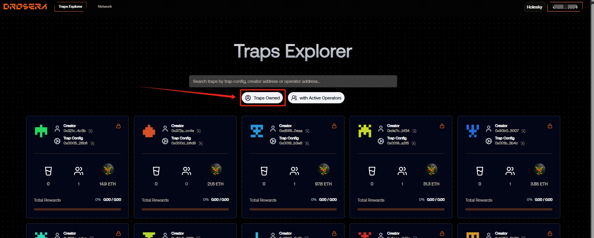
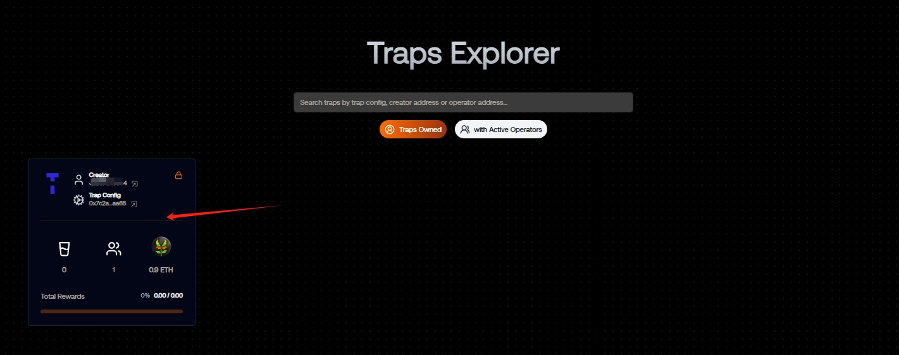
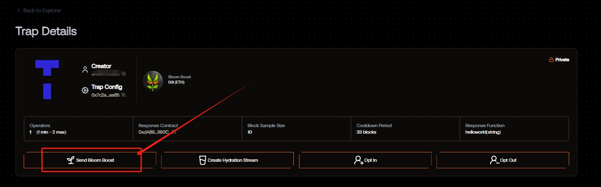
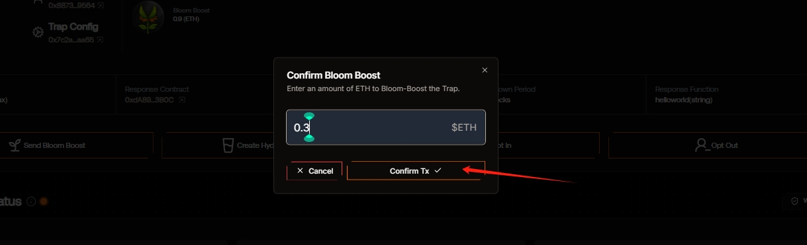
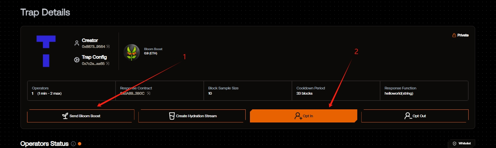
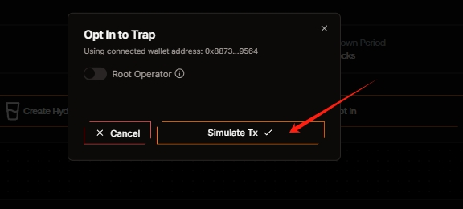
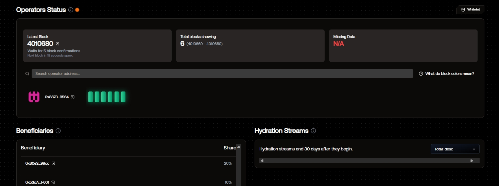
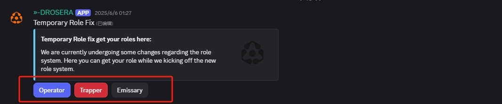
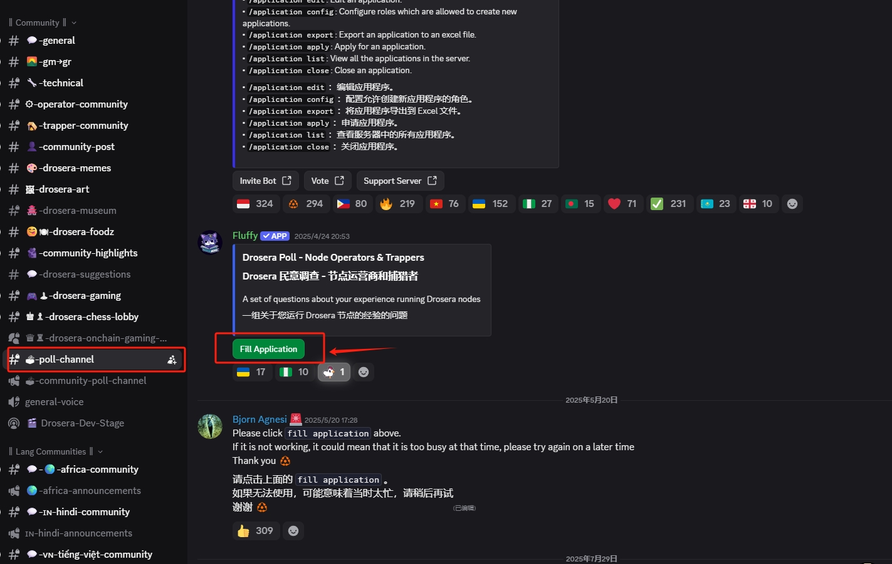

# Drosera

 <a href="https://docs.node-x.xyz/chan-pin-shou-ce/yi-jian-bu-shu/drosera"><strong>中文</strong></a>

## How to deploy a Drosera node via the Node-X platform?

### 1.Obtain a Node-X account and deploy a node

First, you need a Node-X account. If you don’t have one, please go to [the Node-X registration page](https://node-x.xyz/) to register. After registration, follow the steps below to purchase and upload resources to deploy the node. The following is the order placement process using the 0G Alignment Node as an example:

<figure><figcaption></figcaption></figure>

<figure><figcaption></figcaption></figure>

<figure><figcaption></figcaption></figure>

<figure><figcaption></figcaption></figure>

### 2.Fill in the parameters

1. You need to upload your EVM wallet private key. The wallet must contain 1 ETH on the ETH Holesky network. You can mine or claim tokens at https://holesky-faucet.pk910.de/.
2. You need to upload the EVM wallet address corresponding to the private key.
3. You need to upload the ETH\_Hoodi\_RPC. You can obtain it from Zan or Infura. If not provided, a public RPC will be used by default.
4. You also need to upload your DC (Discord) username in order to obtain the Cadet role.

### 3.To coordinate with the deployment

#### 1.Deposit ETH and create an operator

After deployment, you need to visit https://app.drosera.io/ to register as an operator and deposit at least 0.3 ETH on the platform. There will be ongoing consumption during operation, so you may need to deposit additional ETH later. Once on the website, the first step is to connect the wallet that corresponds to the uploaded private key.

<figure><figcaption></figcaption></figure>

<figure><figcaption></figcaption></figure>

<figure><figcaption></figcaption></figure>

<figure><figcaption></figcaption></figure>

<figure><figcaption></figcaption></figure>

<figure><figcaption></figcaption></figure>

<figure><figcaption></figcaption></figure>

<figure><figcaption></figcaption></figure>

#### 2.Obtain the role(<mark style="color:red;">This step is also very important</mark>)

Once you see the interface above, you can go to Discord to obtain the Node Runner role.\
First, head to the #role-fix channel to get the Operator, Hunter, and Messenger roles.

<figure><figcaption></figcaption></figure>

After successfully obtaining the roles, go to the #poll-channel channel to fill out the form and apply for the Node Runner role.

<figure><figcaption></figcaption></figure>

Once you've completed the form, you can get the Node Runner role!

### 4.Wait for service and check the official dashboard

After a successful purchase, Node-X will deploy the Drosera node for you. This process usually takes place within 24 hours. You can instantly check the node status via the following methods:

1. **Check node status:**\
   In the Node-X platform user panel, you can view all the purchased nodes and their current status.
2. **After successful deployment, you can check the node status on the official website:**\
   Go to the official website to check the node status. The node should be online as shown in the image below:

<figure><figcaption></figcaption></figure>

## **Conclusion**

Deploying a Drosera node via the Node-X platform is that simple! Hope this guide is helpful to you.\
If you have any questions or need further guidance, feel free to leave a message or DM me. Good luck! Let’s explore the world of blockchain together!🚀

