# Depin Browser User Manual

<a href="https://docs.node-x.xyz/chan-pin-shou-ce/yi-jian-bu-shu/depin-gua-ji-zhuan-yong-liu-lan-qi-2.0/depin-liu-lan-qi-cao-zuo-shou-ce">中文</a>

### I. Specific Operations

After placing an order on the Node-X platform, we will provide you with the server IP, port, and your browser account credentials.

Here is a [demonstration video](https://www.youtube.com/watch?v=nsNJt2drGbg) for your reference.

Simply input the server IP and port (e.g., 123.121.26.111:3010) into the browser's URL bar, press Enter, and a login pop-up will appear. Enter your username and password in the pop-up to log into the browser, as detailed below:

<figure>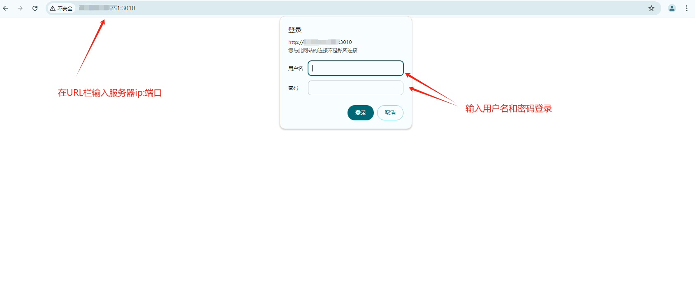<figcaption></figcaption></figure>

<figure>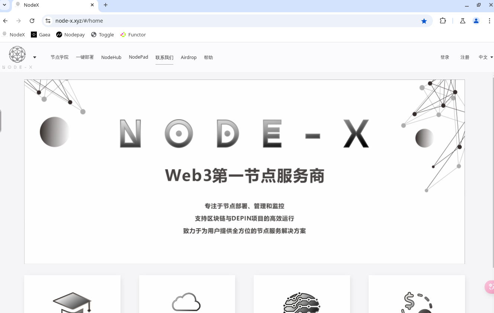<figcaption></figcaption></figure>

**How to perform a paste operation?**

Some data may be too lengthy to input manually, which can be cumbersome. You can click the icon on the left side (as shown in the diagram below) to open the clipboard, then copy the data you want to paste into the clipboard. You can then paste it into the desired location. The operation is shown in the diagram below:

<figure>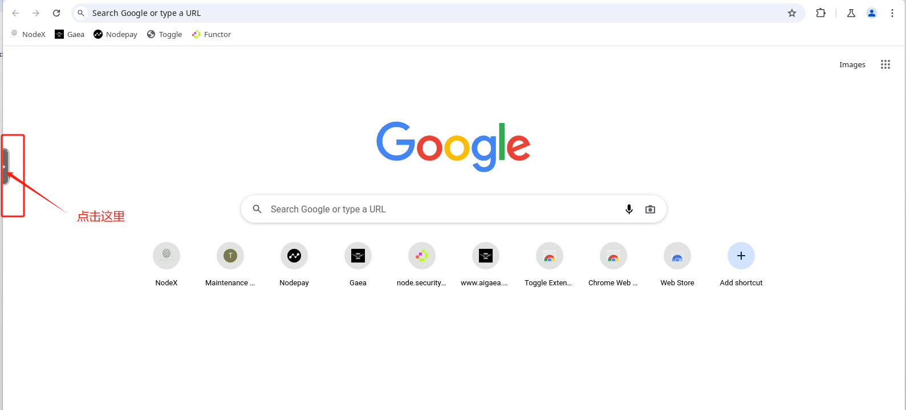<figcaption></figcaption></figure>

<figure>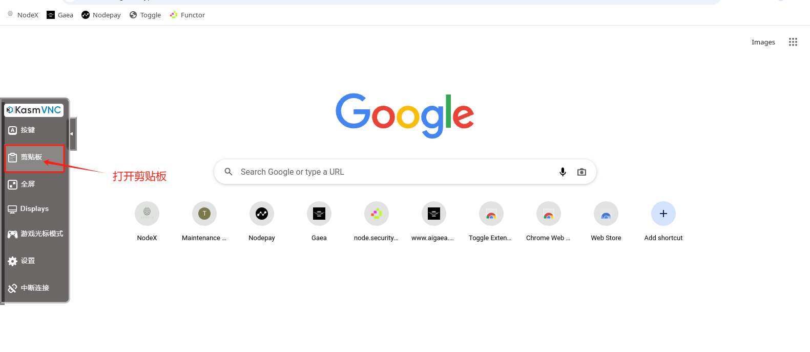<figcaption></figcaption></figure>

<figure>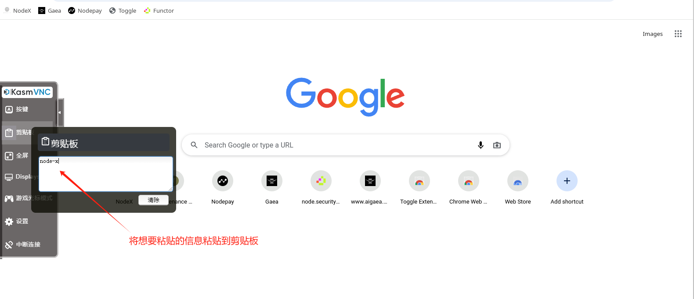<figcaption></figcaption></figure>

<figure>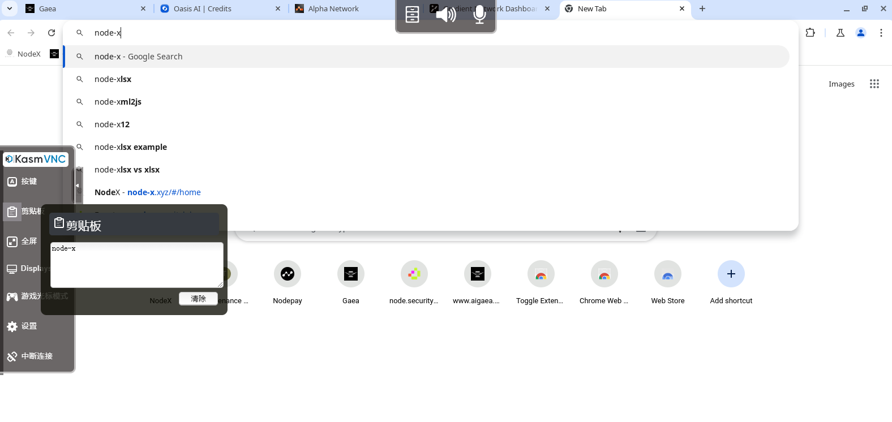<figcaption></figcaption></figure>

### II. Common Issues You Might Encounter

1.If you close all web pages or accidentally minimize the window, you may see the following situation: If you need to retrieve the previously visited webpage, follow the steps below to recover it.

<figure>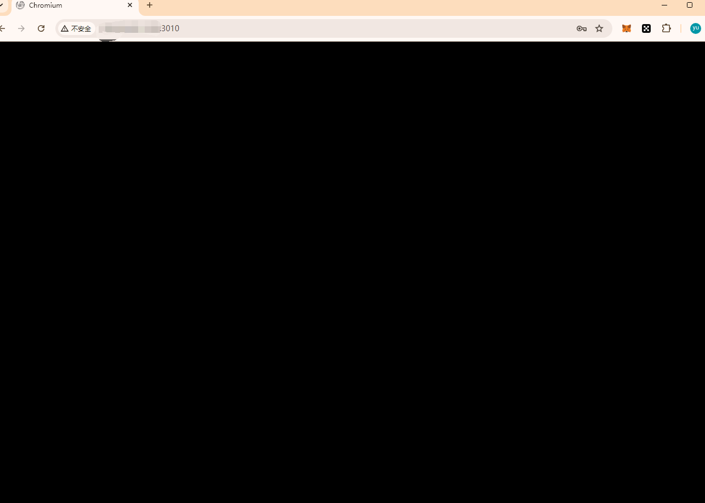<figcaption></figcaption></figure>

Solution：

<figure>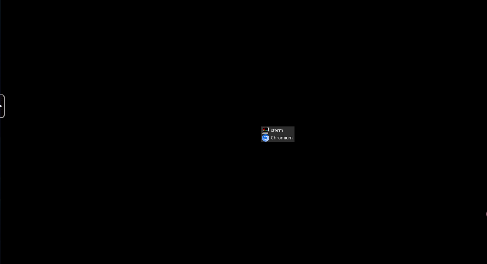<figcaption></figcaption></figure>

<figure>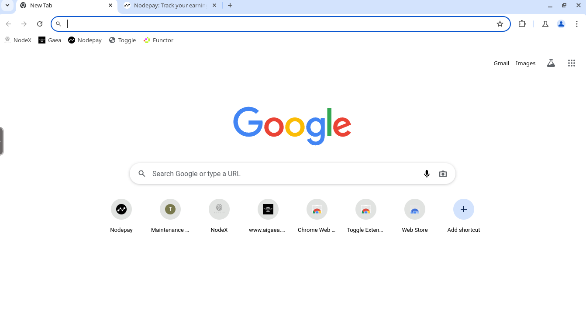<figcaption></figcaption></figure>

If you need to retrieve the web pages you visited earlier, you can follow the steps below to get them back.

<figure>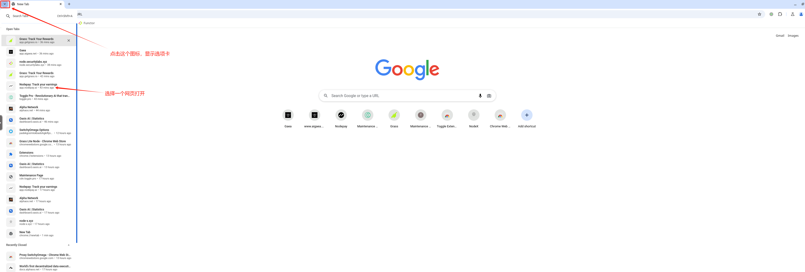<figcaption></figcaption></figure>

<figure>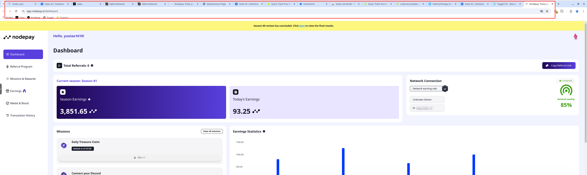<figcaption></figcaption></figure>

2.If your network is particularly slow or unresponsive:

Solutions: Try switching to a different VPN and see if the effect improves.

### Conclusion

We hope you will provide feedback if you encounter other issues. We will consider adding them to the manual and strive to improve it.

If you have any questions or need further guidance, feel free to leave a comment or send me a private message.Let's keep exploring the world of blockchain together! 🚀
