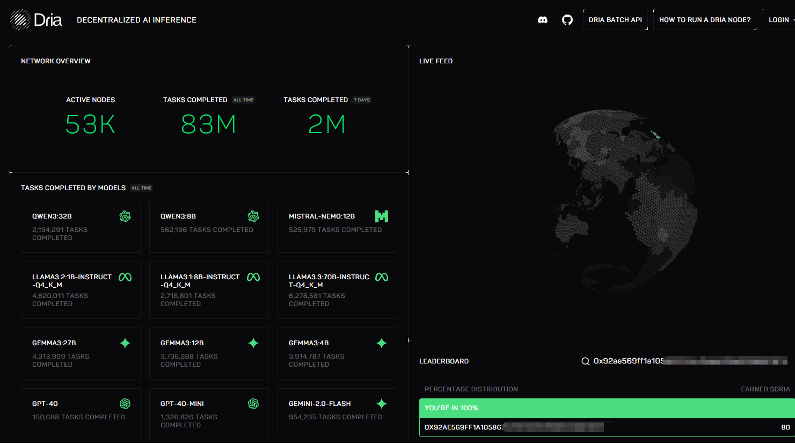

# Dria

 <a href="https://docs.node-x.xyz/chan-pin-shou-ce/yi-jian-bu-shu/shang-xian-xiang-mu/dria"><strong>中文</strong></a>

## How to deploy a Dria Compute node via the Node-X platform?

### 1.Obtain a Node-X account and deploy a node

First, you need a Node-X account. If you don’t have one, please go to [the Node-X registration page](https://node-x.xyz/) to register. After registration, follow the steps below to purchase and upload resources to deploy the node. The following is the order placement process using the 0G Alignment Node as an example:

<figure><figcaption></figcaption></figure>

<figure><figcaption></figcaption></figure>

<figure><figcaption></figcaption></figure>

<figure><figcaption></figcaption></figure>

### 3.Wait for service and check the official dashboard

After a successful purchase, Node-X will deploy the Dria Compute node for you. This process usually takes place within 24 hours. You can instantly check the node status via the following methods:

1. **Check node status:**\
   In the Node-X platform user panel, you can view all the purchased nodes and their current status.
2. **View real-time earnings on the official website:**\
   After deployment is complete, we will return the generated wallet private key to you. You can then use the wallet address to check the real-time rewards of your running node on the official dashboard. For specific incentive details, please refer to the [official incentive mechanism](https://node-guide.dria.co/rewards). You can query using https://dria.co/edge-ai?w=\<wallet\_address>, as shown in the image below:

<figure><figcaption></figcaption></figure>

## **Conclusion**

Deploying a Dria Compute node via the Node-X platform is that simple! Hope this guide is helpful to you.\
If you have any questions or need further guidance, feel free to leave a message or DM me. Good luck! Let’s explore the world of blockchain together!🚀

