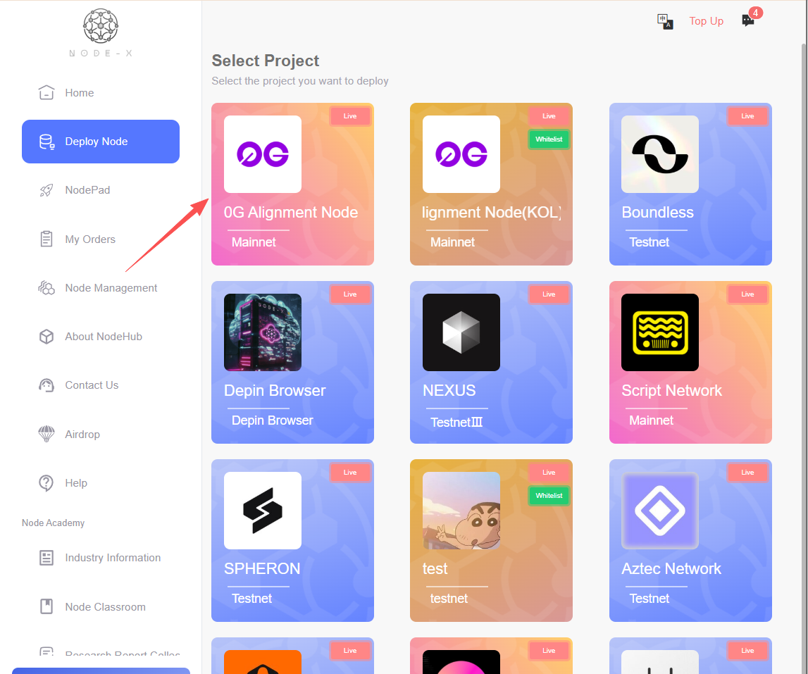

# Inference

 <a href="https://docs.node-x.xyz/chan-pin-shou-ce/yi-jian-bu-shu/shang-xian-xiang-mu/inference"><strong>中文</strong></a>

## How to deploy a Inference node via the Node-X platform?

### 1.Obtain a Node-X account and deploy a node

First, you need a Node-X account. If you don’t have one, please go to [the Node-X registration page](https://node-x.xyz/) to register. After registration, follow the steps below to purchase and upload resources to deploy the node. The following is the order placement process using the 0G Alignment Node as an example:

<figure><figcaption></figcaption></figure>

<figure><figcaption></figcaption></figure>

<figure><figcaption></figcaption></figure>

<figure><figcaption></figcaption></figure>

### 2.Fill in Parameters

* **Upload Secret Key**\
  Go to the official website to register. After successful registration, copy and fill in the secret key. If there are errors during registration, please try several times.

<figure><figcaption></figcaption></figure>

<figure><figcaption></figcaption></figure>

<figure><figcaption></figcaption></figure>

<figure><figcaption></figcaption></figure>

### 3.Wait for service and check the official dashboard

After a successful purchase, Node-X will deploy the inference node for you. Typically, this process will be completed within 24 hours. You can check the node status in real-time through the following methods:

1. **View Node Status:**\
   In the Node-X platform user panel, you can view all the purchased nodes and their current status.
2. **Check Node Status on Official Website**\
   View the real-time operating status of the nodes and their points on the official dashboard.

<figure><figcaption></figcaption></figure>

## **Conclusion**

Deploying a Inference node via the Node-X platform is that simple! Hope this guide is helpful to you.\
If you have any questions or need further guidance, feel free to leave a message or DM me. Good luck! Let’s explore the world of blockchain together!🚀

