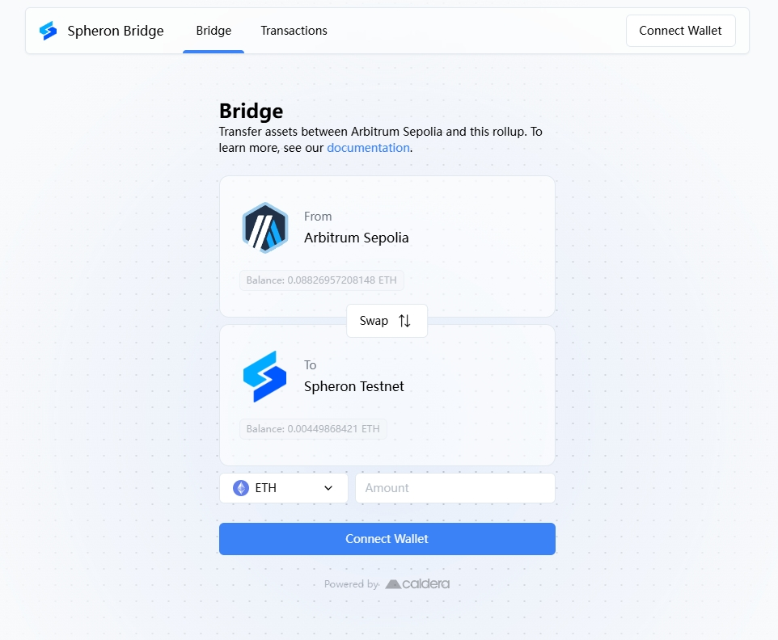
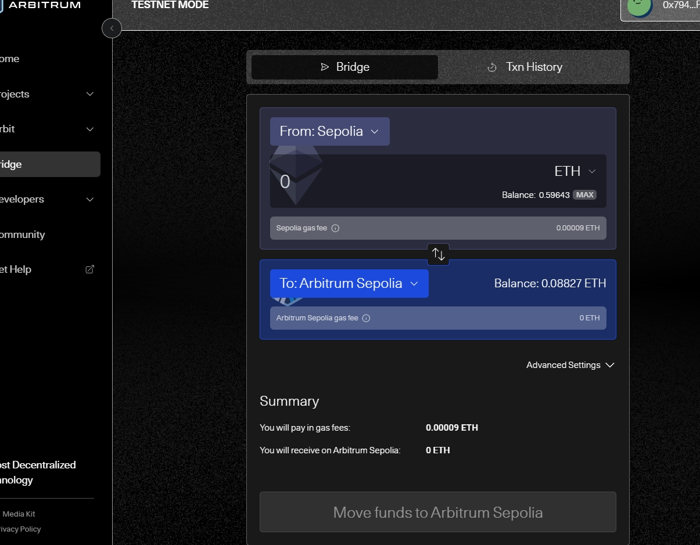
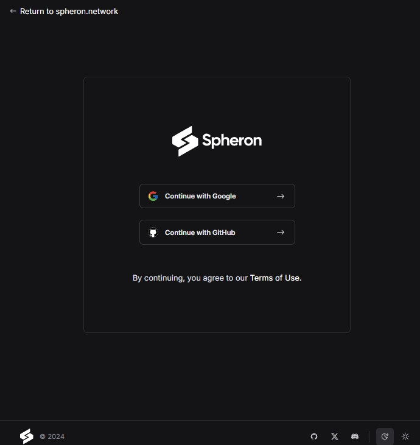
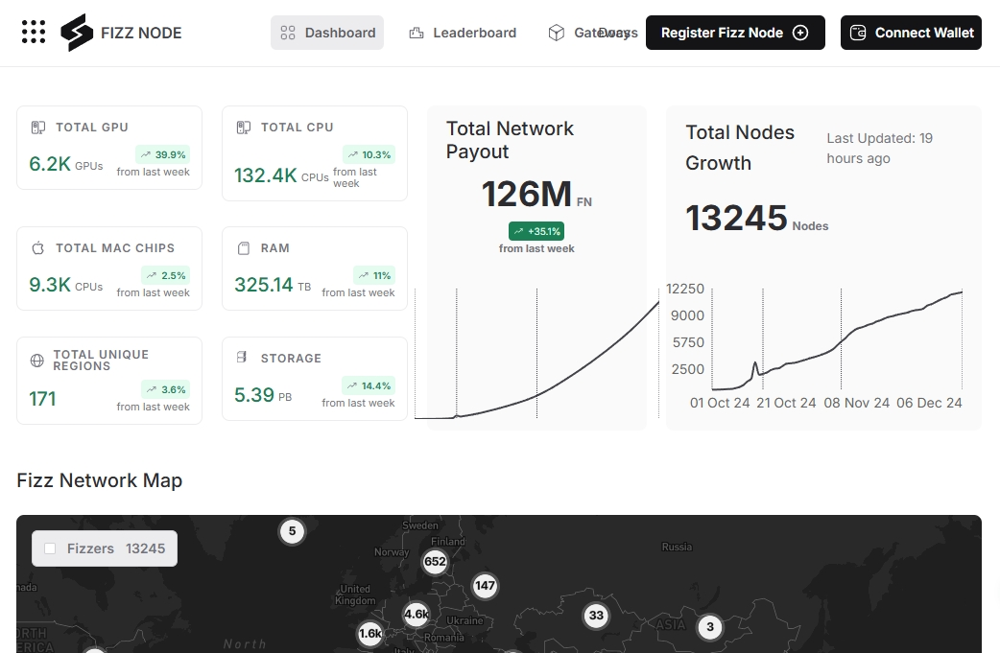
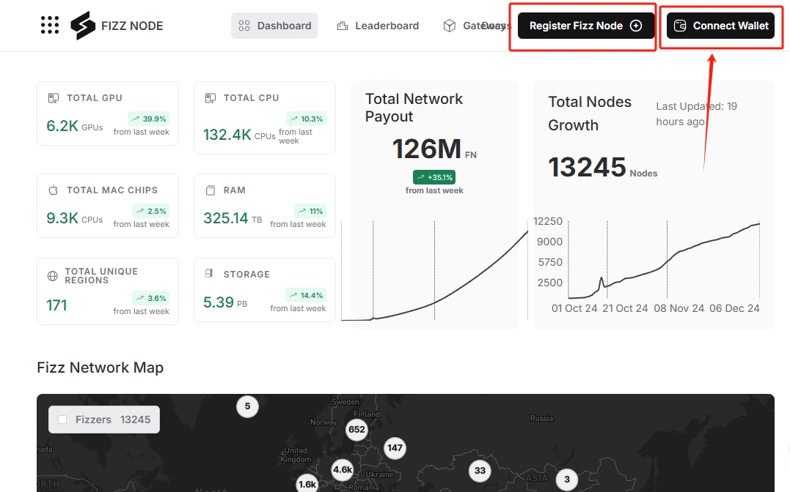
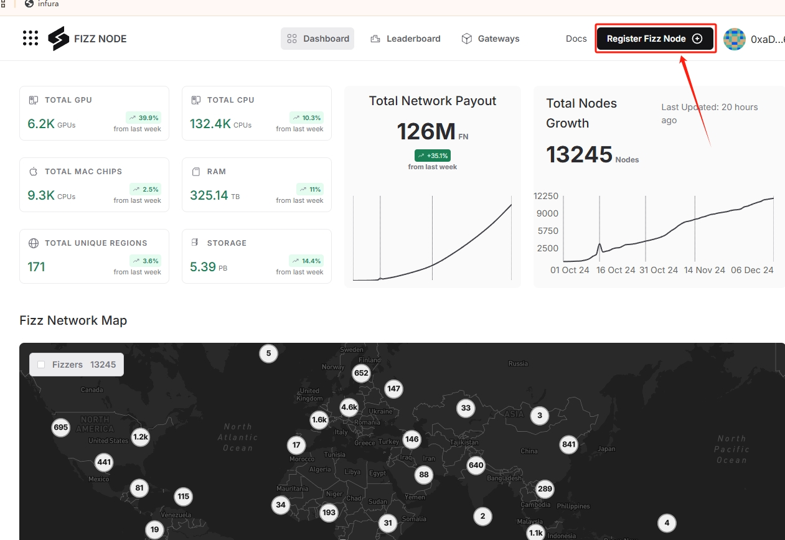
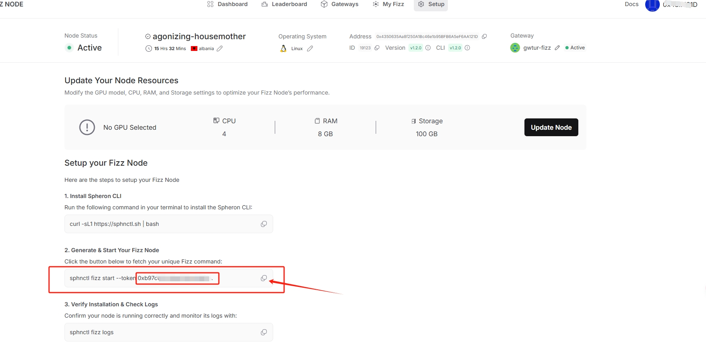
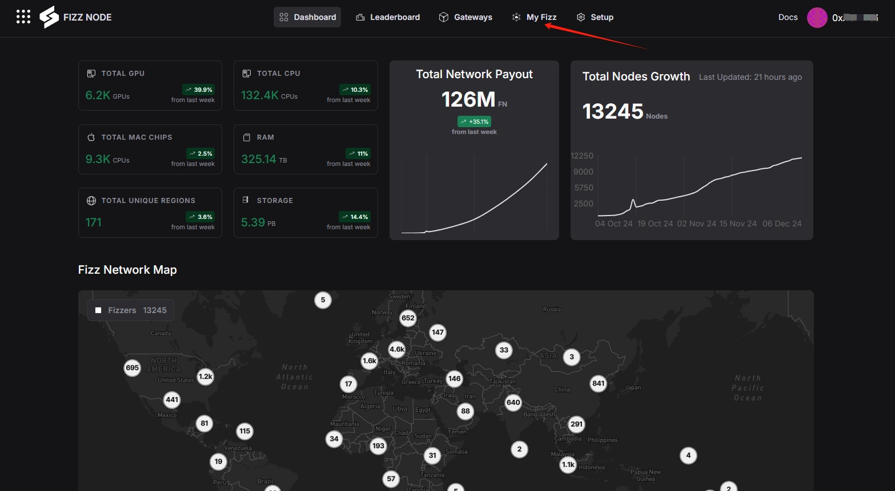
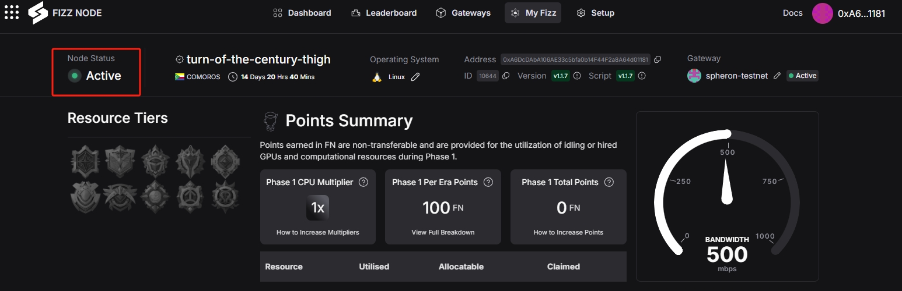

# Spheron Protocol

 <a href="https://docs.node-x.xyz/chan-pin-shou-ce/yi-jian-bu-shu/spheron-protocolhttps://docs.node-x.xyz/chan-pin-shou-ce/yi-jian-bu-shu/spheron-protocol"><strong>中文</strong></a>

## How to deploy a Fizz node via the Node-X platform?

### 1.Obtain a Node-X account and deploy a node

First, you need a Node-X account. If you don’t have one, please go to [the Node-X registration page](https://node-x.xyz/) to register. After registration, follow the steps below to purchase and upload resources to deploy the node. The ordering process is as follows:

<figure><figcaption></figcaption></figure>

<figure><figcaption></figcaption></figure>

<figure><figcaption></figcaption></figure>

### 2.Fill in the parameters

#### **Complete the water claim and register, then download the script.**

* **Obtain Spheron tokens**\
  You need test tokens for the Spheron Testnet, which can be obtained from Arbitrum Sepolia via Spheron Bridgeswap.You need test tokens for the Spheron Testnet, which can be obtained from Arbitrum Sepolia via [Spheron Bridgeswap](https://spheron-devnet-eth.bridge.caldera.xyz/https://spheron-devnet-eth.bridge.caldera.xyz/).

<figure><figcaption></figcaption></figure>

If you don't have Arbitrum Sepolia test tokens, you can convert ETH Sepolia through the [Arbitrum Bridge](https://bridge.arbitrum.io/?destinationChain=arbitrum-sepolia\&sourceChain=sepolia).

<figure><figcaption></figcaption></figure>

Users who place orders can directly go to Node-X's Telegram (t.me/nodex527) to receive ETH Sepolia for free.

After completing the water claim, [open the registration interface](https://fizz.spheron.network/), and then follow the image below to register and download the script.

<figure><figcaption></figcaption></figure>

<figure><figcaption></figcaption></figure>

<figure><figcaption></figcaption></figure>

<figure><figcaption></figcaption></figure>

<mark style="color:red;">Note: We default the resource allocation to Linux 8 CPU, 16 GB RAM, and 100 GB Storage. Please be careful not to allocate incorrectly!</mark>

If the allocated resources do not match the actual configured resources, your rewards will be deducted daily.

<figure><figcaption></figcaption></figure>

<figure><figcaption></figcaption></figure>

<figure><figcaption></figcaption></figure>

### 3.Wait for service and check the official dashboard

After a successful purchase, Node-X will deploy the Fizz node for you. This process usually takes place within 24 hours. You can instantly check the node status via the following methods:

1. **Check node status:**\
   In the Node-X platform user panel, you can view all the purchased nodes and their current status.
2. **After successful deployment, you can check the node status on the official website:**\
   [Go to the official website](https://fizz.spheron.network/) to check the node status. The node should be online as shown in the image below:

<figure><figcaption></figcaption></figure>

<figure><figcaption></figcaption></figure>

## **Conclusion**

Deploying a Fizz node via the Node-X platform is that simple! Hope this guide is helpful to you.\
If you have any questions or need further guidance, feel free to leave a message or DM me. Good luck! Let’s explore the world of blockchain together!🚀

