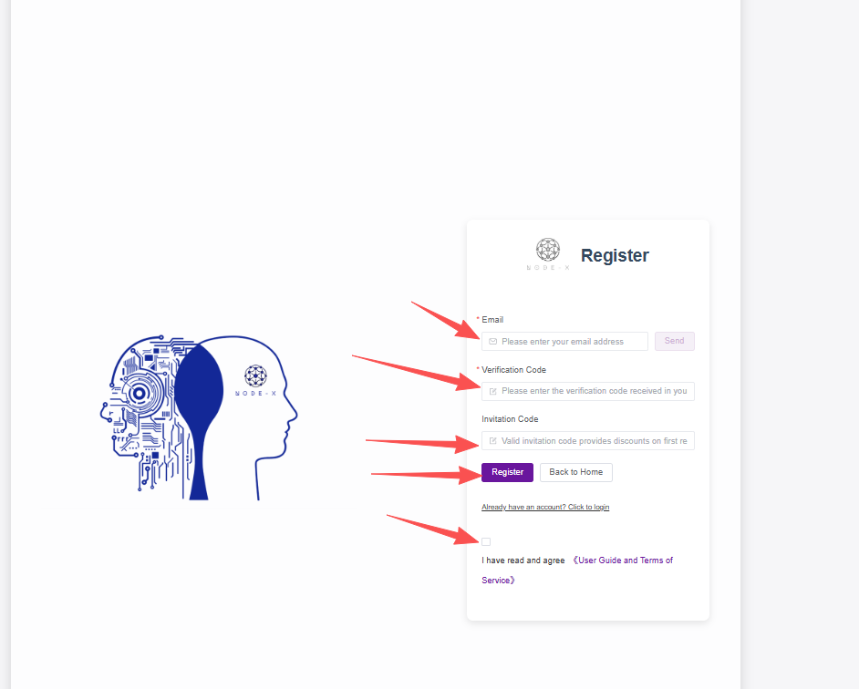
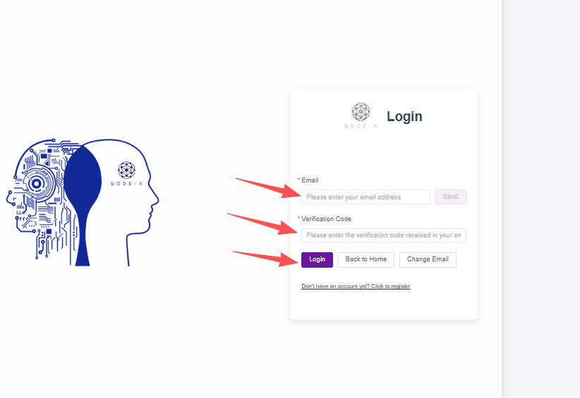

# User Manual

## Naas One-Click Deployment Operation Manual

### 1.Overview

This manual will guide you through login, registration, recharge, notifications, understanding projects, placing orders, and managing orders and nodes, helping you quickly get started and become proficient with the Naas platform.

***

### 2.Login and Registration

#### 2.1. Login Link

* Login URL: [https://app.node-x.xyz/](https://app.node-x.xyz/)

#### 2.2. Login Process

**Naas only supports email login:**

* **Email Login**\
  Use your registered email address to receive a verification code for login.

#### 2.3. Registration Process

* Registration Method: Register an account via email
* Steps:\
  1.Enter a valid email address to receive a verification code.\
  2.After successful registration, the system will send a confirmation email to your inbox.\
  3.Once registered, you can log in using the email verification code.\
  4.If you have an invitation code, entering a valid code can enjoy a first-charge discount.

<figure><figcaption></figcaption></figure>

<figure><figcaption></figcaption></figure>

<figure><figcaption></figcaption></figure>

***

### 3.Recharge

