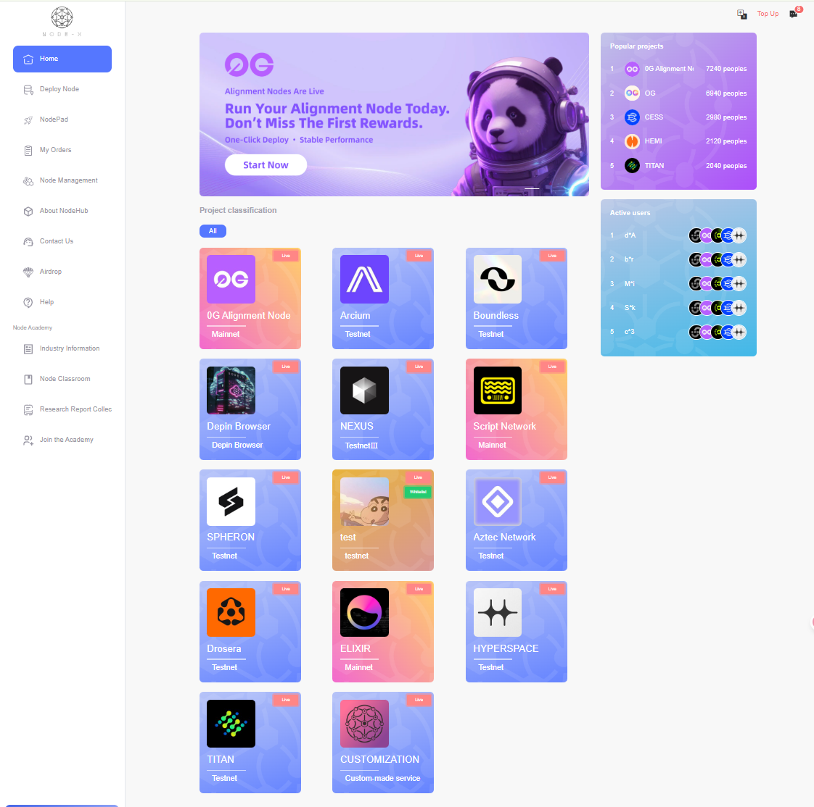
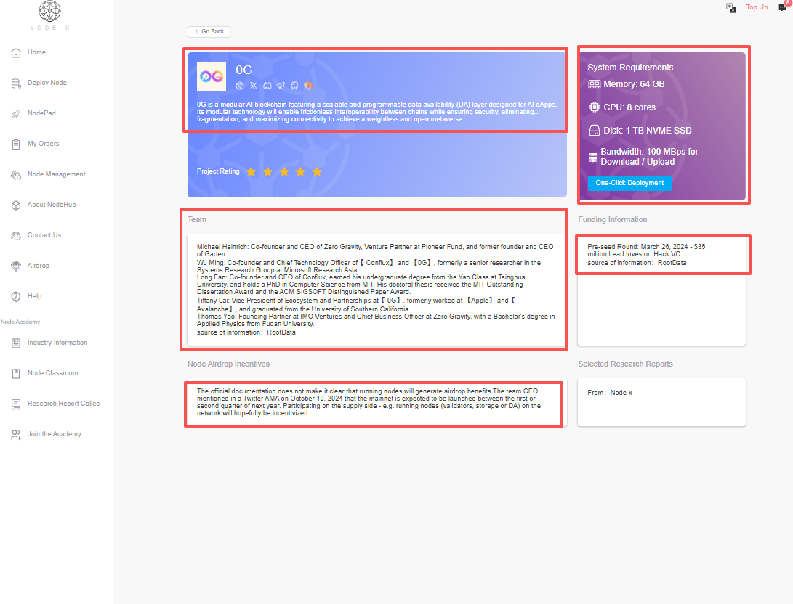
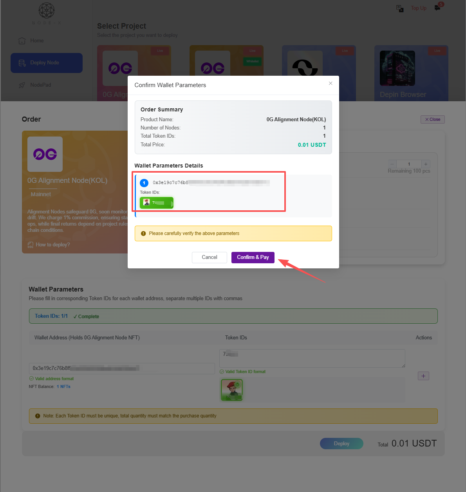

# User Manual

<a href="https://docs.node-x.xyz/chan-pin-shou-ce/yi-jian-bu-shu/cao-zuo-shou-ce">中文</a>

## Naas One-Click Deployment Operation Manual

### 1.Overview

This manual will guide you through login, registration, recharge, notifications, understanding projects, placing orders, and managing orders and nodes, helping you quickly get started and become proficient with the Naas platform.

***

### 2.Login and Registration

#### 2.1. Login Link

* Login URL: [https://node-x.xyz/](https://node-x.xyz/)

#### 2.2. Login Process

**Naas only supports email login:**

* **Email Login**\
  Use your registered email address to receive a verification code for login.

#### 2.3. Registration Process

* Registration Method: Register an account via email
* Steps:\
  1.Enter a valid email address to receive a verification code.\
  2.After successful registration, the system will send a confirmation email to your inbox.\
  3.Once registered, you can log in using the email verification code.\
  4.If you have an invitation code, entering a valid code can enjoy a first-charge discount.

<figure><figcaption></figcaption></figure>

<figure><figcaption></figcaption></figure>

<figure><figcaption></figcaption></figure>

***

### 3.Recharge

After entering Naas, click “Recharge” to perform a recharge and view recharge records.

#### 3.1 Recharge

Click “Recharge,” select the currency and network, then click “Recharge” and confirm payment. You will be redirected to a payment interface where you can scan a QR code to pay or connect your wallet for payment.

> Example page illustration

<figure><figcaption></figcaption></figure>

<figure><figcaption></figcaption></figure>

<figure><figcaption></figcaption></figure>

#### 3.2 View Recharge Records

Click “Recharge Records” to view your recharge history.

> Example page illustration

<figure><figcaption></figcaption></figure>

### 4.Notifications and Internal Messages

Internal messages are an important channel for user communication, used to handle various order issues.

You can also contact us via DC invoicing or other methods.

> Example page illustration

<figure><figcaption></figcaption></figure>

<figure><figcaption></figcaption></figure>

### 5.Industry Information

Before placing an order, users can search for relevant information in the Industry Information section.

This contains official information about projects you are interested in, collected by us.

> Example page illustration

<figure><figcaption></figcaption></figure>

<figure><figcaption></figcaption></figure>

### 6.Placing Orders

* Select a project, choose nodes, select runtime duration, and decide whether to auto-renew. Then click “Deploy” and confirm.
* After confirmation, the node will be deployed within 24 hours. Depending on the project, you may need to upload parameters or cooperate with us for deployment.
* Each project has specific documentation.

> Example page illustration

<figure><figcaption></figcaption></figure>

<figure><figcaption></figcaption></figure>

<figure><figcaption></figcaption></figure>

### 7.Order Management and Node Management

* **Order Management:** Manage your orders (including but not limited to nodes), view order status, deployment progress, and top-up discrepancies.
* **Node Management:** View the status of nodes you entrusted us to deploy.

> Example page illustration

<figure><figcaption></figcaption></figure>

<figure><figcaption></figcaption></figure>

**8.Summary**

Through the above features, Naas can help you:

* Quickly place orders and deploy, with real-time order status and progress updates
* Receive instant notifications and handle order issues and customer feedback promptly
* Easily access industry information to make informed investment decisions
* Offer multiple recharge options, streamlining fund flow and management
* Enhance operational flexibility to adapt quickly to market changes and needs

If you have any questions or encounter technical issues, it is recommended to ask in the community or contact the official Node-x support team for assistance.
