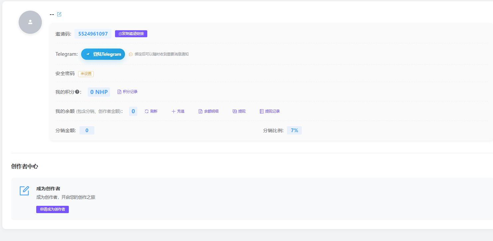

# 操作手册

<a href="https://docs.node-x.xyz/en/product-manual/nodehub/user-manual">English</a>

## NodeHub操作手册

### &#x31;**. 概述**

本操作手冊將引導您從登入、註冊，到伺服器管理、指令編輯與執行，再到節點管理及儀表板監控，協助您快速上手並熟練使用 NodeHub 平台。

***

#### **2. 登入與註冊**

**2.1 登入連結**

* 登入網址： [https://hub.node-x.xyz/](https://hub.node-x.xyz/)

**2.2 登入流程**

NodeHub 支援兩種登入方式：

* **帳號密碼登入**\
  使用已註冊的帳號（使用者名稱）與密碼進行登入。
* **信箱登入**\
  使用已註冊的電子信箱地址獲取驗證碼進行登入。

**2.3 註冊流程**

* **註冊方式**：透過電子信箱註冊帳號
* **註冊步驟**：
  1. 輸入有效的電子信箱地址，設置登入密碼。
  2. 註冊成功後，系統會發送一封確認郵件至您的信箱。
  3. 點擊郵件中的確認連結以完成帳號啟用，即可開始使用平台功能。
  4. 若您擁有邀請碼，也可於註冊時填寫。


示例页面


<figure><figcaption>
<strong>註冊 NodeHub</strong>
</figcaption></figure>

<figure><figcaption>
<strong>登入 NodeHub</strong>
</figcaption></figure>

### 3. 個人資訊與創作者頁面

#### 3.1 個人詳情

個人詳情頁面展示用戶的基本資訊。

在新版系統中，您可以進行以下操作：

1. 上傳個人頭像
2. 設定暱稱
3. 添加社群帳號（如 Twitter、Telegram 等）
4. 編輯個人簡介，展示您的專長或風格
5. 链接TG(获取已部署节点最新近况)
6. 设置或重置安全密码
7. 查看积分详情
8. 操作账号余额（包括充值、刷新、查看余额明细、提现、提现记录）
9. 申请成为创作者

#### 3.2 創作者頁面

創作者頁面展示创作者的基本信息\
在新版系统中，您可以进行一下操作：

1. 获取邀请码
2. 个人信息设置（同个人详情）
3. 链接TG获取重要消息通知
4. 安全密码设置
5. 查看积分详情
6. 个人钱包（包括分销、创作者金额等）
7. 查看公开指令详情（包括指令对应执行次数、服务器数量、总收入，订单数等）
8. 查看付费指令的授权记录。


示例页面


<figure><figcaption></figcaption></figure>

<figure><figcaption></figcaption></figure>

***

### 4. 伺服器管理

**4.1 伺服器列表**

伺服器列表頁面展示用戶所管理的所有伺服器。\
透過此頁面，您可以查看每台伺服器的詳細資訊，例如：

* IP 地址
* 伺服器名稱
* 埠口（Port）
* 狀態（在線／離線／運行中等）
* 記憶體與磁碟容量
* ST（可查看自身算力是否被運營商偷取）


示例页面


<figure><figcaption>
導入伺服器面板查看
</figcaption></figure>

#### **4.2 導入伺服器**

用戶可以透過「導入伺服器」功能，將外部伺服器資訊添加至 NodeHub 管理平台，方便統一管理與監控。

伺服器來源分為3類，一類是租賃其他服務商的伺服器（通常為Linux系統），一類是自己個人的伺服器/PC，一類則是直接通過NodeHub算力市場租賃的伺服器。

1、**若是导入外部服务器需要填寫的資訊包括：**

* **伺服器 IP 位址**
* **端口號**（SSH 連接端口，預設通常為 22）
* **用戶名**（登錄伺服器所用的帳號）
* **密碼**（對應用戶名的登入密碼）

若服务器过太多，可以选择批量导入，需要下载模版填写对应信息再导入即可（暂不支持）


示例页面


<figure><figcaption>
新增服务器
</figcaption></figure>

**2、若是导入个人服务器或个人PC需要在终端执行对应安装指令**

根据选择接入设备的系统执行安装指令


示例页面


<figure><figcaption></figcaption></figure>

**3、直接购买NodeHub算力市场的服务器**
\
服务器会自动接入NodeHub进行管理

#### 4.3 Webshell

接入NodeHub后，可以直接点击WebShell,连接直接进入该设备终端进行操作，无需下载其他终端管理工具，且·设置为浮窗便于测试指令。


示例页面


<figure><figcaption></figcaption></figure>

#### 4.4 伺服器分組

* 用戶可在 NodeHub 平台中建立多個伺服器分組，並將伺服器歸類到不同分組內，以便進行分類管理。
* 在伺服器數量眾多時，快速檢索目標伺服器
* 依照業務、地區、功能等維度分類管理
* 簡化維護流程，提高運維效率


示例页面


<figure><figcaption>
分組管理伺服器
</figcaption></figure>

***

### **5. 官方指令、指令社区与指令管理**

#### 5.1 官方指令与指令社区

官方指令頁面展示NodeHub官方发布的可用的指令，社区指令页面展示NodeHub社区指令创作者公开到社区的指令，方便用戶快速瀏覽與選擇。

指令社区中，可以直接在已公开的指令下评论、点赞、以及踩，可以直接与指令创作者沟通。

在此頁面，您可以：

* 查看指令名稱
* 瞭解指令用途與簡要描述
* 依分類或關鍵字篩選指令
* 執行指令或進入指令詳情頁面，參考詳細操作指南


示例页面


<figure><figcaption></figcaption></figure>

<figure><figcaption></figcaption></figure>

<figure><figcaption></figcaption></figure>

#### **5.2 指令管理**

用戶可在 NodeHub 平台新建、編輯或修改指令腳本，靈活適配不同節點部署需求。

创作者则是可以将脚本公开到指令社区。

**主要操作：**

* **填寫指令名稱**\
  輸入簡潔明確的指令名稱，方便辨識與管理。
* **描述指令作用**\
  簡述該指令的用途與功能，便於其他用戶理解。
* **設置參數**\
  根據指令需求，定義可配置的參數選項，例如節點 ID、網絡類型、錢包地址等。
* **编辑指令**\
  编辑指令，参考示例完成编辑，在編輯指令時，可以按 **Tab** 鍵可啟用自動補全，提升編寫效率與準確度。
* **公开指令（创作者）**\
  编辑完成指令并测试完成后可以公开到社区，可以选择隐藏指令以及收费金额，点击确认，中途需要等待慧审AI进行审核以及人工审核的双重审核机制后才能公开到社区。\


示例页面


<figure><figcaption></figcaption></figure>

***

### 6. 指令執行與任務管理

#### 6.1 執行指令

* 用戶可指定某一台或多台伺服器，選擇需要執行的指令；
* 點擊「執行」按鈕即可開始指令運行，系統會即時回饋執行情況。


示例页面


<figure><figcaption>
新增伺服器進行安裝
</figcaption></figure>

#### 6.2 執行任務列表

顯示所有正在執行中的任務；\
包括任務名稱、開始時間、執行狀態等，方便用戶隨時瞭解當前執行進度。


示例页面


<figure><figcaption>
新增日誌功能，可點擊查看運行日誌。
</figcaption></figure>

#### 6.3 執行歷史

展示所有已完成的任務歷史；\
用戶可查閱執行時間、結果輸出、執行狀態等詳細資訊，以便日後稽核或復盤。


示例页面


<figure><figcaption>
可查看執行歷史
</figcaption></figure>

***

### 7. 節點管理

* 節點管理頁面展示所有節點的詳細資訊；
* 可查看節點狀態（在線 / 離線）與性能指標（CPU、記憶體等）；
* 支援對節點進行啟動、關閉、升級或維護等操作；
* 可以根据IP、执行指令、健康状态、线上状态以及分组进行筛选查看，也可根据IP进行分组查看；
* 可以点击日志查看节点具体运行状态，点击执行则可以自动跳转到对应指令的执行页面。


示例页面


<figure><figcaption></figcaption></figure>

***

### 8. 儀表板

* 儀表板用於展示系統的整體運行狀態與即時性能指標；
* 使用者可即時查看 CPU 使用率、記憶體使用率等關鍵數據，以便及時監控與調整部署。


示例页面


<figure><figcaption>
一眼查看设备资源利用率
</figcaption></figure>

***

### 9.算力市场

算力市场用于为用户提供带有折扣的算力资源，为用户提供一个购买算力资源的渠道

目前已接入Tencent Cloud 、 Aliyun 服务商的算力资源以及GPU资源

#### 9.1下单流程

在算力市场，选择目标服务器，然后查看对应价格，检查余额是否足以购买，若不够还需连接钱包进行充值，再点击立即购买。


示例页面


<figure><figcaption></figcaption></figure>

<figure><figcaption></figcaption></figure>

<figure><figcaption></figcaption></figure>

### 10. 總結

透過以上功能，NODEHUB 可協助您：

* 統一管理多台伺服器並進行分組，提高運維效率；
* 快速編寫與執行指令，查看執行結果與歷史紀錄；
* 將指令分享至社群，獲得其他使用者的反饋與交流；
* 監控節點狀態及系統整體效能，及時進行優化與維護。

如有任何疑問或遇到技術問題，建議您在社群中發問，或聯繫 NODEHUB 官方支援團隊以獲得協助。
