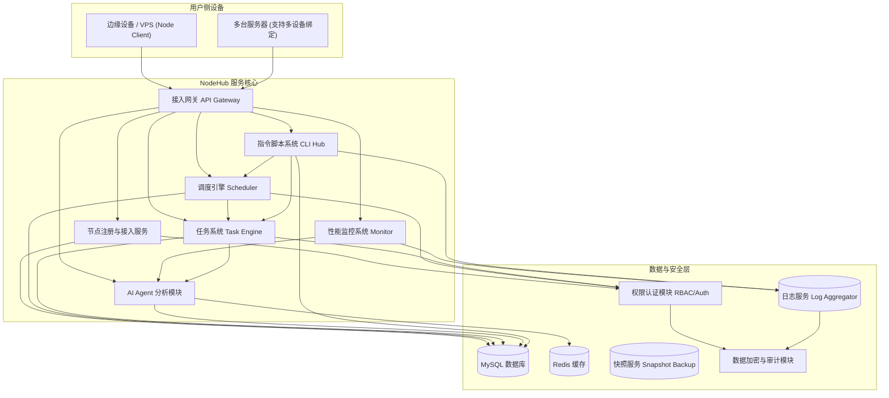

# NodeHub 平台漏洞與事故應急預案方案（V1.0））

#### 一、前言

NodeHub 是 Node-X 平台旗下的去中心化算力管理與節點協作平台，聚焦於全球閒置邊緣算力的聚合與智慧調度。為了保障平台運行穩定性與用戶權益，在面對安全漏洞、平台故障或運維事故等突發事件時，制定以下應急響應預案

***

### 二、平台整体架构概览

#### 三、適用範圍

本預案適用於以下場景：

* 平台安全漏洞：代碼缺陷、訪問控制錯誤、資料外洩等
* 服務不可用：API 閘道崩潰、調度引擎異常、腳本執行中斷等
* 節點異常波動：大規模節點離線、同步失敗、資源突增
* 資料錯誤／遺失：用戶任務紀錄異常、配置誤刪除、腳本版本衝突等

### 四、應急組織結構

<table><thead><tr><th width="374">小組</th><th>主要職責</th></tr></thead><tbody><tr><td><strong>應急指揮組</strong></td><td>制定響應策略，負責最終發布、用戶公告</td></tr><tr><td>技術排查組</td><td>快速定位問題、修復故障或進行回滾</td></tr><tr><td>安全審計組</td><td>分析安全風險、提供證據鏈和複盤材料</td></tr><tr><td>用戶支持組</td><td>與受影響用戶保持聯繫、提供進度反饋</td></tr><tr><td>恢復驗證組</td><td>回歸測試與驗證修復效果，確保平台穩定性</td></tr></tbody></table>

### 五、事件響應流程

* **事件發現**\
  由以下方式觸發應急響應流程：
  * 平台系統監控異常（CPU、記憶體、節點數、響應時間等）
  * 用戶反饋或社區匯報
  * AI Agent 偵測出資源異常或潛在攻擊模型
  * 日誌系統觸發關鍵警報
* **初步響應**\
  技術排查組啟動快速隔離策略：
  * 臨時下線異常節點或接口
  * 暫停任務調度鏈路
  * 數據快照備份（數據庫、Redis、任務狀態）
  * 安全組初步分析異常日誌，記錄操作軌跡
* **事件分級處理**（靈活響應）

| 級別     | 描述                    | 示例                 |
| ------ | --------------------- | ------------------ |
| **P0** | 核心系統癱瘓、數據嚴重洩露、大量用戶受影響 | 調度系統宕機、任務丟失、敏感信息暴露 |
| **P1** | 關鍵功能故障，部分用戶可操作受限      | 腳本執行失敗、節點離線大面積增加   |
| **P2** | 非核心模塊異常或體驗影響          | 報表出錯、監控指標延遲、界面卡頓   |

***

六、技術處置方案

1. 安全類事件（漏洞、攻擊）

* 臨時封禁受影響模組
* 審計訪問日誌，排查攻擊路徑與影響範圍
* 限權＋快速熱修復／回滾
* 發佈安全補丁並進行二次復核

2. 系統／服務當機

* 啟動服務冗餘（備用閘道、熱備服務）
* 降級處理：保留任務控制、暫停非必要資料分析模組
* 腳本系統恢復節點狀態，AI Agent 推送恢復建議

3. 資料遺失或任務異常

* 啟用快照還原（支援分鐘級恢復）
* 審核任務執行軌跡，排查誤刪除或多次執行
* 重建調度任務鏈條，保障任務可恢復性

***

七、用戶通知機制

* 控制台頂部橫幅即時顯示系統狀態
* 郵件＋站內消息＋Telegram／Discord 等渠道推送異常說明
* 內容包含：
  * 事件類型與當前狀態
  * 影響範圍與用戶操作建議
  * 恢復預期與補償機制說明（如有）

***

八、修復與復盤\
修復後流程：

* 全平台灰度恢復
* 所有模組回歸測試、節點狀態核驗
* 修復日誌歸檔、復盤會議總結

復盤重點內容：

* 問題起因、傳播鏈條
* 響應速度與決策分析
* 未來優化方向（自動化、彈性設計等）
* 是否需進行「腳本系統」、「權限模型」等架構優化建議

***

九、演練與優化機制

* 定期組織實戰應急演練
* 每次事件納入事件檔案庫，形成標準化操作手冊（SOP）
* 引入更多 AI Agent 輔助診斷能力
* 強化服務隔離設計，減少跨模組依賴
