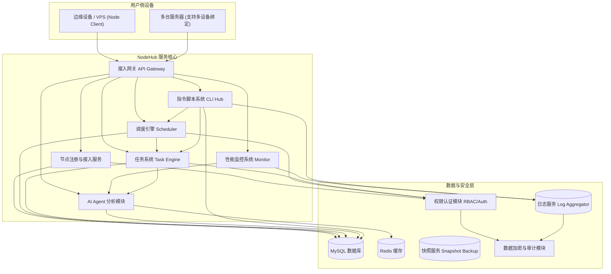

# NodeHub 平台漏洞与事故应急预案方案（V1.0）

### 一、前言

NodeHub 是 Node-X 平台旗下的去中心化算力管理与节点协作平台，聚焦于全球闲置边缘算力的聚合与智能调度。为了保障平台运行稳定性与用户权益，在面对安全漏洞、平台故障或运维事故等突发事件时，制定以下应急响应预案。

***

### 二、平台整体架构概览

### 三、适用范围

本预案适用于以下场景：

* **平台安全漏洞**：代码缺陷、访问控制错误、数据泄露等
* **服务不可用**：API 网关崩溃、调度引擎异常、脚本执行中断等
* **节点异常波动**：大规模节点离线、同步失败、资源突增
* **数据错误/丢失**：用户任务记录异常、配置误删除、脚本版本冲突等

### 四、应急组织结构

| 小组        | 主要职责                |
| --------- | ------------------- |
| **应急指挥组** | 制定响应策略，负责最终发布、用户公告  |
| **技术排查组** | 快速定位问题、修复故障或进行回滚    |
| **安全审计组** | 分析安全风险、提供证据链和复盘材料   |
| **用户支持组** | 与受影响用户保持联系、提供进度反馈   |
| **恢复验证组** | 回归测试与验证修复效果，确保平台稳定性 |

### 五、事件响应流程

#### 1. 事件发现

* 由以下方式触发应急响应流程：
  * 平台系统监控异常（CPU、内存、节点数、响应时间等）
  * 用户反馈或社区汇报
  * AI Agent 检测出资源异常或潜在攻击模型
  * 日志系统触发关键告警

#### 2. 初步响应

* 技术排查组启动快速隔离策略：
  * 临时下线异常节点或接口
  * 暂停任务调度链路
  * 数据快照备份（数据库、Redis、任务状态）
* 安全组初步分析异常日志，记录操作轨迹

#### 3. 事件分级处理（灵活响应）

| 级别     | 描述                    | 示例                 |
| ------ | --------------------- | ------------------ |
| **P0** | 核心系统瘫痪、数据严重泄露、大量用户受影响 | 调度系统宕机、任务丢失、敏感信息暴露 |
| **P1** | 关键功能故障，部分用户可操作受限      | 脚本执行失败、节点离线大面积增加   |
| **P2** | 非核心模块异常或体验影响          | 报表出错、监控指标延迟、界面卡顿   |

***

### 六、技术处置方案

#### 1. 安全类事件（漏洞、攻击）

* 临时封禁受影响模块
* 审计访问日志，排查攻击路径与影响范围
* 限权 + 快速热修复 / 回滚
* 发布安全补丁并进行二次复核

#### 2. 系统/服务宕机

* 启动服务冗余（备用网关、热备服务）
* 降级处理：保留任务控制、暂停非必要数据分析模块
* 脚本系统恢复节点状态，AI Agent 推送恢复建议

#### 3. 数据丢失或任务异常

* 启用快照还原（支持分钟级恢复）
* 审核任务执行轨迹，排查误删除或多次执行
* 重建调度任务链条，保障任务可恢复性

***

### 七、用户通知机制

* 控制台顶部横幅实时显示系统状态
* 邮件 + 站内消息 + Telegram/Discord 等渠道推送异常说明
* 内容包含：
  * 事件类型与当前状态
  * 影响范围与用户操作建议
  * 恢复预期与补偿机制说明（如有）

***

### 八、修复与复盘

#### 修复后流程：

* 全平台灰度恢复
* 所有模块回归测试、节点状态核验
* 修复日志归档、复盘会议总结

#### 复盘重点内容：

* 问题起因、传播链条
* 响应速度与决策分析
* 未来优化方向（自动化、弹性设计等）
* 是否需要进行“脚本系统”、“权限模型”等架构优化建议

***

### 九、演练与优化机制

* 定期组织实战应急演练
* 每次事件纳入事件档案库，形成标准化操作手册（SOP）
* 引入更多 AI Agent 辅助诊断能力
* 强化服务隔离设计，减少跨模块依赖
