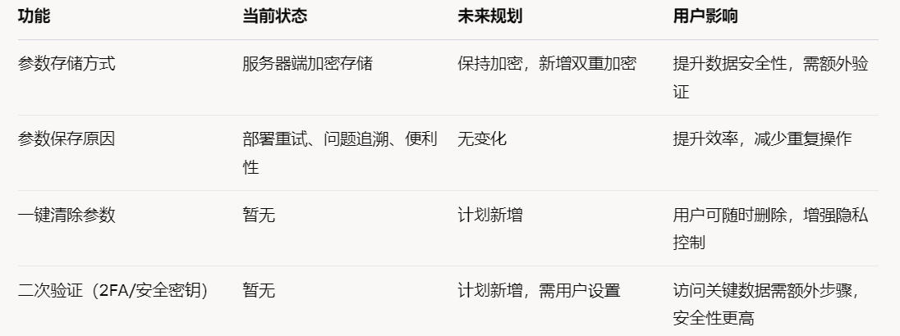

# NodeHub 四要素說明

***

**先驗證，再發放：「真設備 → 真算力 → 真收益」的可信閉環**\
**四要素：ProofX｜MID｜RP｜AP**

<figure><figcaption></figcaption></figure>

***

### **1) ProofX（設備驗真）**

**它是什麼：**\
確認接入的是「真實設備且能力達標」的驗證機制。

**解決什麼：**\
杜絕偽造配置。

**如何通過：**\
客戶端自動檢測硬體指紋、環境可信度、基準跑分一致性；通過後才能進入下一步。

**你能看到：**\
控制台顯示「ProofX：已通過 / 未通過」。

***

### **2) MID（Machine ID，設備唯一身份）**

**它是什麼：**\
ProofX 通過後簽發的「一機一號」身份碼，是設備在網路中的「身分證」。

**解決什麼：**\
讓「這台設備」與後續計分、結算、風控唯一綁定、可追溯。

**規則：**\
不可轉讓、不可複製；異常會降權或凍結。

**你能看到：**\
控制台顯示 MID 編號。

***

### **3) RP（Resource Points，設備側貢獻分）**

**它是什麼：**\
衡量設備長期貢獻度的積分（看「資源」）。

**從哪裡來：**\
設備擁有 MID、保持穩定在線、表現達標後按日累積。

**計分要點：**

* 多維加權：CPU 25%｜GPU 35%｜RAM 12%｜ROM 13%｜NET 15%
* 指標標準化／封頂，避免極端配置「一機獨大」
* 在線率、穩定性、異常狀況直接影響 RP
* 每日釋放上限＋半年減半機制，控制通膨、提升稀缺性

**你能看到：**\
今日／累計 RP。

***

### **4) AP（Action Points，帳號側參與分）**

**它是什麼：**\
衡量帳號「活躍度與參與行為」的積分（看「行為」）。

**從哪裡來：**\
學習答題、治理投票、完成任務、內容共創、邀請等等。

**作用：**\
鼓勵「人」的持續參與；即使沒有設備也能先累積 AP。

**你能看到：**\
今日／本週 AP。

***

## **標準使用流程（3 步）**

1. **接入設備 → 系統檢測**
2. **通過 ProofX → 簽發 MID（一機一號）**
3. **設備累計 RP（保持在線、穩定運行）｜帳號累計 AP（做任務、治理參與）**

**記憶法：**\
過邊檢（ProofX）→ 領工牌（MID）→ 機計分（RP）｜人計分（AP）

***

## **你能得到什麼**

* **有設備：**\
  通過 ProofX → 拿到 MID → 設備長期累積 RP；同時完成任務拿 AP，雙線提升貢獻。
* **沒設備：**\
  可先做任務累積 AP；之後也可在算力市場購買／租賃實例，再走 ProofX → MID → RP 流程。

***

## **常見問題（FAQ）**

**Q1：不通過驗真也能拿 MID 嗎？**\
A：不能。必須通過 ProofX 後，系統才會簽發 MID（一機一號）。

**Q2：只有帳號、沒有設備，可以拿 RP 嗎？**\
A：不能。RP 只看設備，且設備需通過 ProofX 並擁有 MID 才會計分。

**Q3：AP 跟算力強弱有關嗎？**\
A：無關。AP 只看帳號行為（學習、治理、任務、邀請等）。

**Q4：高配置一定 RP 會比較高嗎？**\
A：不一定。RP 有標準化與封頂，長期更看重穩定性、在線率與合規。

**Q5：是不是只有 RP 有用？**\
A：不是。RP（資源）＋ AP（行為）共同構成綜合貢獻，並會一同計入映射權重。

***

## **一句話總結**

**ProofX 驗真簽發 MID，只獎真機真貢獻；**\
**RP 看資源，AP 看行為。**\
**NodeHub：讓真算力、真參與、真回報形成可驗證的經濟閉環。**

***

