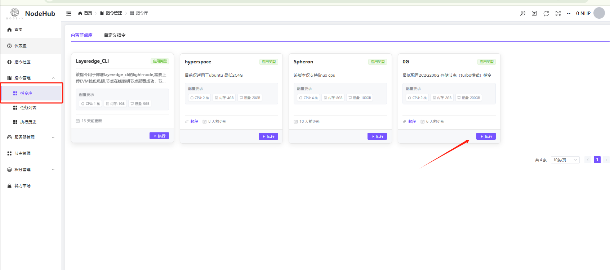
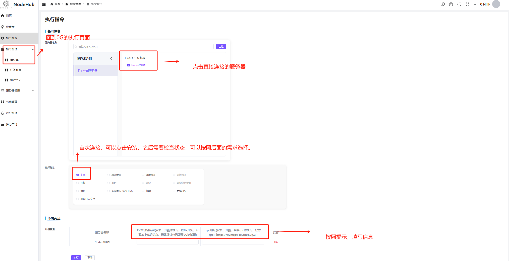
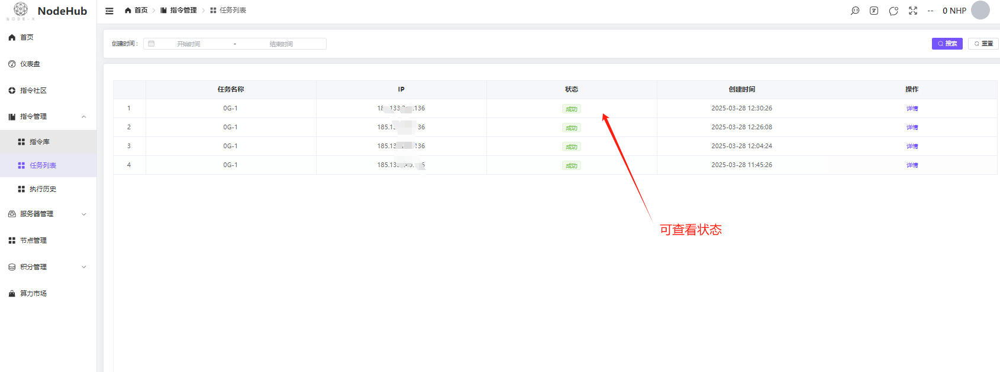
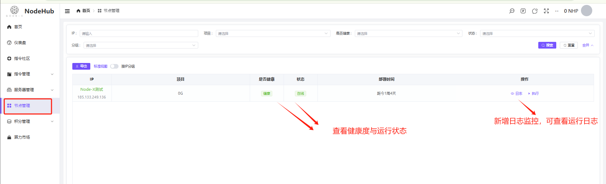

# NODEHUB 運行節點指南

<a href="https://docs.node-x.xyz/en/product-manual/nodehub/nodehub-node-operation-guide">English</a>

## &#x20;1.節點運行操作手冊

**1. 節點運行操作手冊**\
以下步驟預設您已新增伺服器，如尚未新增且有疑問，請參考 ==> [操作手冊](cao-zuo-shou-ce.md)。

首先切換至「控制台」→「指令管理」→「指令庫」，點選您想要部署的節點下方的「執行」，此處以 0G 為例，點選「執行」。

進入指令執行頁面後，請先選擇欲安裝的伺服器，接著點選「安裝」，並依提示前往獲取參數。本步驟需填寫錢包私鑰（錢包內需有代幣），以及 RPC。\
填寫完成後點選「確認」，指令將開始執行。

<figure><figcaption>
指令執行
</figcaption></figure>

<figure><figcaption>
指令運行
</figcaption></figure>

點擊「執行」後，可以點擊「指令管理」——「任務列表」查看執行情況，當執行狀態變為「成功」，則表示指令已成功運行。接著可以在「節點管理」中查看節點的狀態與健康狀況，狀態更新間隔為 20 秒。

1、若狀態長期顯示為「離線」且「不健康」：\
　　應對方法：進入「指令庫」，點擊該專案對應的指令庫，選擇出現問題的伺服器，點選「卸載」，再點擊「執行」。待卸載成功後，再次嘗試安裝。若仍未成功，請確認伺服器配置是否符合要求，並於「任務列表」中查看日誌。

2、若狀態顯示為「在線」但「不健康」：\
　　應對方法：建議先檢查錢包中的代幣是否充足，RPC 是否已達請求上限，伺服器配置是否足夠等。造成此類情況的原因較多，這裡不一一列舉。可參照上述步驟進行重裝操作。

若指令執行失敗，可重新執行；若一直失敗，則可能是所安裝的伺服器無法成功連接至 NodeHub。

<figure><figcaption>
任务列表
</figcaption></figure>

<figure><figcaption>
状态查询
</figcaption></figure>

### 2.项目面板合集

若该项目有节点面板，我们会收录到这里：

HYPERSPACE:[https://node.hyper.space/](https://node.hyper.space/)

0G:[https://chainscan-newton.0g.ai/](https://chainscan-newton.0g.ai/)

Layeredge:[https://dashboard.layeredge.io/](https://dashboard.layeredge.io/)

### 3. 总结

通过以上功能，NODEHUB 可以帮助您：

1. 统一管理多台服务器并对其分组，提升运维效率。
2. 快速编写并执行指令，查看执行结果与历史记录。
3. 分享指令到社区，获取其他用户的反馈与交流。
4. 监控节点状态及系统整体性能，及时进行优化与维护。

文档还未完善，后面会进行补充，如有任何疑问或遇到技术问题，建议在社区内进行提问或联系 NODEHUB 官方支持团队获取帮助。

***

**感谢使用 NODEHUB，祝您使用愉快！**
