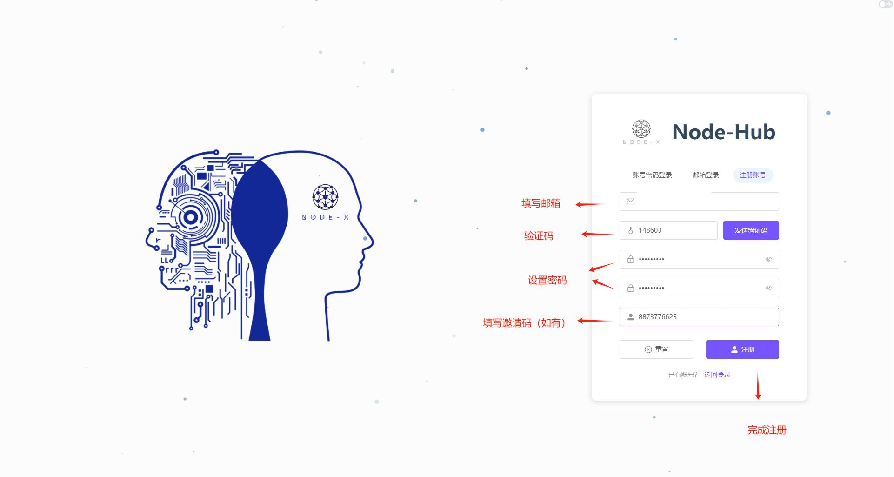
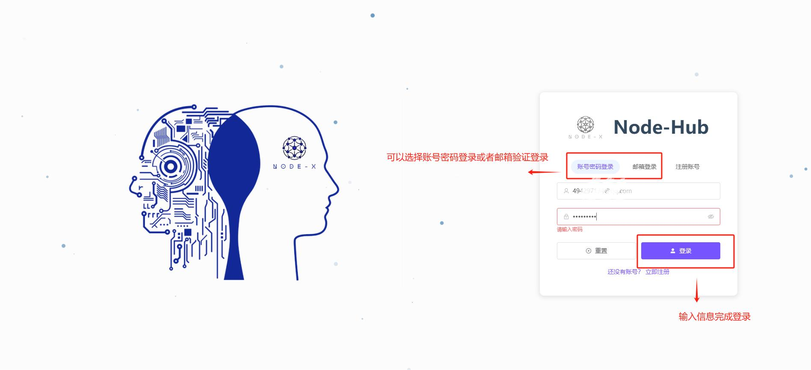
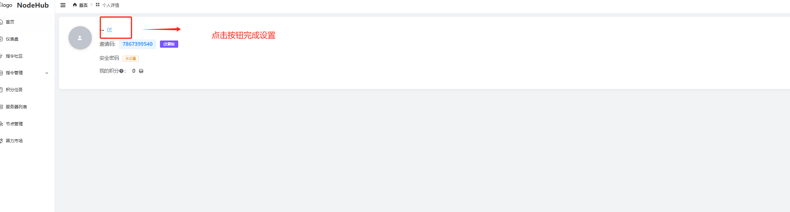
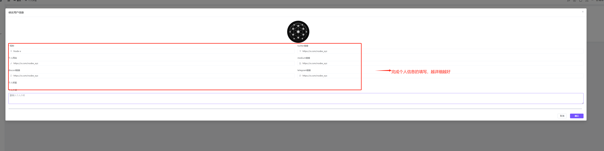
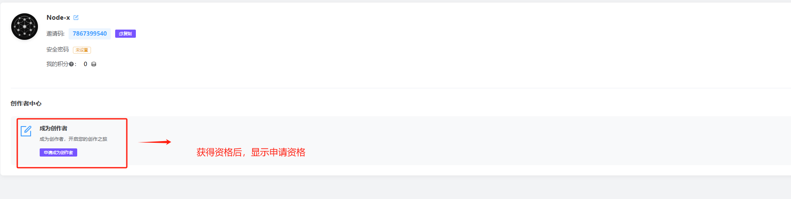
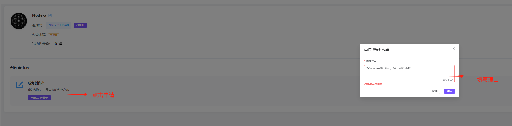
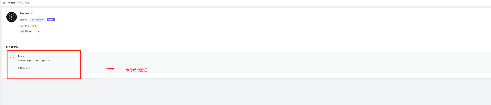
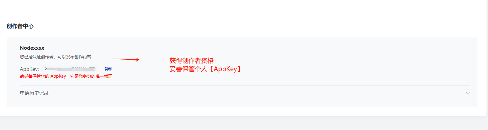

# NodeHub 指令創作者指南

獲得 NodeHub 簡介

NodeHub 是一个去中心化算力平台，致力于打造全球开发者与创作者共建的节点指令生态。通过发布、分享高质量的节点部署与运维脚本，你不仅将成为 Web3 基础设施的建设者，也将获得平台激励与流量支持。

***

一、**誰可以成為 NodeHub 創作者？**

我們歡迎以下熱愛技術、有經驗的朋友加入 NodeHub 社區，共同推動去中心化技術的發展：

* **節點玩家**：有部署節點經驗，了解運行邏輯，擅長總結部署流程與優化技巧。
* **腳本高手**：擅長編寫命令行指令、部署腳本及自動化流程，提升效率和可靠性。
* **自動化工具開發者**：具備 DevOps 實踐經驗，開發過部署／運維工具腳本。
* **Web3 工程師**：有多鏈節點部署經驗，熟悉各鏈特性，可優化相關文檔或腳本。

***

二、**NodeHub 創作者能做什麼？**

作為創作者，你將為 Web3 節點生態持續貢獻實用內容，支持全球用戶：

* 發布節點部署腳本（安裝、初始化、啟動）
* 編寫輔助運維指令（健康檢查、狀態查詢、日誌查看等）
* 維護與優化現有指令（補充功能、提升可配置性、重構變量結構等）

***

**三、平台支持與激勵機制**

NodeHub 將為創作者提供以下資源與回報：

* **平台收益分成**：按用戶調用量分成，實現持續被動收入。
* **官方流量推薦**：優質腳本將獲得首頁推薦位曝光。
* **專屬創作者頻道**：加入核心創作者群，獲取一手信息與合作機會。
* **空投激勵優先權**：積分系統建設中，未來空投優先分配給高活躍度創作者。
* **腳本私有保護機制**：默認私有供調用，防止被複製，保障創作價值。

***

**四、發布者內容要求**

#### 腳本編寫規範（簡潔版）

1. **通用規範**

* 語言要求：使用 Bash/Shell 或指定語言，推薦 Bash。
* 邏輯清晰：功能明確，結構嚴謹，避免冗餘。
* 註解清楚：關鍵邏輯需註解，變量命名規範、易讀。
* 參數化支持：支持通過參數或配置文件適配環境。
* 合規要求：不得包含敏感信息，需註明項目來源及用途。

2. **指令分類規範**

* **自定義類（非持續執行）**
  * 場景：獲取公鑰、註冊等一次性交互操作；
  * 要求：無需卸載、狀態／健康檢查；
  * 註明：項目名、類型、用途。
  * ✅ 示例：獲取 pubkey 上傳官方註冊。
* **持續運行類（服務／節點類）**
  * 場景：節點、服務等需持續運行的任務；
  * 必須提供：
    * 卸載指令
    * 狀態檢查腳本
    * 健康檢查腳本（結合項目標準）
    * 日誌查看腳本
  * ✅ 示例：部署區塊鏈節點或運行服務。

***

五、**建議模塊清單**

撰寫和提交腳本時，推薦包含以下模塊，提升完整性與使用體驗：

* 腳本簡介（功能說明、適用場景）
* 環境依賴（系統版本、必備組件等）
* 安裝與配置指令
* 啟動及初始化操作
* 狀態／日誌／錯誤排查命令
* 停止／重啟／卸載命令
* 變量說明與用戶可自定義配置項
* 使用建議或常見問題說明

***

六、**如何成為 NodeHub 創作者？**

無論你是技術老鳥，還是剛入門的創作者，NodeHub 都為你提供清晰的成長路徑。

**Step 1：填寫創作者申請**

* 登錄 NodeHub，完成帳號註冊
* 點擊個人信息，完成申請表的填寫
* 提供有效 GitHub 帳號
* 提供技術背景和腳本經驗

**Step 2：進入 7 天觀察期**

* 通過初審後，自動進入為期 7 天的觀察期；
* （這段時間是平台了解你，也是你了解平台的機會）
* 期間可上傳腳本、體驗平台功能，但暫不開放激勵權限。

**Step 3：選擇創作模式**

* **認證創作者（推薦）**：
  * 適合希望打造品牌、獲得激勵的創作者；
  * 需完成 KYC；
  * 腳本可選擇開源／隱藏，參與激勵計劃。
* **開源創作者（自由模式）**：
  * 適合偏好自由協作、快速發布的用戶；
  * 無需 KYC；
  * 腳本默認開源，無法參與激勵。

***

✅ 成為 NodeHub 創作者\
一旦完成選擇，你將獲得正式創作者權限：

* 可上傳腳本、獲得平台支持；
* 參與任務激勵、構建個人影響力！

註冊圖示

<figure><figcaption>
第一步 註冊帳戶
</figcaption></figure>

<figure><figcaption>
依照順序完成註冊
</figcaption></figure>

<figure><figcaption>
兩種登入方式選擇
</figcaption></figure>

<figure><figcaption>
設定個人資訊
</figcaption></figure>

<figure><figcaption>
請依照圖片指示完成操作
</figcaption></figure>

<figure><figcaption>
請輸入您的個人資訊，填寫得越詳細越好
</figcaption></figure>

<figure><figcaption>
申請資格
</figcaption></figure>

<figure><figcaption>
填寫申請理由
</figcaption></figure>

<figure><figcaption>
等待後台審核
</figcaption></figure>

<figure><figcaption>
獲得創作者資格
</figcaption></figure>
