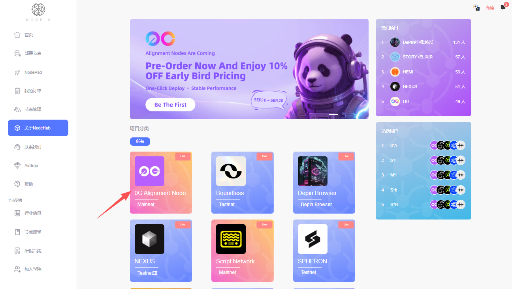
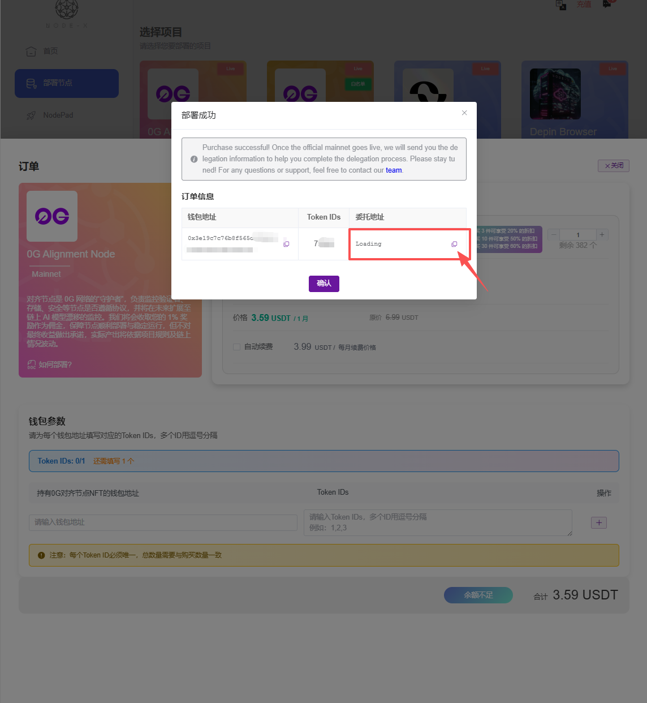
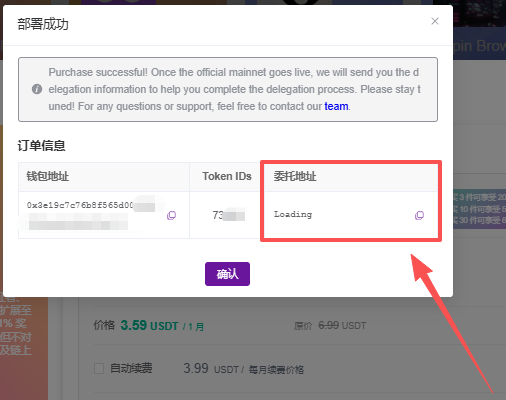

# 0G Alignment Node

&#x20;                                                                                                                                                             [English](https://docs.node-x.xyz/en/product-manual/one-click-deployment/0g-alignment-node)

## 如何通过 Node-X 平台部署 0G Alignment 节点？

#### 1. 获取 Node-X 账号及部署节点

首先，你需要一个 Node-X 账号。如果你还没有账号，请前往 [Node-X 注册页面](https://node-x.xyz) 注册。注册成功后，按照以下步骤购买并上传资源部署节点,下面举个例子：\

<figure><figcaption></figcaption></figure>

<figure><figcaption></figcaption></figure>

<figure><figcaption></figcaption></figure>

<figure><figcaption></figcaption></figure>

### 下方是0G节点所需的信息：

#### 1. 上传EVM地址以及NFT的TOKEN ID

* **购买并上传信息**：\
  需要上传EVM地址（需要钱包中含有NFT），一个NFT对应一个节点，前面填钱包地址，后面填入对应钱包中的NFT的TOKEN ID。
* **获取委托地址进行委托**\
  下单成功后，会有一个弹窗，返回您的节点信息，即对应的钱包地址、TOKEN ID 、委托地址，然后前往0G官网进行委托即可。

<figure><figcaption></figcaption></figure>

#### 3. 等待服务与查看官方面板

购买成功后，Node-X 将为你部署 0G Alignment 节点。通常情况下，这个过程会在24小时内完成。你可以通过以下方式实时查看节点状态：

1. **查看节点状态**：\
   在 Node-X 平台的用户面板中，你可以看到所有已购买的节点及其当前状态。
2. **部署成功后可以前往官方查看节点状态：**\
   前往官方，查看节点状态，节点正常在线如下图所示：\

#### 结语

通过 Node-X 平台部署 0G Alignment 节点就是这么简单！希望这篇指南对你有所帮助。

如果你有任何问题或需要进一步的指导，欢迎留言或私信我。加油！一起探索区块链的世界吧！ 🚀
