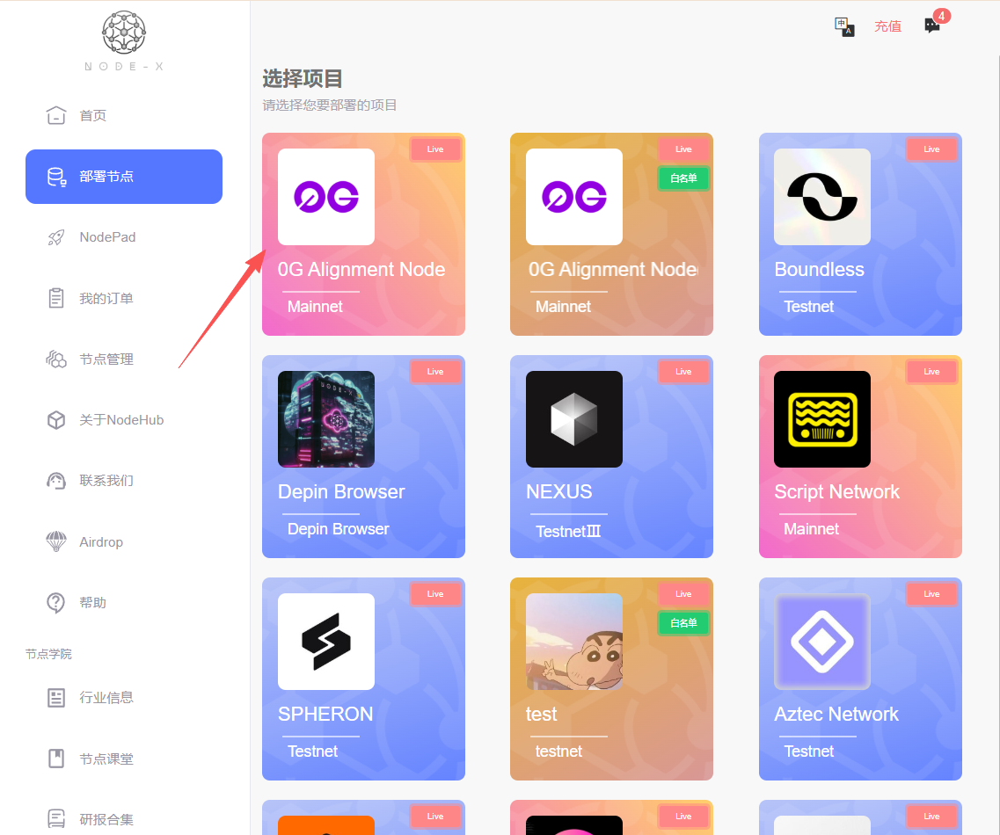

# 0G Alignment Node

<a href="https://docs.node-x.xyz/en/product-manual/one-click-deployment/0g-alignment-node">English</a>

## 如何通過 Node-X 平台部署 0G Alignment 節點？

#### 1. 獲取Node-X賬號以及部署節點

首先，你需要一個 Node-X 賬號。如果你還沒有賬號，請前往 [Node-X註冊頁面](https://node-x.xyz/) 註冊。註冊成功後，按照以下步驟購買並上傳資源部署節點,下面是下單流程：\

<figure><figcaption></figcaption></figure>

<figure><figcaption></figcaption></figure>

<figure><figcaption></figcaption></figure>

<figure><figcaption></figcaption></figure>

### 下方是部署0G節點需要上傳的參數：

#### 1. 上傳EVM地址以及NFT的TOKEN ID

* **上傳信息並購買**：\
  需要上傳EVM地址（錢包中含有NFT），一個NFT對應一個接啊定，根據提示填寫即可，后面填入对应钱包中的NFT的TOKEN IDS，若所填TOKEN IDS不是錢包中NFT TOKEN IDS,則會被標識出來
* **獲取委託地址進行委託**\
  下單成功後，會有一個彈窗，返回您的節點訊息，即對應的錢包地址、TOKEN ID 、委託地址，然後前往0G官網進行委託即可。

<figure><figcaption></figcaption></figure>

#### 3. 等待服務與查看官方面板

購買成功後，Node-X 將為你部署 0G Alignment 節點。通常情況下，這個過程會在24小時內完成。你可以透過以下方式即時查看節點狀態：

1. **查看節點狀態：**\
   在 Node-X 平台的使用者面板中，你可以看到所有已購買的節點及其目前狀態。
2. **部署成功後可以前往官方查看節點狀態：**\
   前往官方，查看節點狀態，節點正常在線如下圖所示：\

**結語**

透過 Node-X 平台部署 0G Alignment 節點就是這麼簡單！希望這篇指南對你有幫助。

如果你有任何問題或需要進一步的指導，歡迎留言或私訊我。加油！一起探索區塊鏈的世界吧！ 🚀
