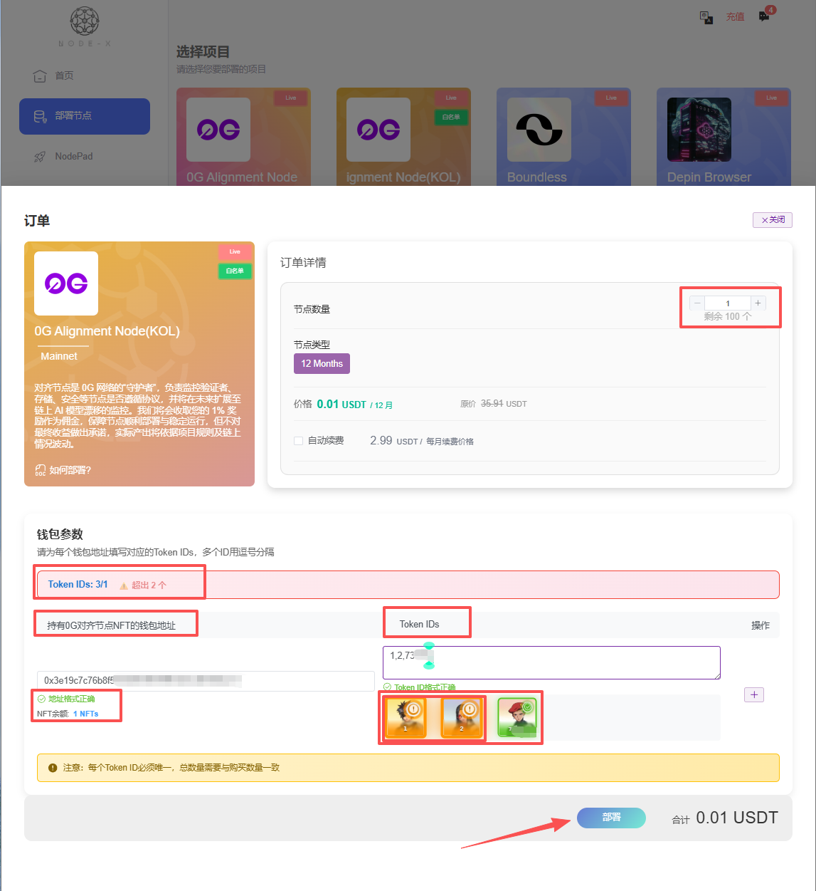

# Aztec Network

## 如何通过 Node-X 平台部署  Aztec 验证者节点？

<mark style="color:red;">**注意：Aztec 官方尚未对该节点做出激励规则，请自行判断。**</mark>

#### 1. 获取 Node-X 账号及部署节点

首先，你需要一个 Node-X 账号。如果你还没有账号，请前往 [Node-X 注册页面](https://node-x.xyz) 注册。注册成功后，按照以下步骤购买并上传资源部署节点,下面举个例子：

<figure><figcaption></figcaption></figure>

<figure><figcaption></figcaption></figure>

<figure><figcaption></figcaption></figure>

### 该项目需要上传三个参数

1、需要上传EVM钱包私钥\
该钱包中需要存有一定sepolia ETH，用于支付gas

RPC需要是否付费的RPC,免费的RPC请求次数不够。\
可以前往[znkr](https://www.ankr.com/)获取ETH sepolia Beacon 和 ETH sepolia两个链的RPC。

双方配合完成注册\
节点部署并完成区块同步之后，需要前往[Aztec DC](https://discord.com/invite/aztec)进行注册。部署完成后，我们返回给您节点部署的服务器IP并配合钱包地址\

<figure><figcaption></figcaption></figure>

进入Aztec的DC后，找到[#upgrade-role](https://discord.gg/aztec)频道，在频道中可以输入/checkip,会让您填入相应的数据。填入并发送即可。

#### 2. 等待服务与查看官方面板

购买成功后，Node-X 将为你部署Aztec 全节点。通常情况下，这个过程会在24小时内完成。你可以通过以下方式实时查看节点状态：

1. **查看节点状态**：\
   在 Node-X 平台的用户面板中，你可以看到所有已购买的节点及其当前状态。

#### 结语

通过 Node-X 平台部署Aztec 全节点就是这么简单！希望这篇指南对你有所帮助。

如果你有任何问题或需要进一步的指导，欢迎留言或私信我。加油！一起探索区块链的世界吧！ 🚀
