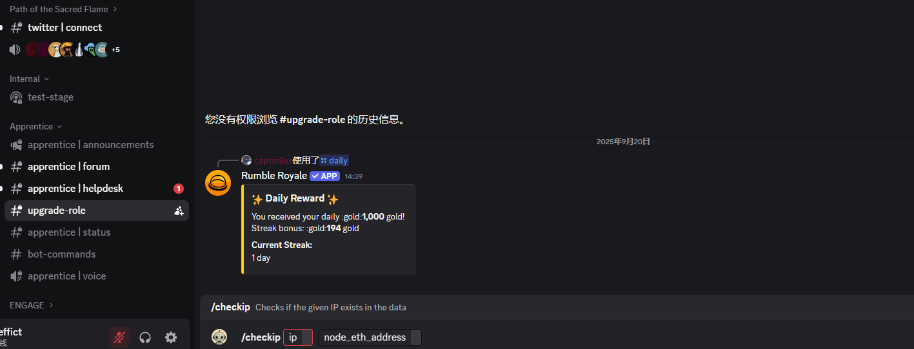

# Aztec Network

<a href="https://docs.node-x.xyz/en/product-manual/one-click-deployment/aztec-network">English</a>

## 如何通過 Node-X 平台部署  Aztec 驗證者節點？

<mark style="color:red;">**注意：Aztec 官方對該節點做出激勵規則，請自行判斷。**</mark>

#### 1. 獲取 Node-X 賬號及部署節點

首先，你需要一個Node-X 賬號。如果你還沒有賬號，請前往 [Node-X 註冊頁面](https://node-x.xyz/)。註冊成功後，按照以下步驟購買並填寫資源信息部署節點,下面以0G Alignment node舉個例子：

<figure><figcaption></figcaption></figure>

<figure><figcaption></figcaption></figure>

<figure><figcaption></figcaption></figure>

### 填寫参数

1、需要填寫EVM錢包私鑰\
此錢包中需要存有一定sepolia ETH，用於支付gas

RPC需要是否付費的RPC,免費的RPC請求次數不夠。\
可以前往[znkr](https://www.ankr.com/)獲取ETH sepolia Beacon 和 ETH sepolia兩個鏈的RPC。

雙方配合完成註冊\
節點部署並完成區塊同步後，需要前往[Aztec DC](https://discord.com/invite/aztec)進行註冊。部署完成後，我們返回給您節點部署的伺服器IP並配合錢包位址

<figure><figcaption></figcaption></figure>

進入Aztec的DC後，找到[#upgrade-role](https://discord.gg/aztec)頻道，在頻道中可以輸入/checkip,會讓您填入對應的資料。填入並發送即可。

#### 2. 等待服務與查看官方面板

購買成功後，Node-X 將為你部署Aztec 全節點。通常情況下，這個過程會在24小時內完成。你可以透過以下方式即時查看節點狀態：

1. 檢視節點狀態：\
   在 Node-X 平台的使用者面板中，你可以看到所有已購買的節點及其目前狀態。

## **結語**

透過 Node-X 平台部署Aztec 全節點就是這麼簡單！希望這篇指南對你有幫助。

如果你有任何問題或需要進一步的指導，歡迎留言或私訊我。加油！一起探索區塊鏈的世界吧！ 🚀
