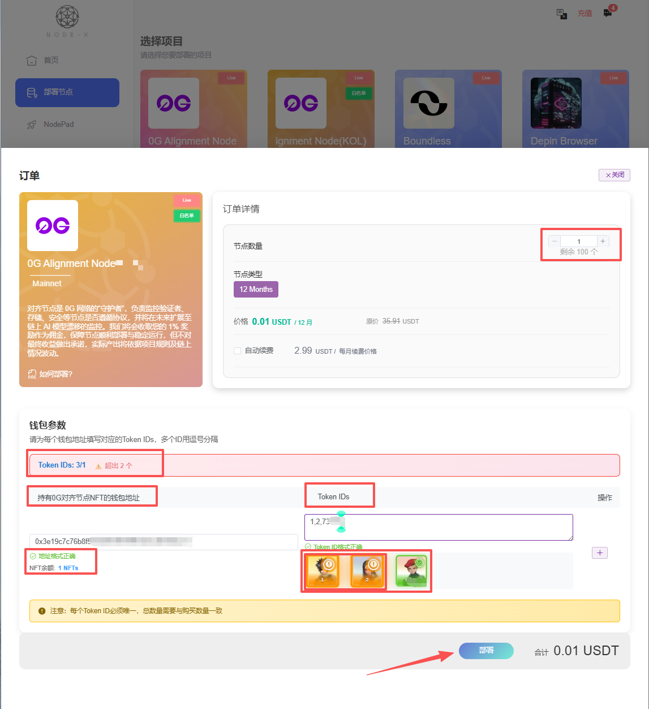

# Boundless Network

## 如何通過 Node-X 平台部署  Boundless-Prover 節點？

<mark style="color:red;">註：不保證能搶到訂單，一切以官方為準。</mark>

#### 1. 獲取 Node-X 帳號及部署節點

首先，你需要一個 Node-X 帳號。如果你還沒有帳號，請前往 [Node-X 註冊頁面](https://node-x.xyz/#/home) 註冊。註冊成功後，請按照以下步驟購買並上傳資源部署節點,下面舉個例子：

<figure><figcaption></figcaption></figure>

<figure><figcaption></figcaption></figure>

<figure><figcaption></figcaption></figure>

<figure><figcaption></figcaption></figure>

### 2、填寫參數

1）EVM錢包私鑰：EVM錢包中需要選擇eth-sepolia、base-mainnet、base-sepolia三條鏈中的一條，然後需要在選擇的鏈上有一定的ETH（預設存入0.0001ETH）和至少6個USDC，當然也可以存入更多,目前官方推base主網，所以建議在錢包中base主網存入至少6USDC。

#### 3. 等待服務與查看官方面板

購買成功後，Node-X 將為你部署 Boundless-prover 節點。通常情況下，這個過程會在24小時內完成。你可以透過以下方式即時查看節點狀態：

1. **檢視節點狀態**：\
   在 Node-X 平台的使用者面板中，你可以看到所有已購買的節點及其目前狀態。

## 結語

透過 Node-X 平台部署 Boundless-prover節點就是這麼簡單！希望這篇指南對你有幫助。\
如果你有任何問題或需要進一步的指導，歡迎留言或私訊我。加油！一起探索區塊鏈的世界吧！ 🚀
