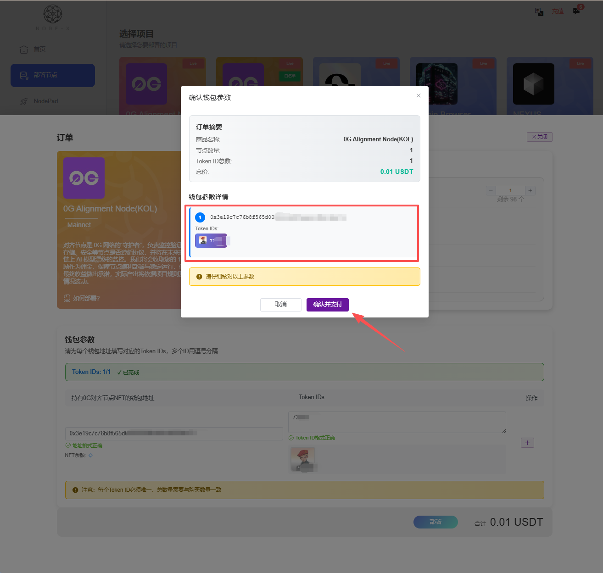

# Boundless Network

## 如何通過 Node-X 平台部署  Boundless-Prover 節點？

<mark style="color:red;">註：不保證能搶到訂單，一切以官方為準。</mark>

#### 1. 獲取 Node-X 帳號及部署節點

首先，你需要一個 Node-X 帳號。如果你還沒有帳號，請前往 [Node-X 註冊頁面](https://node-x.xyz/#/home) 註冊。註冊成功後，請按照以下步驟購買並上傳資源部署節點,下面舉個例子：

<figure><figcaption></figcaption></figure>

<figure><figcaption></figcaption></figure>

<figure><figcaption></figcaption></figure>

<figure><figcaption></figcaption></figure>

### 2、填寫參數

1）EVM钱包私钥：EVM钱包中需要选择eth-sepolia、base-mainnet、base-sepolia三条链中的一条，然后需要在选择的链上有一定的ETH（默认存入0.0001ETH）和至少6个USDC，当然也可以存入更多,目前官方主推base主网，所以建议在钱包中base主网存入至少6USDC。

#### 3. 等待服务与查看官方面板

购买成功后，Node-X 将为你部署 Boundless-prover 节点。通常情况下，这个过程会在24小时内完成。你可以通过以下方式实时查看节点状态：

1. **查看节点状态**：\
   在 Node-X 平台的用户面板中，你可以看到所有已购买的节点及其当前状态。

#### 结语

通过 Node-X 平台部署 Boundless-prover节点就是这么简单！希望这篇指南对你有所帮助。

如果你有任何问题或需要进一步的指导，欢迎留言或私信我。加油！一起探索区块链的世界吧！ 🚀
