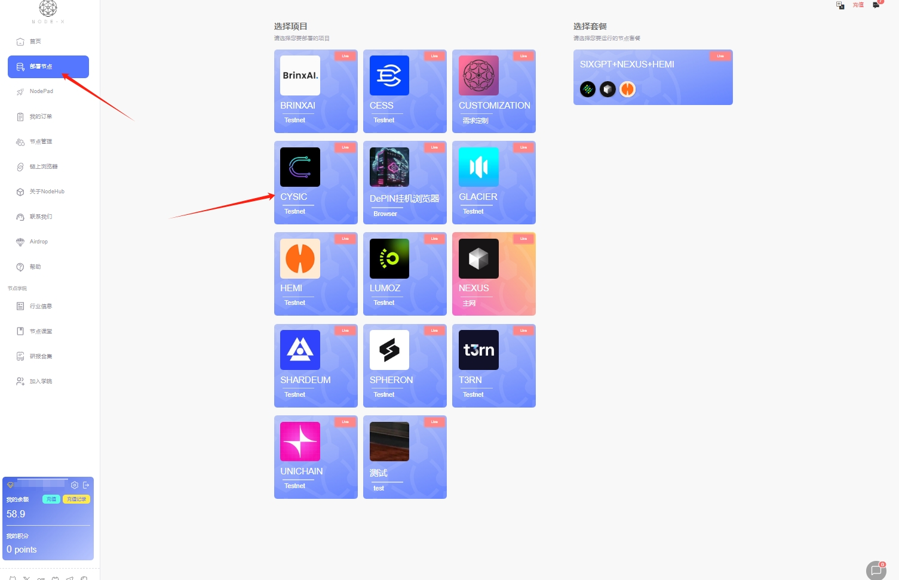

# Boundless Network

## 如何通过 Node-X 平台部署  Boundless-Prover 节点？

<mark style="color:red;">注：不保证能抢到订单，一切以官方为准。</mark>

#### 1. 获取 Node-X 账号及部署节点

首先，你需要一个 Node-X 账号。如果你还没有账号，请前往 [Node-X 注册页面](https://node-x.xyz) 注册。注册成功后，按照以下步骤购买并上传资源部署节点,下面举个例子：

<figure><figcaption>
选择需要部署的项目
</figcaption></figure>

<figure><figcaption>
点击部署
</figcaption></figure>

<figure><figcaption>
确认支付
</figcaption></figure>

<figure><figcaption>
点击上传信息
</figcaption></figure>

<figure><figcaption>
点击“添加”，上传对应的信息
</figcaption></figure>

### 2、所需上传参数

1）EVM钱包私钥：EVM钱包中需要选择eth-sepolia、base-mainnet、base-sepolia三条链中的一条，然后需要在选择的链上有一定的ETH（默认存入0.0001ETH）和至少6个USDC，当然也可以存入更多,目前官方主推base主网，所以建议在钱包中base主网存入至少6USDC。

#### 3. 等待服务与查看官方面板

购买成功后，Node-X 将为你部署 Boundless-prover 节点。通常情况下，这个过程会在24小时内完成。你可以通过以下方式实时查看节点状态：

1. **查看节点状态**：\
   在 Node-X 平台的用户面板中，你可以看到所有已购买的节点及其当前状态。

#### 结语

通过 Node-X 平台部署 Boundless-prover节点就是这么简单！希望这篇指南对你有所帮助。

如果你有任何问题或需要进一步的指导，欢迎留言或私信我。加油！一起探索区块链的世界吧！ 🚀
