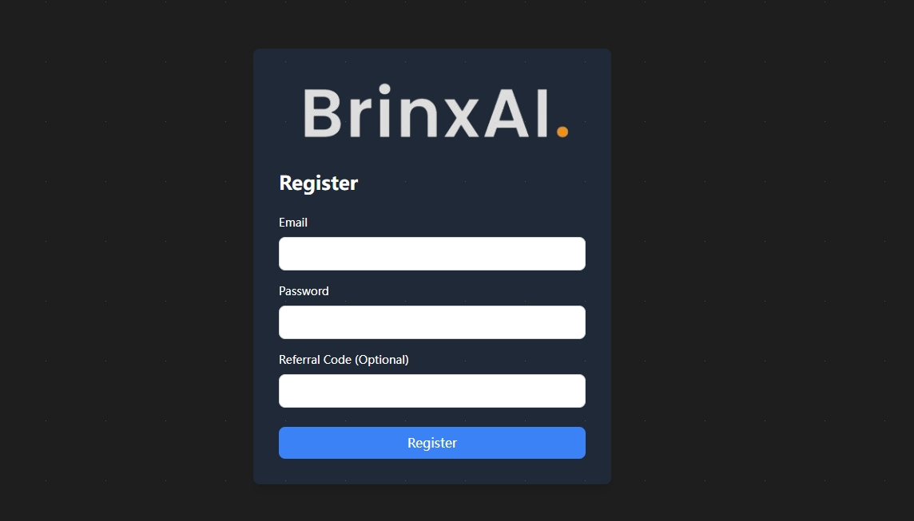
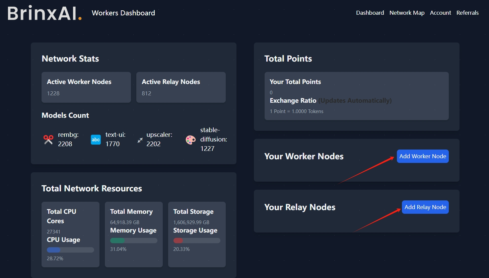
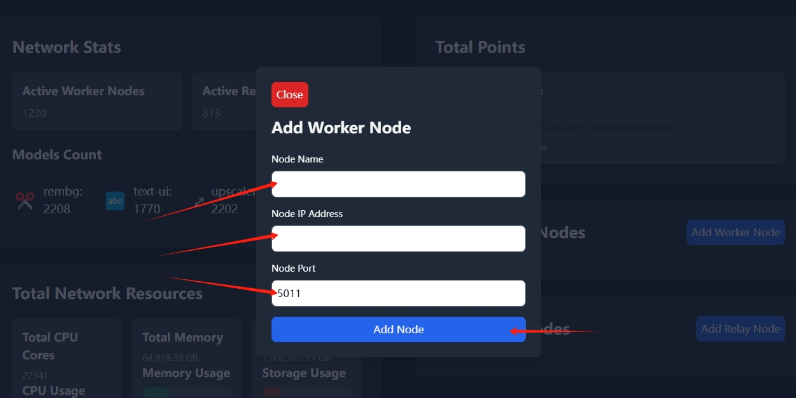
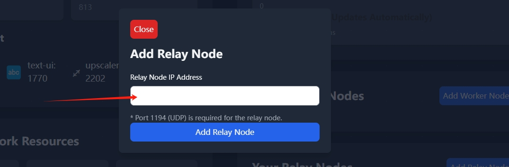
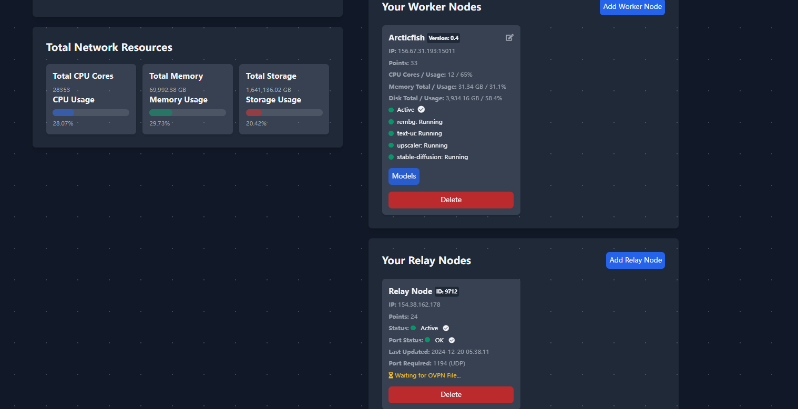

# BrinxAI

## 如何通过 Node-X 平台部署  BrinxAI 节点？

#### 1. 获取 Node-X 账号及部署节点

首先，你需要一个 Node-X 账号。如果你还没有账号，请前往 [Node-X 注册页面](https://node-x.xyz) 注册。注册成功后，按照以下步骤购买并上传资源部署节点,下面举个例子：

<figure><figcaption>
选择需要部署的项目
</figcaption></figure>

<figure><figcaption>
点击部署
</figcaption></figure>

<figure><figcaption>
确认支付
</figcaption></figure>

<figure><figcaption>
点击上传信息
</figcaption></figure>

<figure><figcaption>
点击“添加”，上传对应的信息
</figcaption></figure>

### 下方是BrinxAI节点所需的信息：

1、**完成添加节点操作**

购买成功后，Node-X 将为你部署 BrinxAI节点。通常情况下，这个过程会在24小时内完成。运行成功后，我们会提供服务器ip以及端口，您就可以[前往官网](https://workers.brinxai.com/login.php)注册用户并添加节点。

<figure><figcaption>
根据提示进行注册和登录
</figcaption></figure>

<figure><figcaption>
根据自己的订单选择添加节点
</figcaption></figure>

<figure><figcaption>
设置工作节点名称和输入IP以及端口，点击添加节点
</figcaption></figure>

<figure><figcaption>
输入IP,点击添加中继节点
</figcaption></figure>

<figure><figcaption>
正常运行就是这样的
</figcaption></figure>

通过 Node-X 平台部署BrinxAI节点就是这么简单！希望这篇指南对你有所帮助。

如果你有任何问题或需要进一步的指导，欢迎留言或私信我。加油！一起探索区块链的世界吧！ 🚀
