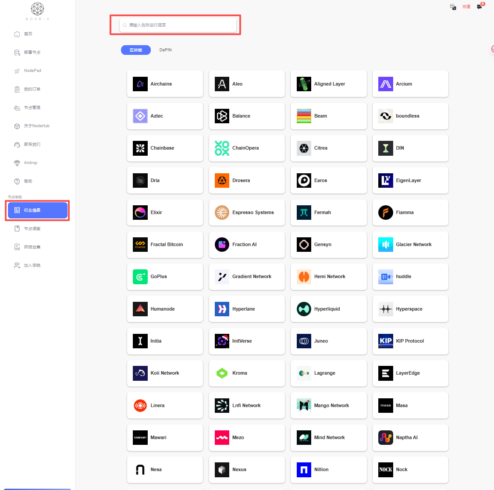

# 操作手册

English

## Naas一鍵部署操作手冊

### 1.概述

本操作手冊將引導您從登入、註冊，到充值、通知、了解項目、下單，再到訂單管理與節點管理，協助您快速上手並熟練使用 Naas 平台。

***

### 2.登入與註冊

#### 2.1 登入連結

* 登入網址：[https://node-x.xyz/](https://node-x.xyz/)

#### 2.2 登入流程

**Naas 僅支援郵箱的登入方式：**

信箱登入
\
使用已註冊的電子信箱地址獲取驗證碼進行登入。

#### 2.3 註冊流程

**註冊方式：透過電子信箱註冊帳號**

**註冊步驟：**

* 輸入有效的電子信箱地址，獲取驗證碼。
* 註冊成功後，系統會發送一封確認郵件至您的信箱。
* 註冊成功後，同樣通過電子郵箱獲取驗證碼的方式登錄
* 若有邀請碼，使用有效邀請碼，可以享受首充優惠。


示例页面


<figure><figcaption></figcaption></figure>

<figure><figcaption></figcaption></figure>

<figure><figcaption></figcaption></figure>

***

### 3.充值

進入Naas後點擊充值，可以進行充值以及查看充值記錄

#### 3.1. 充值

點擊充值，選擇充值的幣種與網絡，然後點擊充值並確認支付，隨後會跳轉到支付界面，可以直接掃碼支付也可以連接錢包後支付


示例頁面


<figure><figcaption></figcaption></figure>

<figure><figcaption></figcaption></figure>

<figure><figcaption></figcaption></figure>

#### 3.2. 查看充值記錄

點擊充值記錄，查看充值記錄。


示例頁面


<figure><figcaption></figcaption></figure>

***

### 4.通知與站內信

站內信是用戶與我們溝通的重要通道，用於處理用戶訂單的各種問題。

當然還可以通過DC開票或其他方式聯繫我們


示例頁面


<figure><figcaption></figcaption></figure>

<figure><figcaption></figcaption></figure>

***

### 5.行業信息

用戶下單前可以先到行業信息中搜索相關信息，這是我們搜集的對於您感興趣的項目的官方信息。


示例頁面


<figure><figcaption></figcaption></figure>

<figure><figcaption></figcaption></figure>

***

### 6.下單

點擊選擇的項目後，選擇節點，選擇運行時長，然後選擇是否自動續費，再點擊部署並確認，確認後節點會在下單後24小時內完成部署，根據項目的不同，可能需要上傳參數，可能需要用戶與我們配合部署，每個項目都有具體的文檔說明。


示例頁面


<figure><figcaption></figcaption></figure>

<figure><figcaption></figcaption></figure>

<figure><figcaption></figcaption></figure>

***

### 7.訂單管理與節點管理

訂單管理用於管理訂單（包括但不限於節點），包括查看訂單狀態、查看訂單部署進度，補差價

節點管理用於查看您委託部署的節點狀態


示例頁面


<figure><figcaption></figcaption></figure>

<figure><figcaption></figcaption></figure>

***

### 8.總結

通過上述功能，Naas可以協助您：

* 快速下單與部署，隨時查看訂單狀態與進度；
* 獲取即時通知，及時處理訂單問題與客戶反饋；
* 方便查閱行業信息，幫助您做出明智的投資決策；
* 多種充值選擇，簡化資金流動與管理流程；
* 提高操作靈活性，快速適應市場變化與需求。

如有任何疑問或遇到技術問題，建議您在社群中發問，或聯繫 Node-x 官方支援團隊以獲得協助。

***
