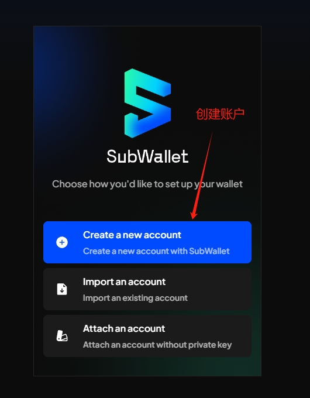

# CESS

查看节点如何通过 Node-X 平台部署 CESS 节点？

#### 1. 获取 Node-X 账号及部署节点

首先，你需要一个 Node-X 账号。如果你还没有账号，请前往 [Node-X 注册页面](https://node-x.xyz) 注册。注册成功后，按照以下步骤购买并上传资源部署节点,下面举个例子：

<figure><figcaption>
选择需要部署的项目
</figcaption></figure>

<figure><figcaption>
点击部署
</figcaption></figure>

<figure><figcaption>
确认支付
</figcaption></figure>

<figure><figcaption>
点击上传信息
</figcaption></figure>

<figure><figcaption>
点击“添加”，上传对应的信息
</figcaption></figure>

### 下方是CESS-**Storage**节点所需的信息：

#### 1. 在浏览器中添加[SubWallet - Polkadot](https://chromewebstore.google.com/search/SubWallet%20-%20Polkadot%20Wallet?hl=zh-CN\&utm_source=ext_sidebar) Wallet扩展程序并创建钱包

**建议创建两个钱包：**

**一个作为领取奖励的钱包地址；**

**一个质押钱包**；

<figure><figcaption>
步骤1
</figcaption></figure> <figure><figcaption>
步骤2
</figcaption></figure> <figure><figcaption>
步骤3
</figcaption></figure> <figure><figcaption>
步骤4
</figcaption></figure>

#### 2.完成质押并提供质押账户的助记词

在购买资源后，你需要提供1个以cX开头的领取奖励的钱包地址和1个质押钱包的助记词（保证里面有余额）：

1. **领水**：\
   下单用户可直接到Node-X的TG(t.me/nodex527)免费领取4100CESS。
2. **质押**\
   [前往质押](https://cess.network/light-wallet/)，连接钱包后为质押账户质押**4000CESS。**

**注：在官网的连接质押账户钱包，查看余额，确保质押的账户余额超过4000个测试币。**

<figure><figcaption>
staking1
</figcaption></figure> <figure><figcaption>
staking2
</figcaption></figure>

#### 3. 等待服务与查看官方面板

上传成功后，Node-X 将为你部署 **CESS Storage**节点。通常情况下，这个过程会在24小时内完成。你可以通过以下方式实时查看节点状态：

1. **查看节点状态**：\
   在 Node-X 平台的用户面板中，你可以看到所有已购买的节点及其当前状态。
2. **项目方面板查看**：\
   节点配置完成后，可以通过[官方面板](https://scan.cess.network/storage) **你提供的质押账户钱包地址** 查询节点状态，更新有延迟。

<figure><figcaption>
查看节点状态
</figcaption></figure>

<figure><figcaption>
节点状态
</figcaption></figure>

<figure><figcaption>
节点奖励，部署成功大概一周就会有奖励
</figcaption></figure>

#### 结语

通过 Node-X 平台部署 CESS节点就是这么简单！希望这篇指南对你有所帮助。

如果你有任何问题或需要进一步的指导，欢迎留言或私信我。加油！一起探索区块链的世界吧！ 🚀
