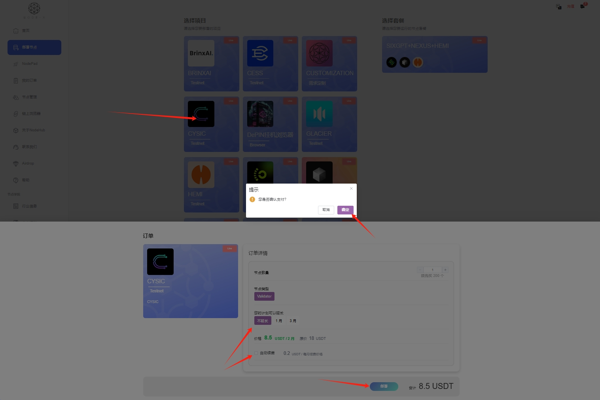
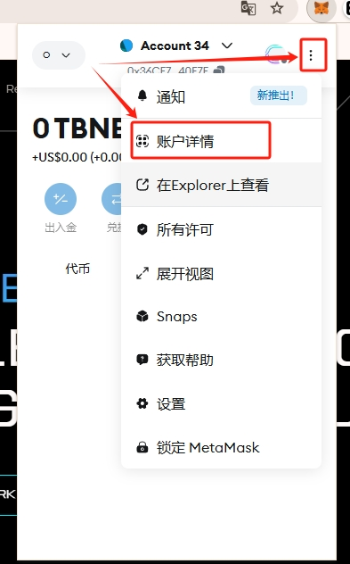
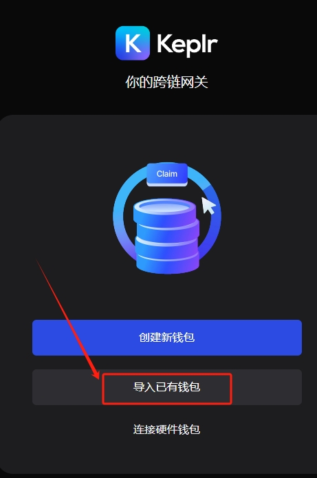

# Cysic

## 如何通过 Node-X 平台部署  Cysic 节点？

<mark style="color:red;">**特别注意：提交的钱包地址必须完成注册且不能是之前已经在服务器上运行过的，否则运行不了！！！**</mark>

#### 1. 获取 Node-X 账号及部署节点

首先，你需要一个 Node-X 账号。如果你还没有账号，请前往 [Node-X 注册页面](https://node-x.xyz) 注册。注册成功后，按照以下步骤购买并上传资源部署节点,下面举个例子：

<figure><figcaption>
选择需要部署的项目
</figcaption></figure>

<figure><figcaption>
点击部署
</figcaption></figure>

<figure><figcaption>
确认支付
</figcaption></figure>

<figure><figcaption>
点击上传信息
</figcaption></figure>

<figure><figcaption>
点击“添加”，上传对应的信息
</figcaption></figure>

### 下方是Cysic节点所需的信息：

1、完成注册领水后提供**EVM钱包（如：小狐狸）地址。**

在购买资源后，你需要提供1个 **EVM** 钱包地址：

首先打开钱包（这里以小狐狸为例），从中拿到你用来跑验证者的钱包地址的私钥，然后将这个私钥导入Keplr钱包中，注册为CYSIC需要连接这两个钱包，如下图：

<figure><figcaption></figcaption></figure> <figure><figcaption></figcaption></figure> <figure><figcaption></figcaption></figure> <figure><figcaption></figcaption></figure> <figure><figcaption></figcaption></figure>

<figure><figcaption></figcaption></figure> <figure><figcaption>
添加钱包
</figcaption></figure> <figure><figcaption>
导入已有钱包
</figcaption></figure> <figure><figcaption>
选择私钥导入
</figcaption></figure>

<figure><figcaption>
输入获取的私钥
</figcaption></figure> <figure><figcaption>
备注钱包
</figcaption></figure> <figure><figcaption>
选择网络
</figcaption></figure> <figure><figcaption>
完成！！
</figcaption></figure>

[进入网站](https://cysic.xyz/)，然后根据下方步骤完成注册并领水。

邀请码只有白名单用户才拥有，若你没有邀请，可以前往TG(t.me/nodex527)联系我们

<figure><figcaption>
点击加入测试网
</figcaption></figure>

<figure><figcaption>
连接钱包
</figcaption></figure>

<figure><figcaption>
填写邀请码进行注册
</figcaption></figure>

<figure><figcaption>
根据自己的情况创建用户
</figcaption></figure>

<figure><figcaption>
创建成功
</figcaption></figure>

<figure><figcaption>
这里可以领水，每天可以领取0.5$CYS
</figcaption></figure>

领取的$CYS可在仪表盘进行交换质押，以获取更多奖励。

#### 2. 等待服务与查看官方面板

购买成功后，Node-X 将为你部署 CYSIC  Verifier节点。通常情况下，这个过程会在24小时内完成。你可以通过以下方式实时查看节点状态：

1. **查看节点状态**：\
   在 Node-X 平台的用户面板中，你可以看到所有已购买的节点及其当前状态。
2. **通过官方面板查看节点状态：**

节点配置完成后，可以通过[**官方面板**](https://testnet.cysic.xyz/m/dashboard/verifier)链接钱包 查询验证者状态，更新有延迟。

<figure><figcaption>
可以在这里查看节点状态
</figcaption></figure>

#### 结语

通过 Node-X 平台部署CYSIC verifier节点就是这么简单！希望这篇指南对你有所帮助。

如果你有任何问题或需要进一步的指导，欢迎留言或私信我。加油！一起探索区块链的世界吧！ 🚀
