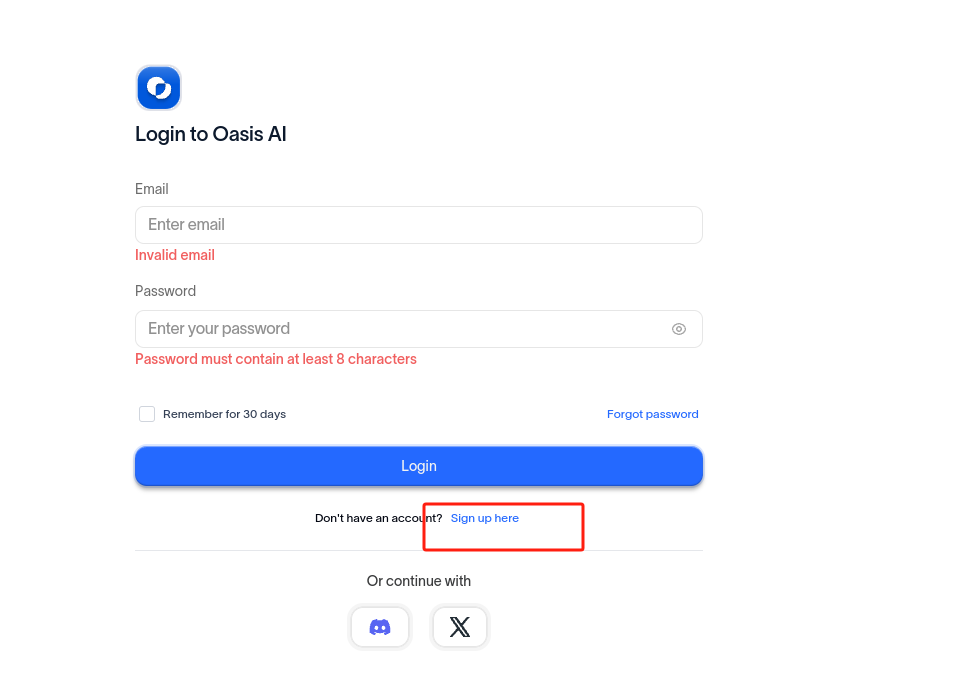
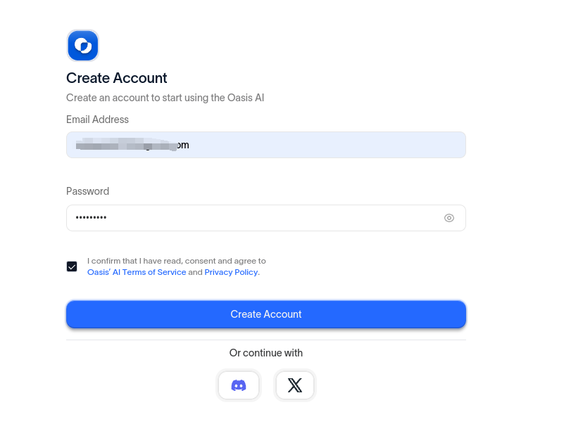
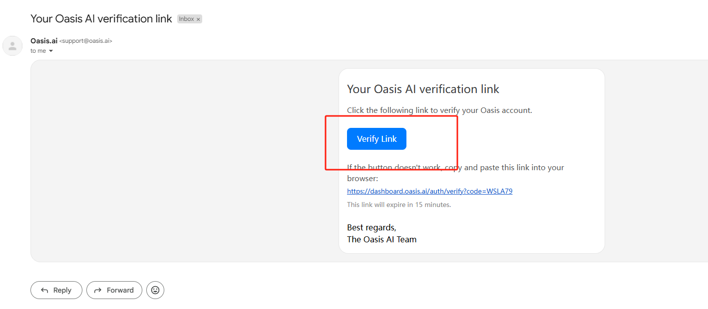
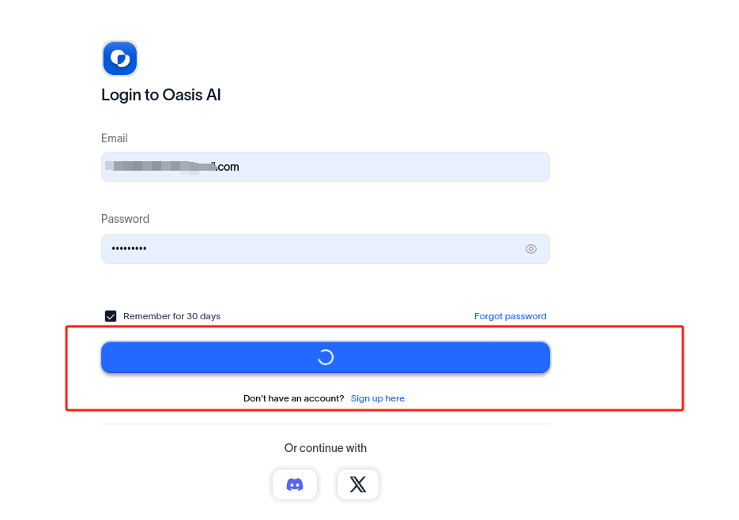
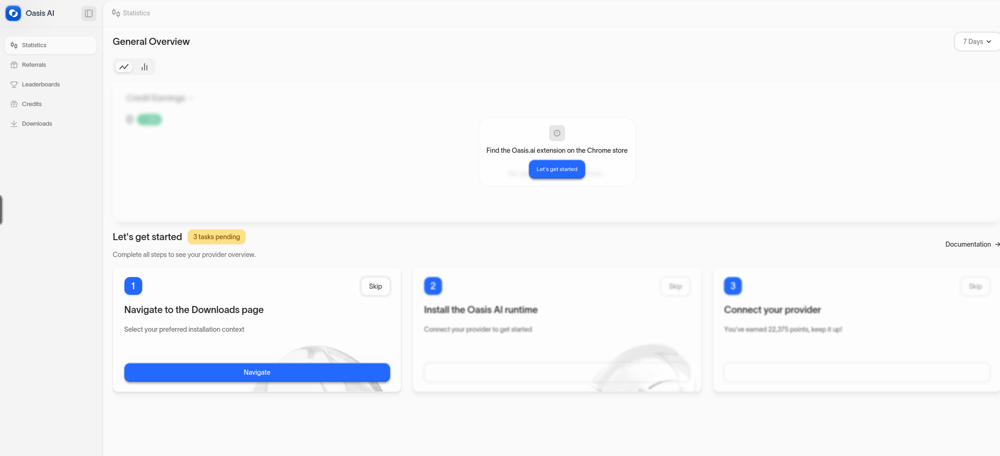
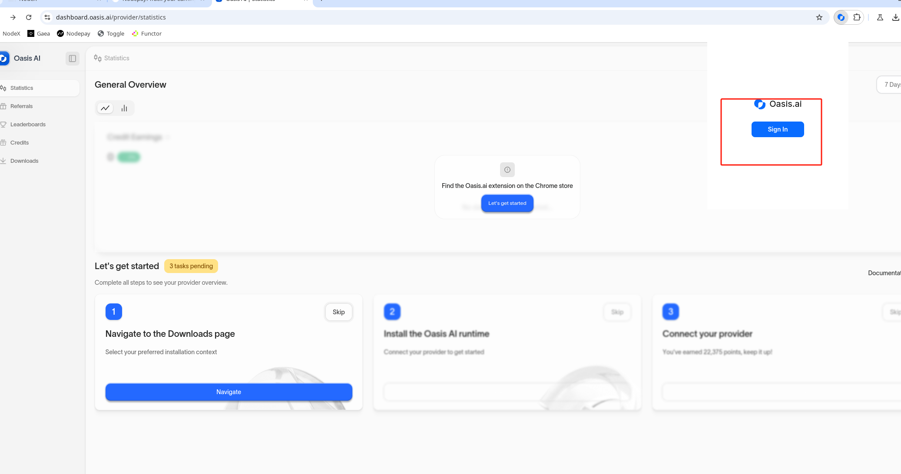
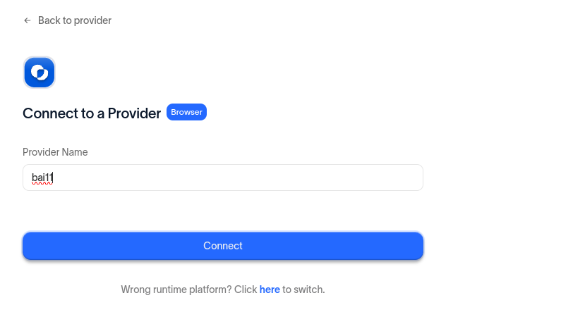
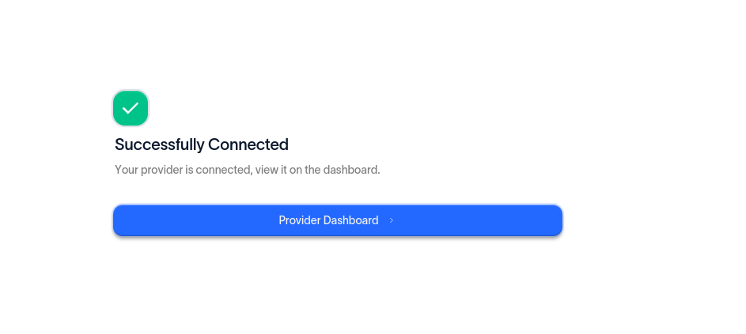
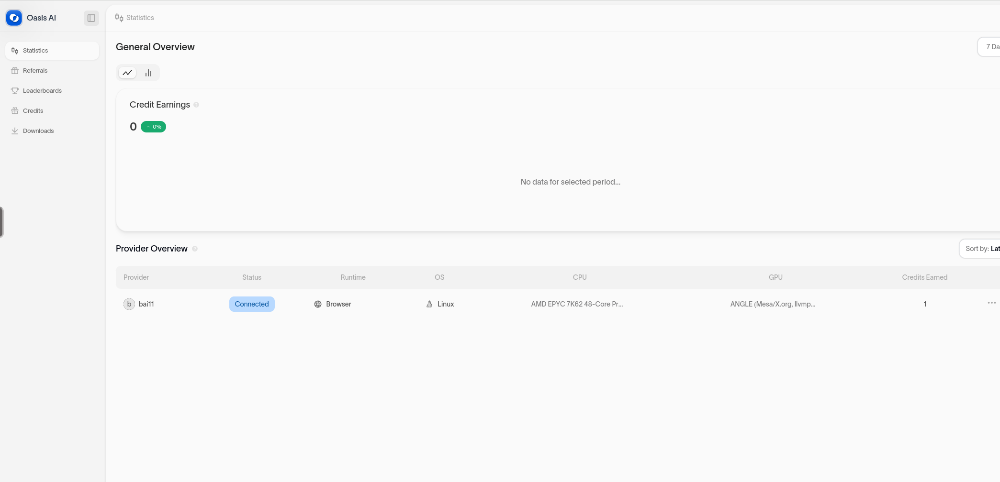
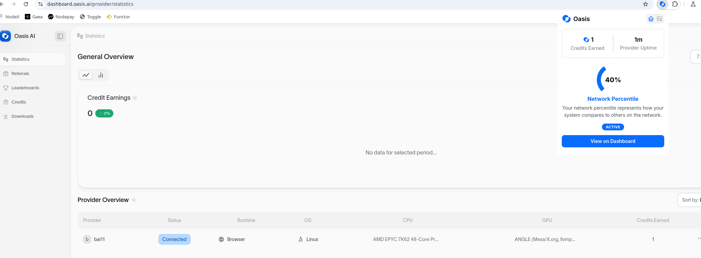

# Oasis AI

## 如何部署  Oasis AI？

#### 1. 等待服务与查看官方面板

购买成功后，Node-X 将为你部署浏览器 。通常情况下，这个过程会在24小时内完成。你可以通过以下方式进行Oasis AI的部署：

1. 登录浏览器： \
   根据Node-X提供的账号密码登录浏览器，在浏览器的url栏输入服务器ip以及端口回车后会弹出一个登录弹窗，输入账号以及密码进行登录。
2. **具体步骤：**

**注：若遇到什么问题可以查看**[**操作手册**](https://docs.node-x.xyz/chan-pin-shou-ce/yi-jian-bu-shu/depin-gua-ji-zhuan-yong-liu-lan-qi/depin-liu-lan-qi-cao-zuo-shou-ce)**，其中也许有解决问题的办法，若都解决不了，请直接联系客服，我们会尽快为您解决。**

打开扩展程序，打开Oasis.ai会直接进入下方图片显示的界面。

<figure><figcaption>
点击标识的地方前往注册
</figcaption></figure>

<figure><figcaption>
输入邮箱密码进行注册，你也可以使用DC或推特注册
</figcaption></figure>

<figure><figcaption>
在邮箱进行验证
</figcaption></figure>

<figure><figcaption>
返回登录
</figcaption></figure>

<figure><figcaption>
输入登录账号以及密码登录
</figcaption></figure>

<figure><figcaption>
进入到面板首页
</figcaption></figure>

<figure><figcaption>
打开扩展程序或直接点击中间的Let's get started
</figcaption></figure>

<figure><figcaption>
命名提供者，并连接到提供者
</figcaption></figure>

<figure><figcaption>
返回仪表盘
</figcaption></figure>

<figure><figcaption>
显示出Connected,且后面OS为Linux就正常运行
</figcaption></figure>

<figure><figcaption>
或者打开扩展程序，数值下方显示ACTIVE即为正常运行
</figcaption></figure>

配置浏览器完成之后

**注意：不要关闭浏览器里面的必要网页。**

结语

部署 Oasis AI就是这么简单！希望这篇指南对你有所帮助。

如果你有任何问题或需要进一步的指导，欢迎留言或私信我。加油！一起探索区块链的世界吧！ 🚀
