# Depin浏览器操作手册

## 一、具体操作

## 如何进入浏览器？

在Node-X平台下单后，我们会为你提供服务器ip及端口，浏览器账号密码。

这里有[演示视频](https://www.youtube.com/watch?v=nsNJt2drGbg)，提供给你参考。

你直接将服务器ip及端口（如123.121.26.111:3010）,输入到浏览器的URL栏，回车后弹出登录弹窗，在弹窗中输入账号密码登录浏览器，具体如下：

<figure>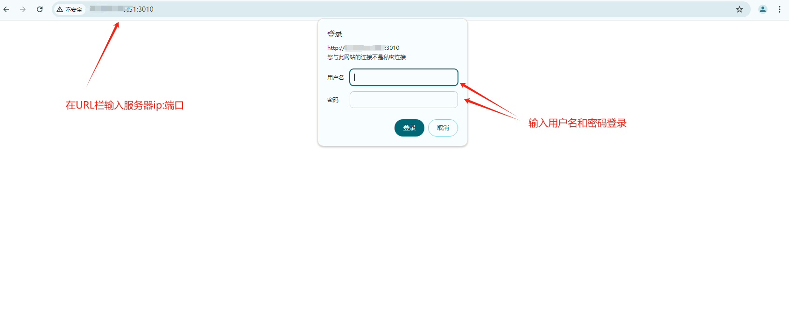<figcaption>
根据提示输入相应的信息
</figcaption></figure>

<figure>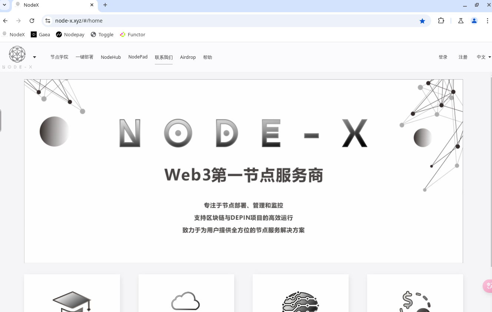<figcaption>
这样就进入到浏览器页面啦
</figcaption></figure>

## 如何进行粘贴操作？

有些数据过于冗长，手动输入过于麻烦，我们可以点击左侧如下图标识位置的图标，然后打开剪贴板，将需要粘贴的数据粘贴到剪贴板中,在选择需要粘贴的地方粘贴即可。操作如下图所示：

<figure>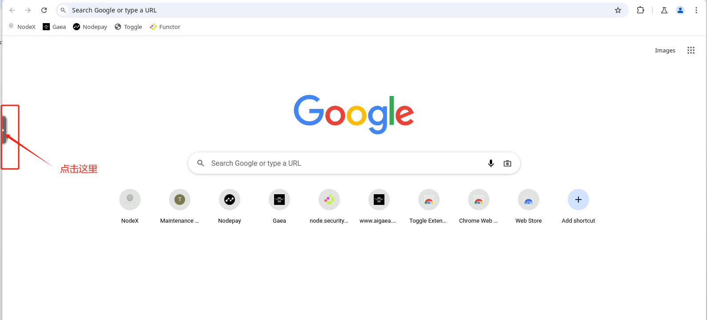<figcaption>
根据上图打开工具栏
</figcaption></figure>

<figure>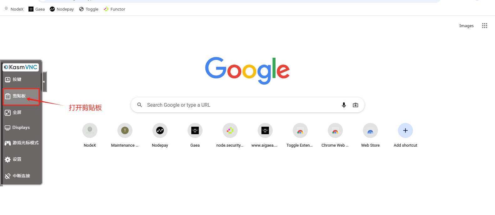<figcaption>
打开剪贴板
</figcaption></figure>

<figure>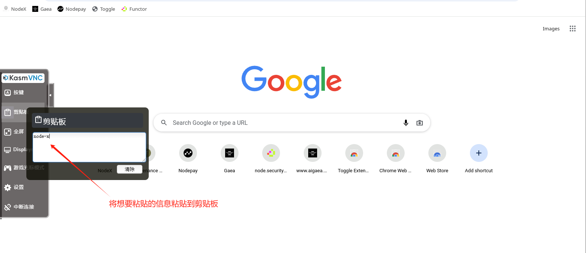<figcaption>
将信息粘贴到剪贴版中
</figcaption></figure>

<figure>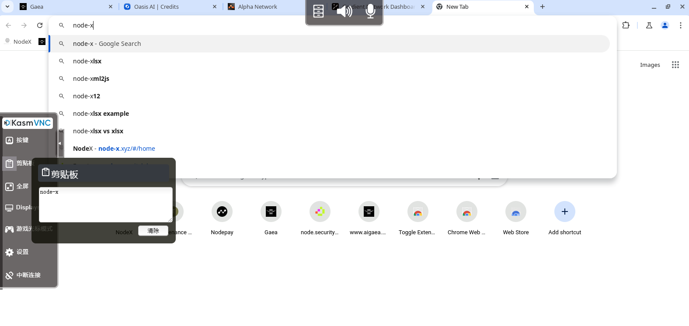<figcaption>
选择需要粘贴信息的地方粘贴即可
</figcaption></figure>

## 二、你可能遇到的问题

1、若你把全部网页关闭了或不小心将窗口最小化，出现下方情况：

<figure>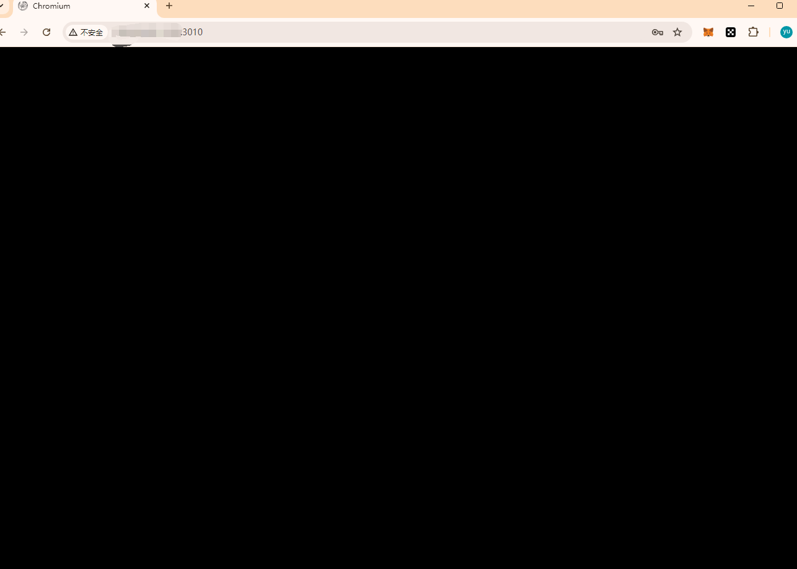<figcaption>
出现黑屏，不要怕
</figcaption></figure>

解决办法：

<figure>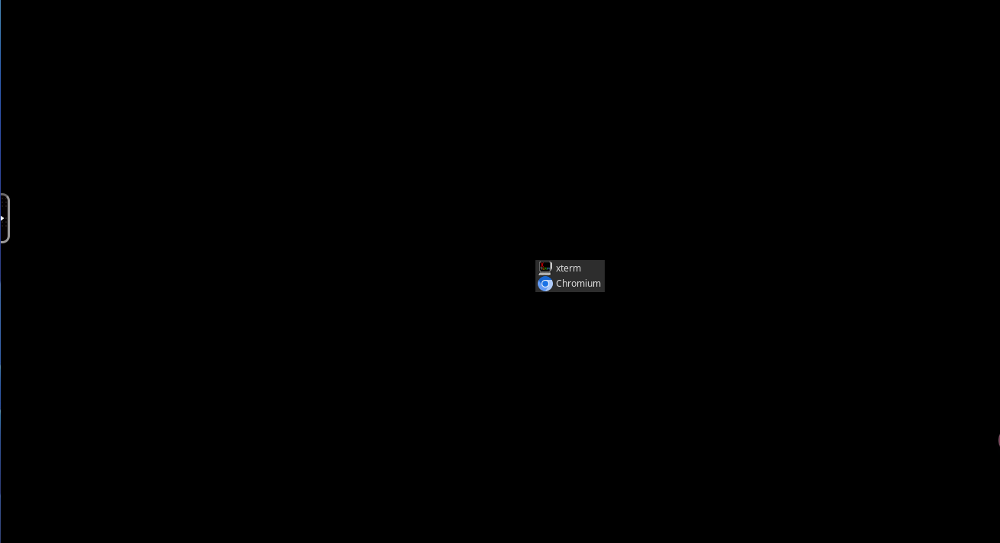<figcaption>
随便找个空白处，点击鼠标右键，就会出现如图中的图标，点击Chromium
</figcaption></figure>

<figure>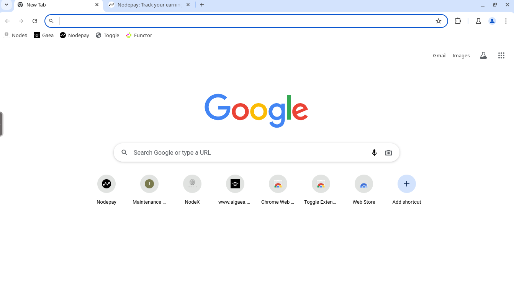<figcaption>
就能继续操作了，您挂机的项目就需要重新配置且不要再关闭页面啦
</figcaption></figure>

若你需要找回之前访问的网页可以跟着下面的操作找回。

<figure>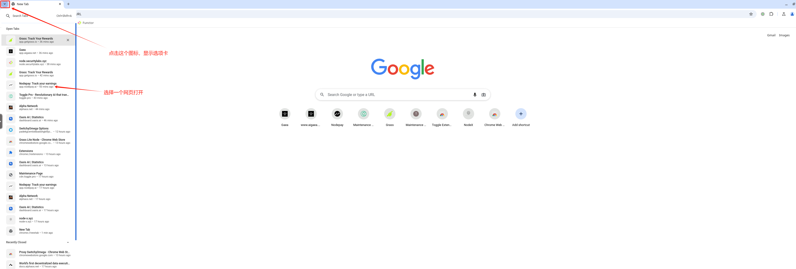<figcaption>
若你是最小化窗口了，可以跟着图中的操作进行找回网页
</figcaption></figure>

<figure>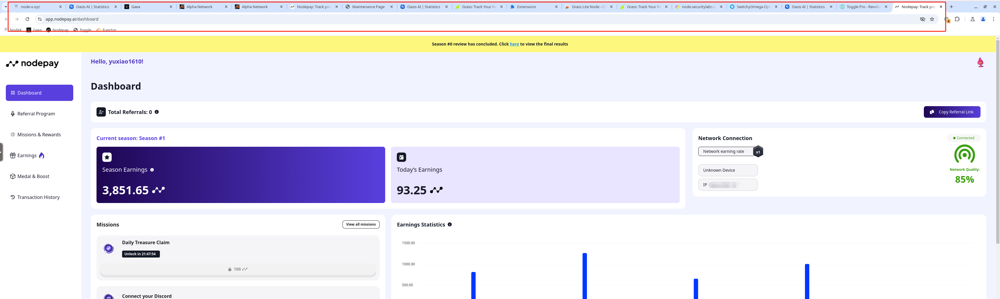<figcaption>
这不就找回来了么
</figcaption></figure>

2、若你的网络特别卡顿或直接动不了了。

解决办法：

你可以考虑更换一下VPN,试试效果。

结语

希望你遇到其他问题及时反馈，我们也会收录进来，我们会尽量完善操作手册。

如果你有任何问题或需要进一步的指导，欢迎留言或私信我。加油！一起探索区块链的世界吧！ 🚀
