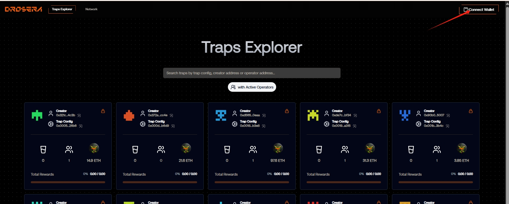
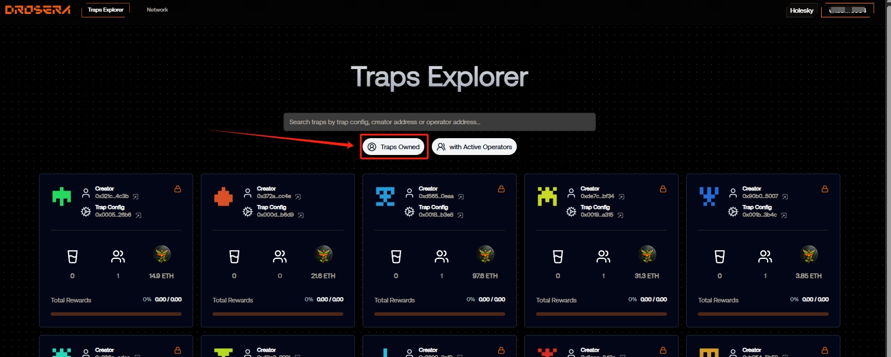
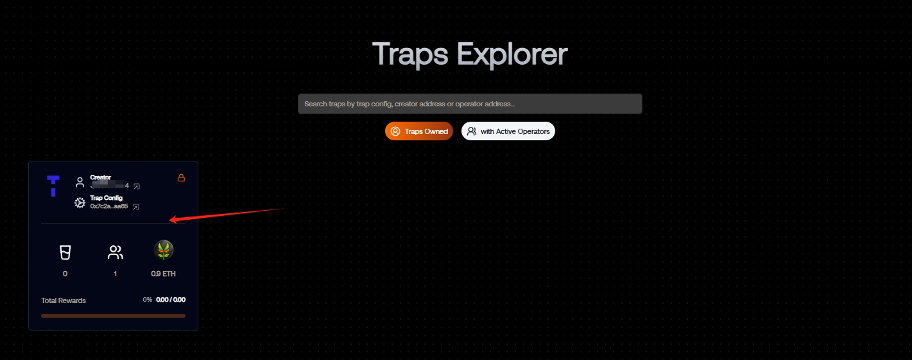
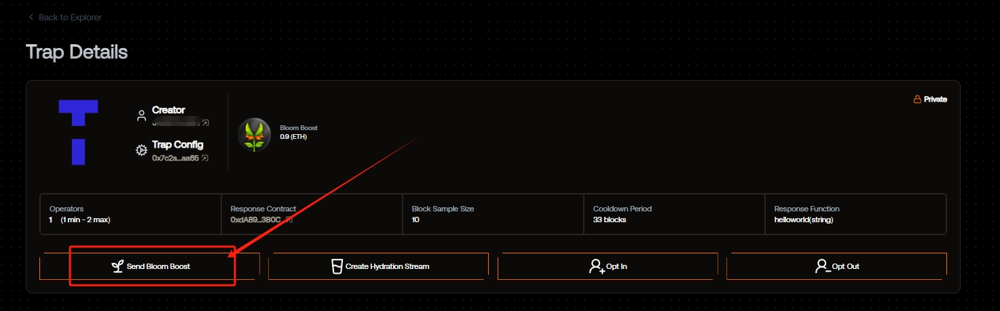
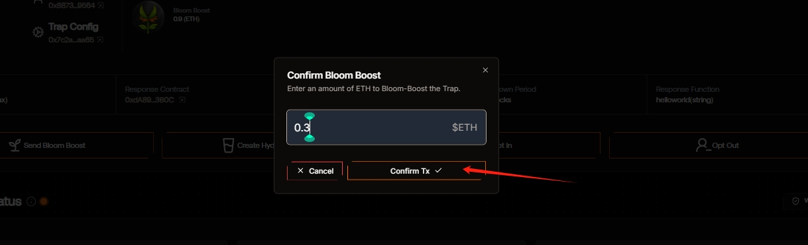
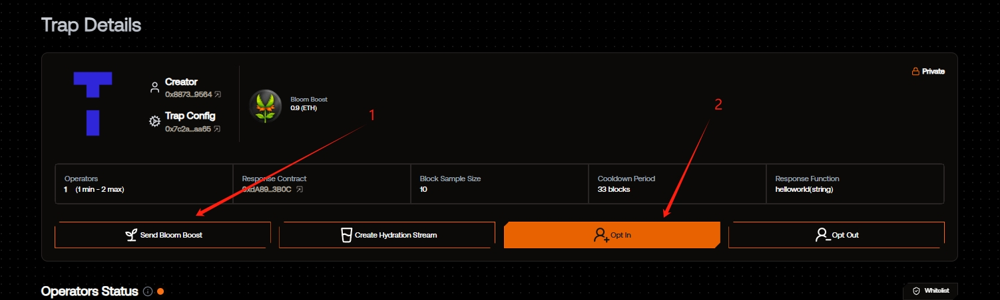
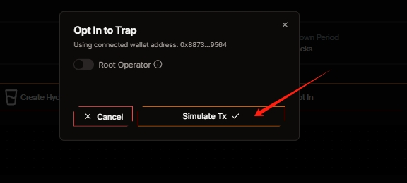
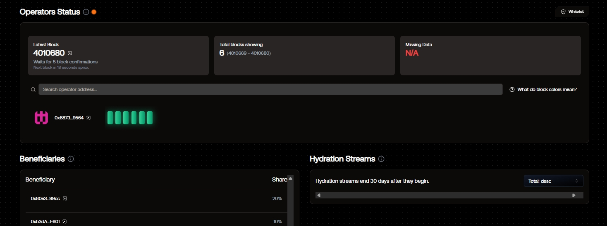
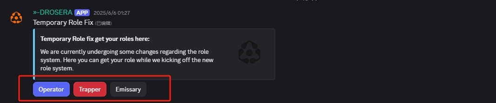
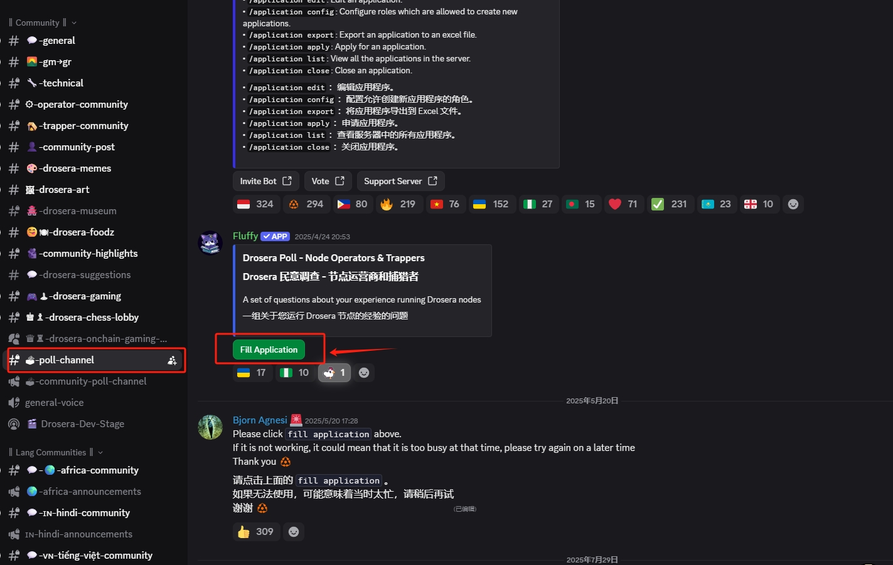

# Drosera

#### 如何透過 Node-X 平台部署 Drosera 節點？

**注意：** Drosera 官方尚未對該節點發佈激勵規則，請用戶自行判斷風險。

**1. 獲取 Node-X 帳號及部署節點**\
首先，你需要一個 Node-X 帳號。如果你還沒有帳號，請前往[ Node-X 註冊頁面](https://node-x.xyz/#/home)註冊。

註冊成功後，按照以下步驟購買並上傳資源以部署節點，下面舉個例子：

<figure><figcaption>
選擇需要部署的項目
</figcaption></figure>

<figure><figcaption>
点击部署
</figcaption></figure>

<figure><figcaption>
确认支付
</figcaption></figure>

<figure><figcaption>
点击上传信息
</figcaption></figure>

<figure><figcaption>
点击“添加”，上传对应的信息
</figcaption></figure>

### 1、所需上传参数

1）需要上传EVM钱包私钥，钱包中需要在ETH Hoodi网络下有1个ETH,可以前往[https://holesky-faucet.pk910.de/](https://holesky-faucet.pk910.de/)挖取或领取代币。\
2）需要上传私钥对应的EVM钱包地址\
3）需要上传ETH\_Hoodi\_RPC,可以前往[zan](https://zan.top/)或[infura](https://www.infura.io/zh),若未上传则默认使用公共RPC\
4）获取cadet角色，还需要上传DC用户名

#### 2、需要配合部署

我们在部署后您需要前往[https://app.drosera.io/](https://app.drosera.io/)注册操作者并且在网站存入至少0.3个ETH\
进入网站后首先是连接上传私钥对应的钱包

<figure><figcaption>
连接钱包
</figcaption></figure>

<figure><figcaption>
点击选择Traps Owned
</figcaption></figure>

<figure><figcaption>
点击这个进去进行存入ETH
</figcaption></figure>

<figure><figcaption>
点击send Bloom Boost
</figcaption></figure>

<figure><figcaption>
存入至少0.3
</figcaption></figure>

<figure><figcaption>
存入成功后，点击Opt In
</figcaption></figure>

<figure><figcaption>
点击Simulate Tx，成功后还需要点击一次注册一个操作者，成功后会出现现类似于下方的格式
</figcaption></figure>

<figure><figcaption>
完成后告知我们一声，我们启动一下节点，这样就是部署成功了，但还是需要注意自己的余额是否充足
</figcaption></figure>

**2、角色获取（**<mark style="color:red;">**这一步也很重要**</mark>**）**\
当看到上方这个界面时可以[前往DC](https://discord.gg/drosera)获取Node Runner角色\
首先是前往-role-fix频道获取操作者，捕猎者，使者角色

<figure><figcaption></figcaption></figure>

获取成功后前往-poll-channel频道填写表单申请Node Runner角色

<figure><figcaption></figcaption></figure>

填写完成就可以获取Node Runner角色啦！\

#### 3. 等待服务与查看官方面板

购买成功后，Node-X 将为你部署 Drosera 节点。通常情况下，这个过程会在24小时内完成。你可以通过以下方式实时查看节点状态：

1. **查看节点状态**：\
   在 Node-X 平台的用户面板中，你可以看到所有已购买的节点及其当前状态。

#### 结语

通过 Node-X 平台部署 Drosera 节点就是这么简单！希望这篇指南对你有所帮助。

如果你有任何问题或需要进一步的指导，欢迎留言或私信我。加油！一起探索区块链的世界吧！ 🚀
