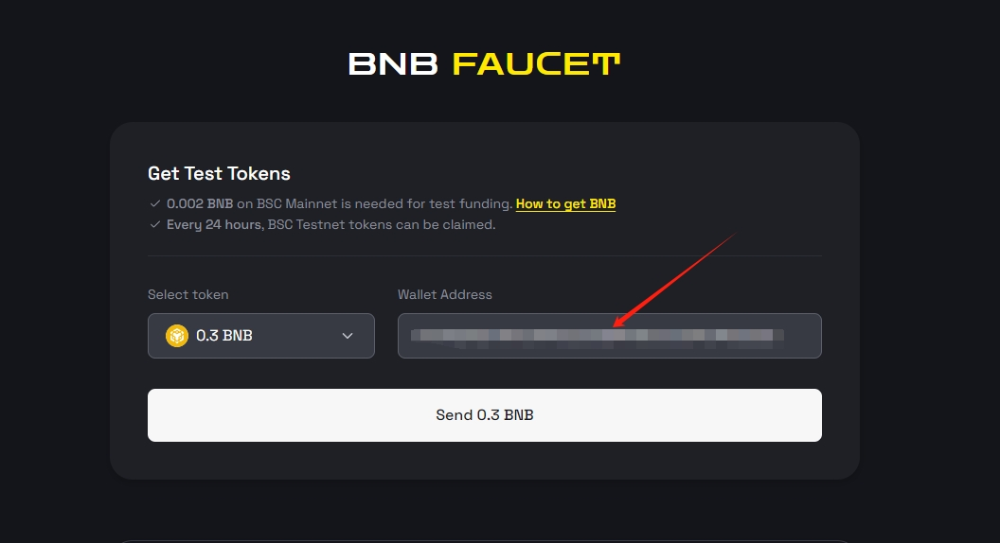
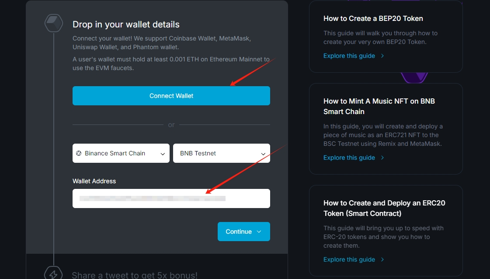
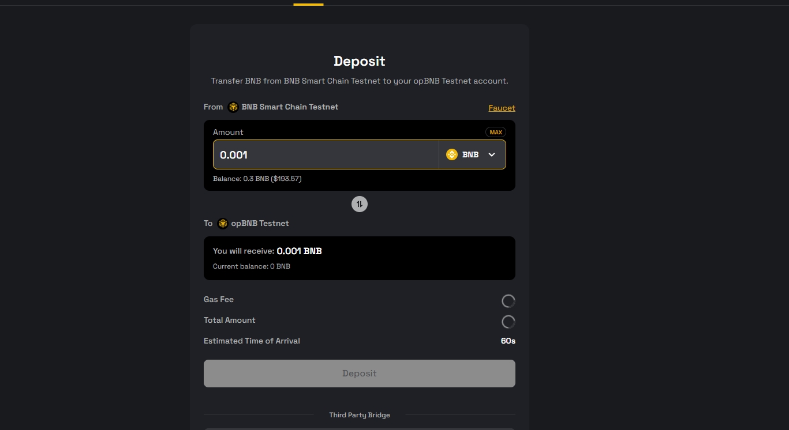
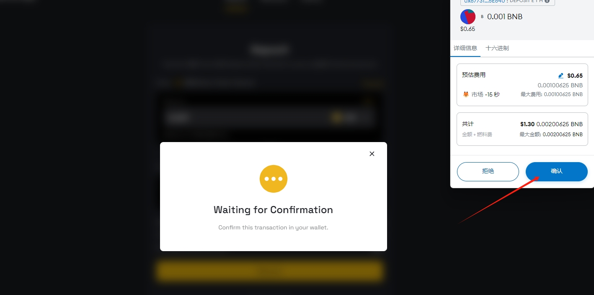
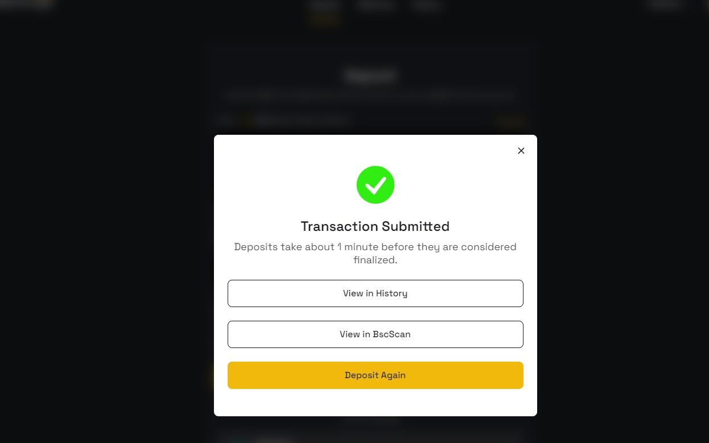
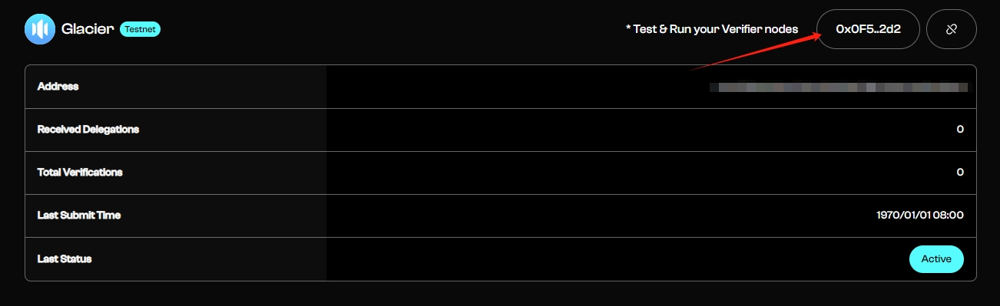

# Glacier Network

## 如何通过 Node-X 平台部署  Glacier 节点？

#### 1. 获取 Node-X 账号及部署节点

首先，你需要一个 Node-X 账号。如果你还没有账号，请前往 [Node-X 注册页面](https://node-x.xyz) 注册。注册成功后，按照以下步骤购买并上传资源部署节点,下面举个例子：

<figure><figcaption>
选择需要部署的项目
</figcaption></figure>

<figure><figcaption>
点击部署
</figcaption></figure>

<figure><figcaption>
确认支付
</figcaption></figure>

<figure><figcaption>
点击上传信息
</figcaption></figure>

<figure><figcaption>
点击“添加”，上传对应的信息
</figcaption></figure>

### 下方是Glacier节点所需的信息：

1、完成领水后提供**EVM钱包（如：小狐狸）私钥。**

在购买资源后，你需要提供1个 **EVM** 钱包私钥：

我们需要opBNB的测试币，若没有就得先有BSC 的测试币，以下是推荐的领水方式。

领水方式一：

需要钱包的BSC主网上至少拥有0.002BNB,[点击这里](https://www.bnbchain.org/en/testnet-faucet)进行领水。

<figure><figcaption>
确保BSC Mainnet 拥有至少0.002BNB,再粘贴地址点击领水
</figcaption></figure>

领水方式二：

需要钱包的ETH主网中至少拥有0.001ETH，[点击这里](https://faucet.quicknode.com/binance-smart-chain/bnb-testnet)进行领水。

<figure><figcaption>
确保ETH Mainnet 拥有至少0.001ETH,再粘贴地址点击领水或连接钱包
</figcaption></figure>

然后转换为opBNB 的测试币

现在你有了BSC 的测试币，你可以直接通过opBNB Bridge将其转换为opBNB Testnet 的测试币。

<figure><figcaption>
连接钱包后，需要至少0.001
</figcaption></figure>

<figure><figcaption>
点击确认
</figcaption></figure>

<figure><figcaption>
这就完成了
</figcaption></figure>

#### 2. 等待服务与查看官方面板

购买成功后，Node-X 将为你部署 Glacier  Verifier节点。通常情况下，这个过程会在24小时内完成。你可以通过以下方式实时查看节点状态：

1. **查看节点状态**：\
   在 Node-X 平台的用户面板中，你可以看到所有已购买的节点及其当前状态。
2. **通过官方面板查看节点状态：**

节点配置完成后，可以通过[**官方面板**](https://testnet.nodes.glacier.io/status)链接钱包 查询验证者状态，更新有延迟。

<figure><figcaption>
点击钱包地址的图标，就能看到运行状态了
</figcaption></figure>

#### 结语

通过 Node-X 平台部署 **Glacier** 节点就是这么简单！希望这篇指南对你有所帮助。

如果你有任何问题或需要进一步的指导，欢迎留言或私信我。加油！一起探索区块链的世界吧！ 🚀
