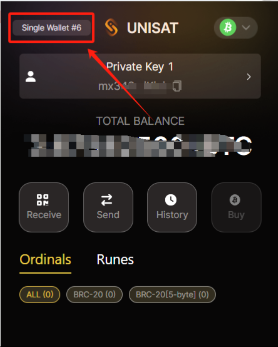
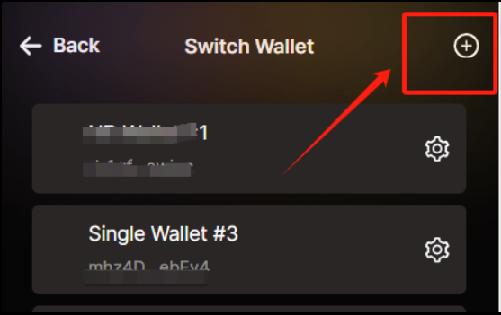
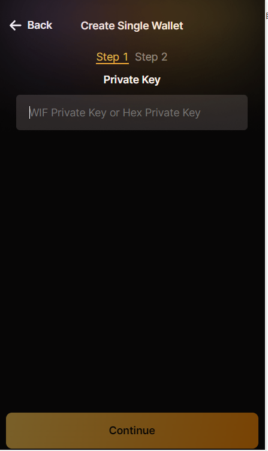
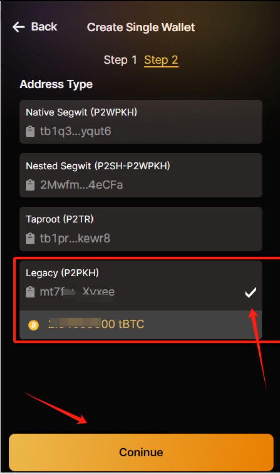
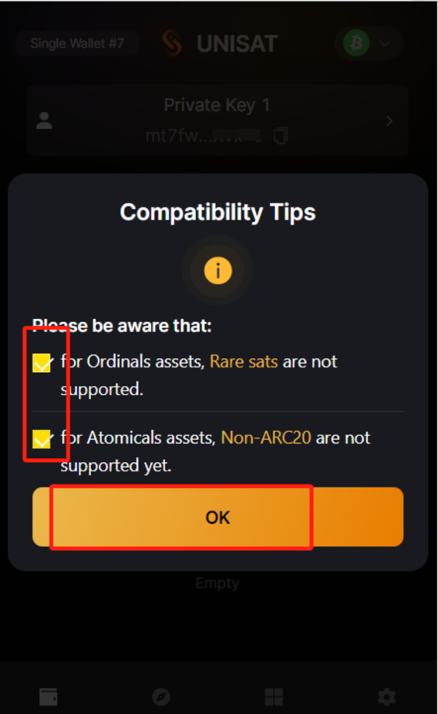

# Hemi-Wallet

## 如何通过 Unisat 钱包操作Hemi账户？

#### 1. 登录Unisat钱包，点击左上角：

<figure><figcaption></figcaption></figure>

2.点击添加账户按钮：

<figure><figcaption></figcaption></figure>

3.选择通过私钥导入：

<figure><figcaption></figcaption></figure>

4.输入部署信息中的private\_key：

<figure><figcaption></figcaption></figure>

<figure><figcaption></figcaption></figure>

5.选择Legacy：

<figure><figcaption></figcaption></figure>

6.勾选后提交：

<figure><figcaption></figcaption></figure>

#### 结语

希望这篇指南对你有所帮助。

如果你有任何问题或需要进一步的指导，欢迎留言或私信我。加油！一起探索区块链的世界吧！ 🚀
