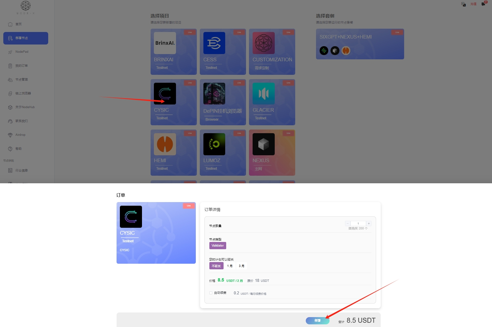

# Hyperspace

## 如何通过 Node-X 平台部署  Hyperspace 节点？

#### 1. 获取 Node-X 账号及部署节点

首先，你需要一个 Node-X 账号。如果你还没有账号，请前往 [Node-X 注册页面](https://node-x.xyz) 注册。注册成功后，按照以下步骤购买并上传资源部署节点,下面举个例子：

<figure><figcaption>
选择需要部署的项目
</figcaption></figure>

<figure><figcaption>
点击部署
</figcaption></figure>

<figure><figcaption>
确认支付
</figcaption></figure>

<figure><figcaption>
点击上传信息
</figcaption></figure>

<figure><figcaption>
点击“添加”，上传对应的信息
</figcaption></figure>

### 下方是Hyperspace节点所需的信息：

#### 2. 获取私钥并提交

[点击这里](https://node.hyper.space/)，前往获取私钥，然后前往购买并上传该私钥即可\
<mark style="color:red;">注：上传私钥后不要更新私钥，否则会影响到节点的正常运行</mark>

<figure><figcaption>
点击标识位置的图标
</figcaption></figure>

<figure><figcaption>
复制私钥
</figcaption></figure>

#### 3.查看节点信息

上传私钥后，我们会在24小时以内为您部署，部署成功后，您可以查看积分以及节点状态。

<figure><figcaption>
点击标识位置查看节点状态
</figcaption></figure>

<figure><figcaption>
这就是正常运行啦！
</figcaption></figure>

#### 结语

通过 Node-X 平台部署Hyperspace节点就是这么简单！希望这篇指南对你有所帮助。

如果你有任何问题或需要进一步的指导，欢迎留言或私信我。加油！一起探索区块链的世界吧！ 🚀
