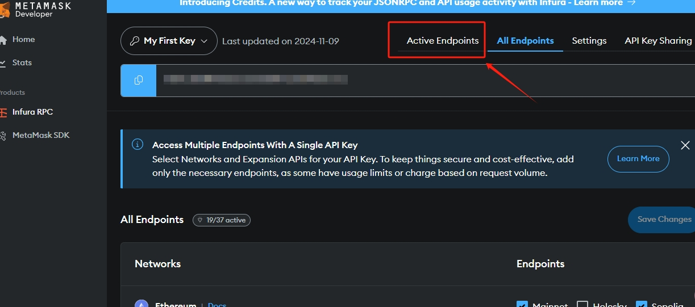

# Lumoz

## 如何通过 Node-X 平台部署 Lumoz zkVerifier节点？

<mark style="color:red;">**注：该节点需要拥有许可证。**</mark>

#### 1. 获取 Node-X 账号及部署节点

首先，你需要一个 Node-X 账号。如果你还没有账号，请前往 [Node-X 注册页面](https://node-x.xyz) 注册。注册成功后，按照以下步骤购买并上传资源部署节点,下面举个例子：

<figure><figcaption>
选择需要部署的项目
</figcaption></figure>

<figure><figcaption>
点击部署
</figcaption></figure>

<figure><figcaption>
确认支付
</figcaption></figure>

<figure><figcaption>
点击上传信息
</figcaption></figure>

<figure><figcaption>
点击“添加”，上传对应的信息
</figcaption></figure>

### 下方是Lumoz节点所需的信息：

#### 1. 提供拥有许可证且拥有至少0.00005Arbitrum主网 ETH的EVM钱包地址、私钥和Arbitrum主网的RPC

1. **获取私钥及钱包地址**：\
   若你购买节点的钱包比较重要，建议授权到另一个钱包，并提交钱包地址及私钥。[前往授权](https://node.lumoz.org/claim-license)，连接钱包后，进行授权。在授权时需要支付一定的gas,请确保钱包中Arbitrum主网有一定的资金能够支付gas。授权完成后，需要确保<mark style="color:red;">被授权钱包中拥有至少0.00005Arbitrum主网 ETH</mark>，在初始化节点时需要支付0.00005的gas。完成后，请将被授权的钱包私钥和地址填入模版中的对应位置。

<figure><figcaption>
连接钱包
</figcaption></figure>

<figure><figcaption>
输入授权的数量和被授权的钱包地址
</figcaption></figure>

2.到INFURA获取Arbitrum 主网的RPC\
[点击这里](https://developer.metamask.io/register)前往**INFURA**获取RPC。登录后，根据下方步骤获取RPC。若没有注册，可以参考[这里](https://docs.node-x.xyz/chan-pin-shou-ce/yi-jian-bu-shu/waku)。

<figure><figcaption></figcaption></figure>

<figure><figcaption></figcaption></figure>

<figure><figcaption></figcaption></figure>

<figure><figcaption></figcaption></figure>

**上传被授权钱包私钥和地址以及Arbitrum主网的RPC**

#### 三. 等待服务与查看官方面板

购买成功后，Node-X 将为你部署节点。通常情况下，这个过程会在24小时内完成,完成后。你可以通过以下方式实时查看节点状态：

1. **查看节点状态**：\
   在 Node-X 平台的用户面板中，你可以看到所有已购买的节点及其当前状态。
2. **配置节点信息**：\
   节点配置完成后，您可以通过[官方面板](https://zkverifier.lumoz.org/my-node)设置节点名称、节点描述、节点logo、节点收益的分配（根据自己的情况分配奖励占比）以及社交账户链接等。

<figure><figcaption>
设置节点信息
</figcaption></figure>

3.查看节点状态以及质押节点（若你拥有esMOZ或MOZ）

节点配置完成后，您可以通过[官方面板](https://zkverifier.lumoz.org/)连接钱包查看节点信息以及质押节点

<figure><figcaption>
查看节点信息
</figcaption></figure>

#### 结语

通过 Node-X 平台部署lumoz节点就是这么简单！希望这篇指南对你有所帮助。

如果你有任何问题或需要进一步的指导，欢迎留言或私信我。加油！一起探索区块链的世界吧！ 🚀
