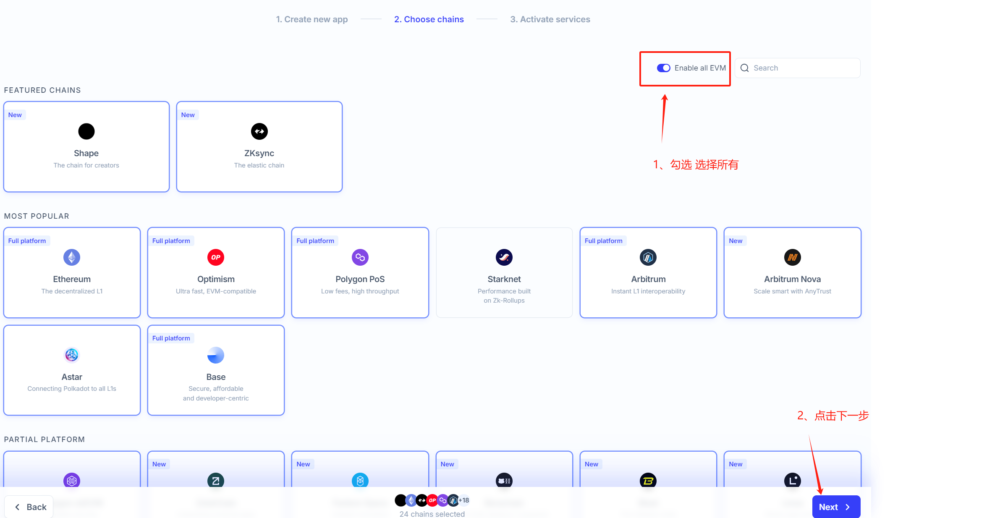

# ORA

## 如何通过 Node-X 平台部署 ORA 节点？

#### 1. 获取 Node-X 账号及资源

首先，你需要一个 Node-X 账号。如果你还没有账号，请前往 [Node-X 注册页面](https://node-x.xyz) 注册。注册成功后，按照以下步骤购买并部署节点所需的资源：

1. **充值账户**：\
   登录 Node-X 平台后，找到充值选项，为你的账户充值足够的金额。
2. **选择服务**：\
   Node-X 目前仅提供节点部署。
3. **购买资源**：\
   选择合适的节点类型，点击“部署”按钮。确认所有信息无误后，再次点击“确认”完成购买。

#### 2. 创建一个 EVM（小狐狸等） 钱包，并保证钱包内有Sepolia测试网ETH测试代币(部署启动至少保证钱包中有0.1个，节点后续运行若有消耗，需自行充值以保证节点正常运行)，完成后提供钱包私钥

在购买资源后，你需要提供**EVM** 钱包私钥：

1. **创建EVM钱包并充值Sepolia测试网ETH测试代币**
2. **下载模板填写EVM私钥（必须）、个人RPC地址(可选，如AIchemy，若有则提供)**：\
   下载模板填写EVM钱包私钥并上传，全程加密传输且不经过人工，安全可保证。
3. **生成个人RPC地址(可选)**：\
   1）前往[Alchemy](https://dashboard.alchemy.com/apps)注册账号

&#x20;       2）创建个人RPC：

<figure><figcaption></figcaption></figure>

&#x20;          输入RPC信息：

<figure><figcaption></figcaption></figure>

&#x20;          选择链：

<figure><figcaption></figcaption></figure>

&#x20;        完成创建：

<figure><figcaption></figcaption></figure>

&#x20;        获取Mainnet的wss和http地址：

<figure><figcaption></figcaption></figure>

&#x20;        获取Sepolia的wss和http地址：

<figure><figcaption></figcaption></figure>

#### 3. 等待服务与查看官方面板

购买成功后，Node-X 将为你部署 ORA节点。通常情况下，这个过程会在24小时内完成。你可以通过以下方式实时查看节点状态：

1. **查看节点状态**：\
   在 Node-X 平台的用户面板中，你可以看到所有已购买的节点及其当前状态。

#### 结语

通过 Node-X 平台部署 ORA 节点就是这么简单！希望这篇指南对你有所帮助。

如果你有任何问题或需要进一步的指导，欢迎留言或私信我。加油！一起探索区块链的世界吧！ 🚀
