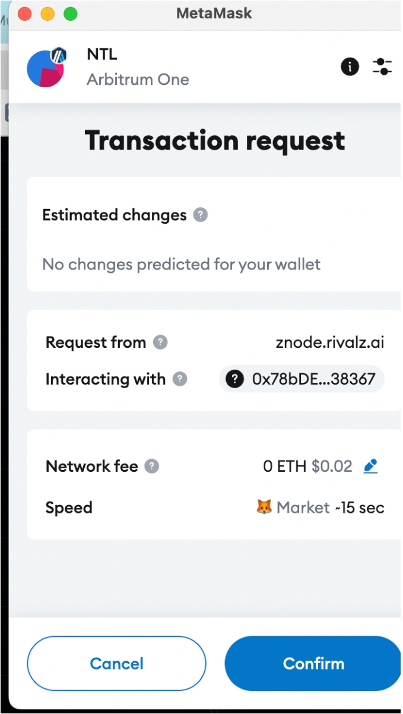

# Rivalz Znode

### 如何通过 Node-X 平台部署 Rivalz Znode节点？

<mark style="color:red;">**注：该节点需要用户拥有许可证**</mark>。

#### 1. 获取 Node-X 账号及部署节点

首先，你需要一个 Node-X 账号。如果你还没有账号，请前往 [Node-X 注册页面](https://node-x.xyz) 注册。注册成功后，按照以下步骤购买并上传资源部署节点,下面举个例子：

<figure><figcaption>
选择需要部署的项目
</figcaption></figure>

<figure><figcaption>
点击部署
</figcaption></figure>

<figure><figcaption>
确认支付
</figcaption></figure>

<figure><figcaption>
点击上传信息
</figcaption></figure>

<figure><figcaption>
点击“添加”，上传对应的信息
</figcaption></figure>

### 下方是Rivalz-Znode节点所需的信息：

#### 1. 完成委托的步骤

下单完成后，我们会返回一个ID给您，您需要使用这个ID完成委托。

**!!!**&#x5728;委托节点之前，请确保您的钱包至少包含1个NFT并有足够的gas。

[前往委托节点](https://znode.rivalz.ai/licenses)

<figure><figcaption>
连接钱包
</figcaption></figure>

<figure><figcaption>
进行委托
</figcaption></figure>

<figure><figcaption>
根据其提示完成委托步骤
</figcaption></figure>

<figure><figcaption>
支付gas完成委托
</figcaption></figure>

<figure><figcaption>
委托完成
</figcaption></figure>

#### 2. 等待服务与查看官方面板

资源购买成功后，Node-X 将为你分配 Rivalz Znode节点。通常情况下，这个过程会在24小时内完成。

你可以通过以下方式实时查看节点状态：

1. **查看节点状态**：\
   在 Node-X 平台的用户面板中，你可以看到所有已购买的节点及其当前状态。
2. **项目方面板查看**：\
   节点配置完成后，可以去项目方提供的[面板地址](https://znode.rivalz.ai/licenses)查看节点的详细信息。

<figure><figcaption>
节点正在运行
</figcaption></figure>

#### 结语

通过 Node-X 平台部署 Rivalz 节点就是这么简单！希望这篇指南对你有所帮助。

如果你有任何问题或需要进一步的指导，欢迎留言或私信我。加油！一起探索区块链的世界吧！ 🚀
