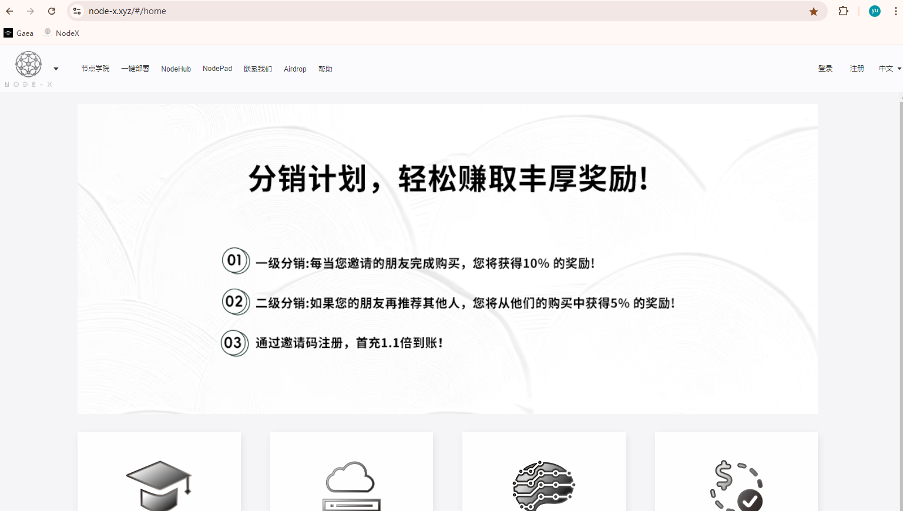
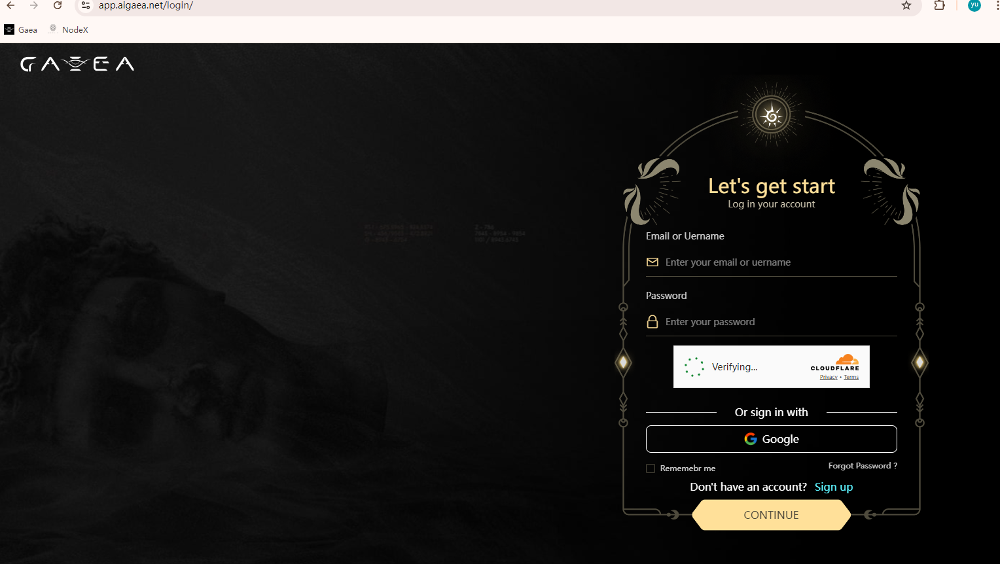
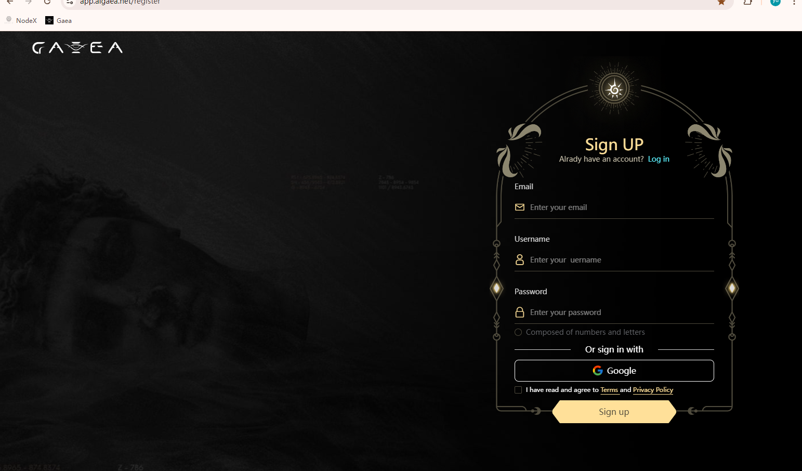
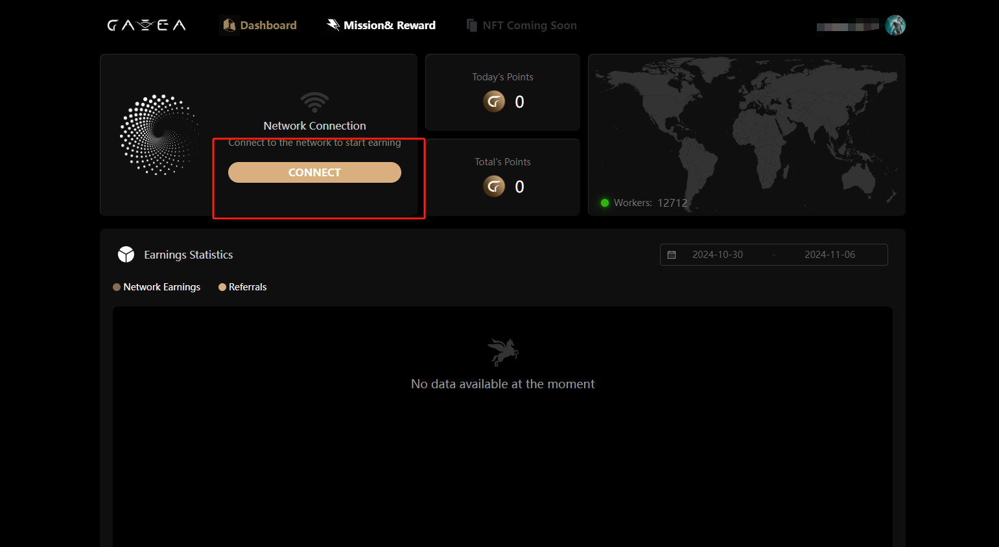
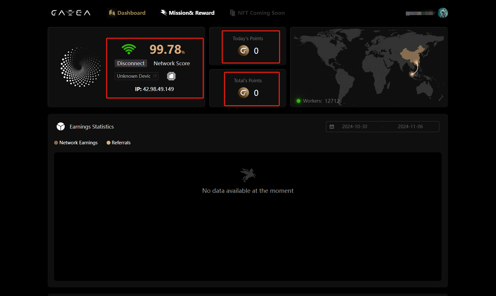
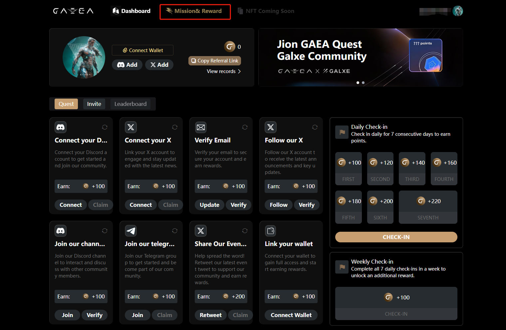

# AIGAEA

## 如何部署  AIGAEA？

#### 1. 等待服务与查看官方面板

购买成功后，Node-X 将为你部署浏览器 。通常情况下，这个过程会在24小时内完成。你可以通过以下方式进行aigaea的部署：

1. 登录浏览器： \
   根据Node-X提供的账号密码登录浏览器，在浏览器的url栏输入服务器ip以及端口回车后会弹出一个登录弹窗，输入账号以及密码进行登录。
2. **具体步骤：**

**注：若遇到什么问题可以查看**[**操作手册**](https://docs.node-x.xyz/chan-pin-shou-ce/yi-jian-bu-shu/depin-gua-ji-zhuan-yong-liu-lan-qi/depin-liu-lan-qi-cao-zuo-shou-ce)**，其中也许有解决问题的办法，若都解决不了，请直接联系客服，我们会尽快为您解决。**

在登陆浏览器之后，你可以看到书签栏有Gaea的书签，直接打开。

<figure><figcaption>
打开书签
</figcaption></figure>

<figure><figcaption>
点击sign up
</figcaption></figure>

<figure><figcaption>
填写注册信息并点击注册，邀请码可以不用填
</figcaption></figure>

<figure><figcaption>
点击CONNECT
</figcaption></figure>

<figure><figcaption>
面板可以查看运行状态以及奖励情况
</figcaption></figure>

<figure><figcaption>
点击标识的地方跳转到这个页面，完成任务可以获取更多积分
</figcaption></figure>

配置浏览器完成之后

**注意：不要关闭浏览器里面必要的网页。**

结语

部署 aigaea就是这么简单！希望这篇指南对你有所帮助。

如果你有任何问题或需要进一步的指导，欢迎留言或私信我。加油！一起探索区块链的世界吧！ 🚀
