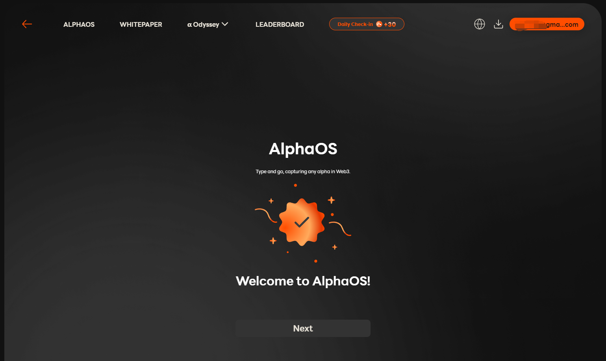

# Alpha Network

## 如何部署  Alpha Network？

#### 1. 等待服务与查看官方面板

购买成功后，Node-X 将为你部署浏览器 。通常情况下，这个过程会在24小时内完成。你可以通过以下方式进行Alpha Network的部署：

1. 登录浏览器： \
   根据Node-X提供的账号密码登录浏览器，在浏览器的url栏输入服务器ip以及端口回车后会弹出一个登录弹窗，输入账号以及密码进行登录。
2. **具体步骤：**

**注：若遇到什么问题可以查看**[**操作手册**](https://docs.node-x.xyz/chan-pin-shou-ce/yi-jian-bu-shu/depin-gua-ji-zhuan-yong-liu-lan-qi/depin-liu-lan-qi-cao-zuo-shou-ce)**，其中也许有解决问题的办法，若都解决不了，请直接联系客服，我们会尽快为您解决。**

打开[演示视频](https://www.youtube.com/watch?v=u2VrZNCOfmk)，可以直接查看具体步骤。

当然也可以跟着步骤一步一步完成配置。

登录浏览器之后，打开扩展程序，打开AlphaOS插件。

<figure><figcaption>
打开插件之后，点击标识的图标
</figcaption></figure>

<figure><figcaption>
点击登录/注册
</figcaption></figure>

<figure><figcaption>
根据自己的情况注册，这里使用邮箱注册为例
</figcaption></figure>

<figure><figcaption>
需要验证码
</figcaption></figure>

<figure><figcaption>
打开邮箱查看验证码
</figcaption></figure>

<figure><figcaption>
成功注册
</figcaption></figure>

<figure><figcaption>
点击标识的图标
</figcaption></figure>

<figure><figcaption>
点击开始挖矿
</figcaption></figure>

<figure><figcaption>
这样就是在运行了
</figcaption></figure>

<figure><figcaption>
划到这里，绑定社交账号可以获取更多积分
</figcaption></figure>

配置浏览器完成之后

**注意：不要关闭浏览器里面的必要网页。**

结语

部署 Alpha Network就是这么简单！希望这篇指南对你有所帮助。

如果你有任何问题或需要进一步的指导，欢迎留言或私信我。加油！一起探索区块链的世界吧！ 🚀
