# Gradient Network

## 如何部署  Gradient Network？

#### 1. 等待服务与查看官方面板

购买成功后，Node-X 将为你部署浏览器 。通常情况下，这个过程会在24小时内完成。你可以通过以下方式进行Gradient Network的部署：

1. 登录浏览器： \
   根据Node-X提供的账号密码登录浏览器，在浏览器的url栏输入服务器ip以及端口回车后会弹出一个登录弹窗，输入账号以及密码进行登录。
2. **具体步骤：**

**注：若遇到什么问题可以查看**[**操作手册**](https://docs.node-x.xyz/chan-pin-shou-ce/yi-jian-bu-shu/depin-gua-ji-zhuan-yong-liu-lan-qi/depin-liu-lan-qi-cao-zuo-shou-ce)**，其中也许有解决问题的办法，若都解决不了，请直接联系客服，我们会尽快为您解决。**

直接打开扩展程序，打开Gradient sentry node插件,点击Sign up.

<figure>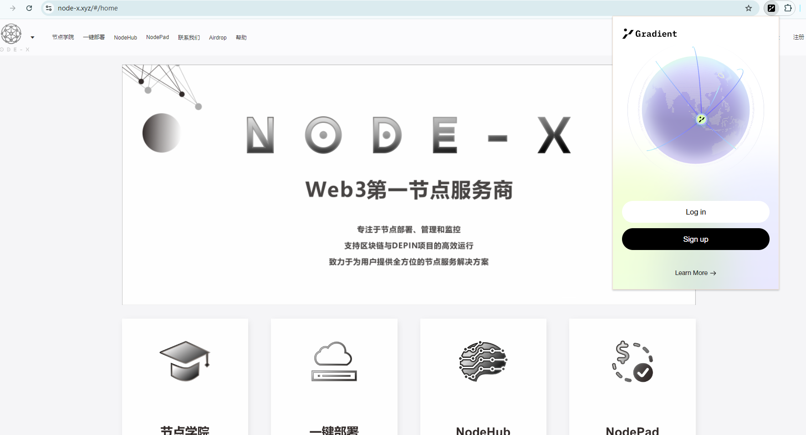<figcaption>
打开插件
</figcaption></figure>

<figure>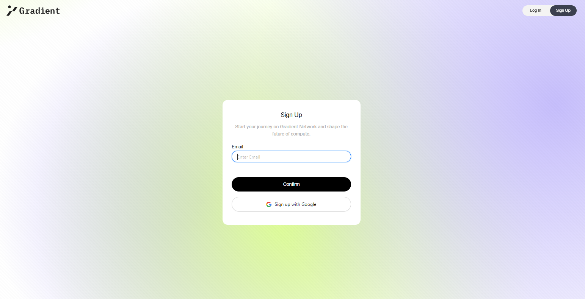<figcaption>
开始注册
</figcaption></figure>

<figure>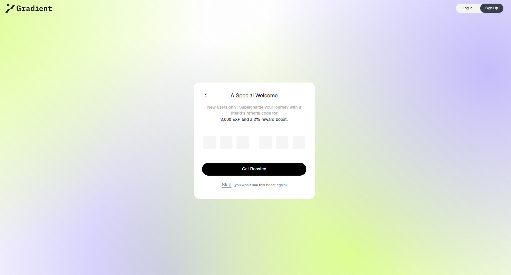<figcaption>
输入邀请码可以使用我们的（PVVEPS）
</figcaption></figure>

<figure>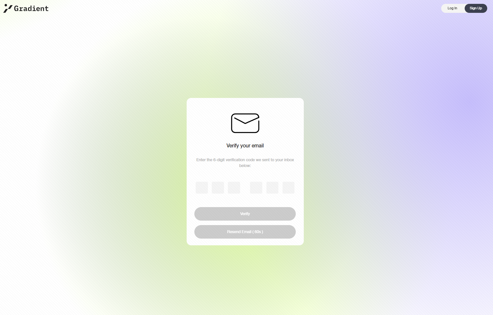<figcaption>
在设置完密码之后，需要去邮箱查看验证码
</figcaption></figure>

<figure>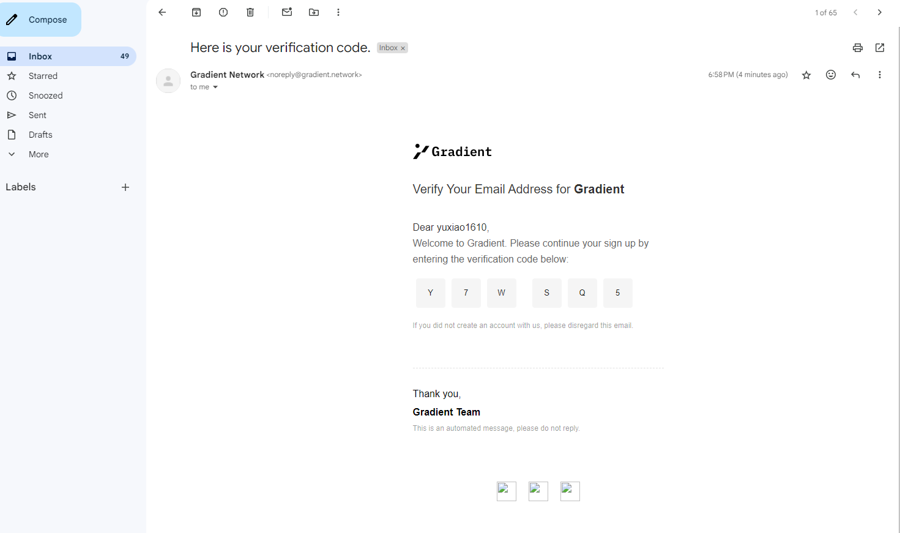<figcaption>
查看验证码
</figcaption></figure>

<figure>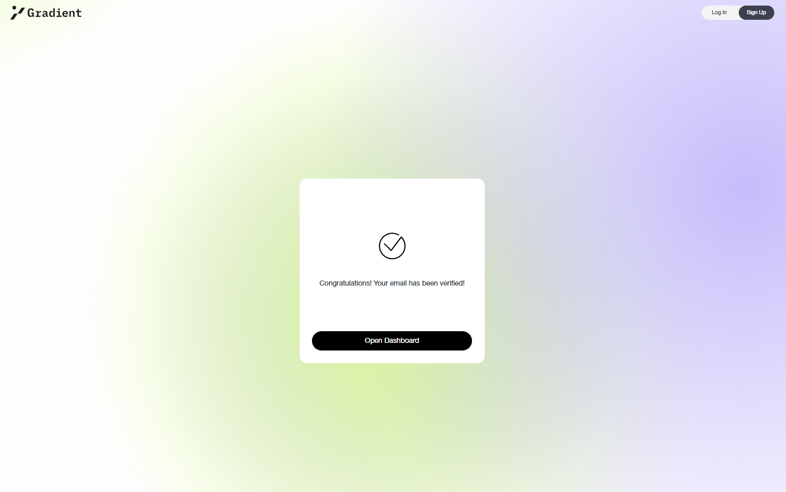<figcaption>
点击open Dashboard
</figcaption></figure>

<figure>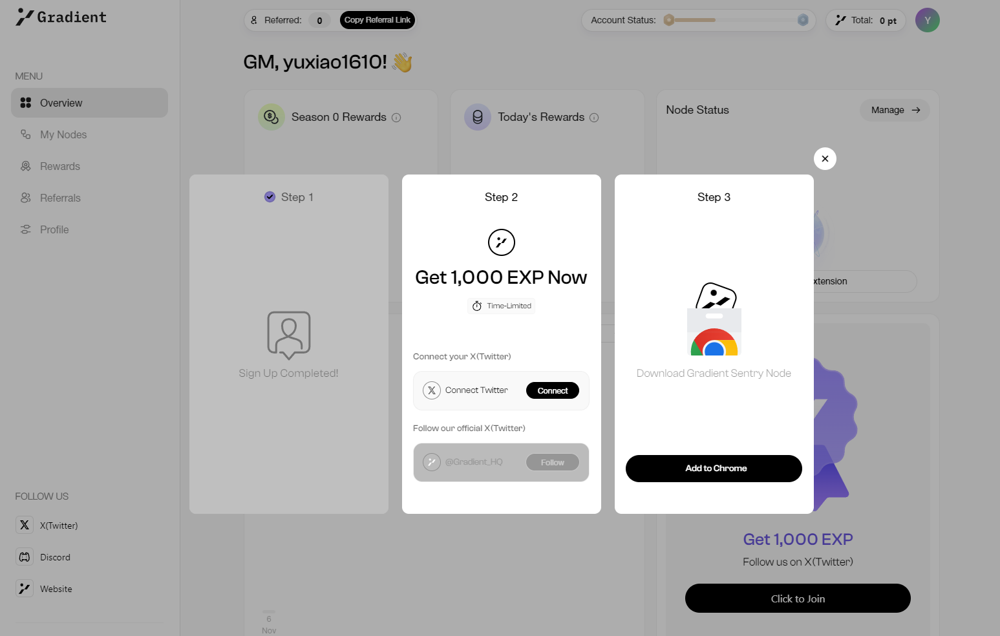<figcaption>
完成绑定任务可获取积分
</figcaption></figure>

<figure>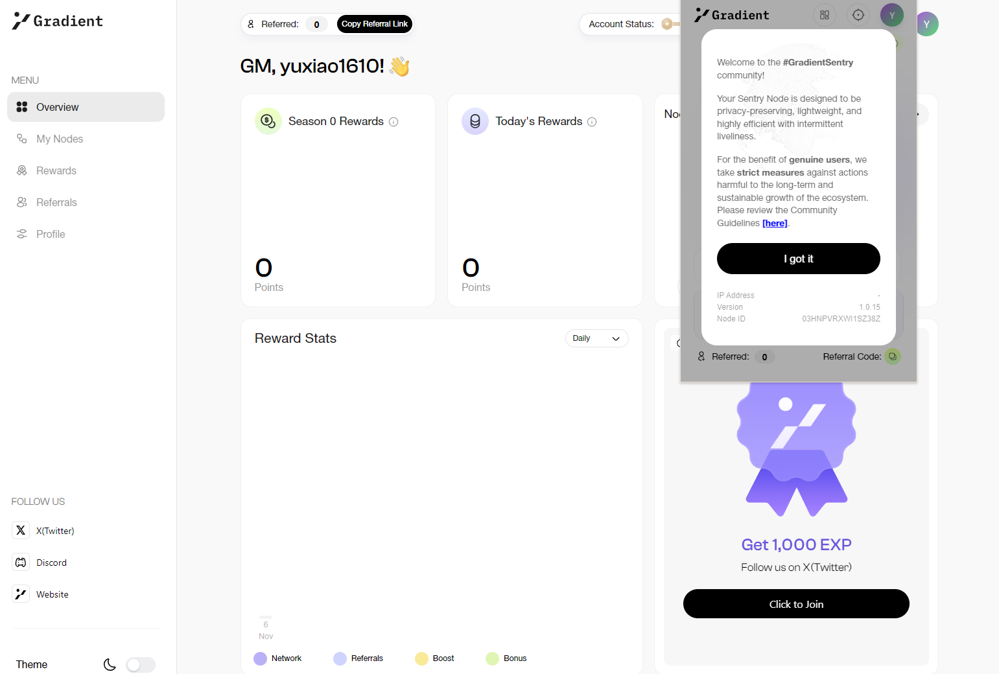<figcaption>
再次打开插件，点击I got it
</figcaption></figure>

<figure>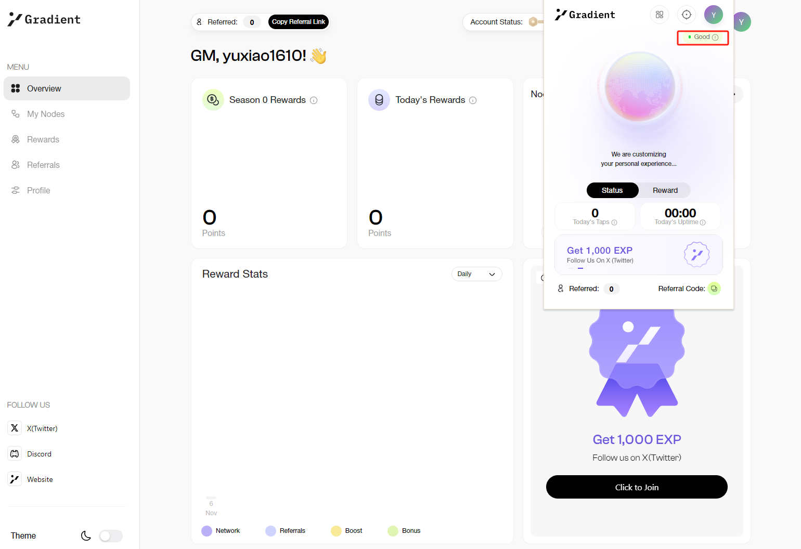<figcaption>
标识位置显示good即为正常运行
</figcaption></figure>

<figure>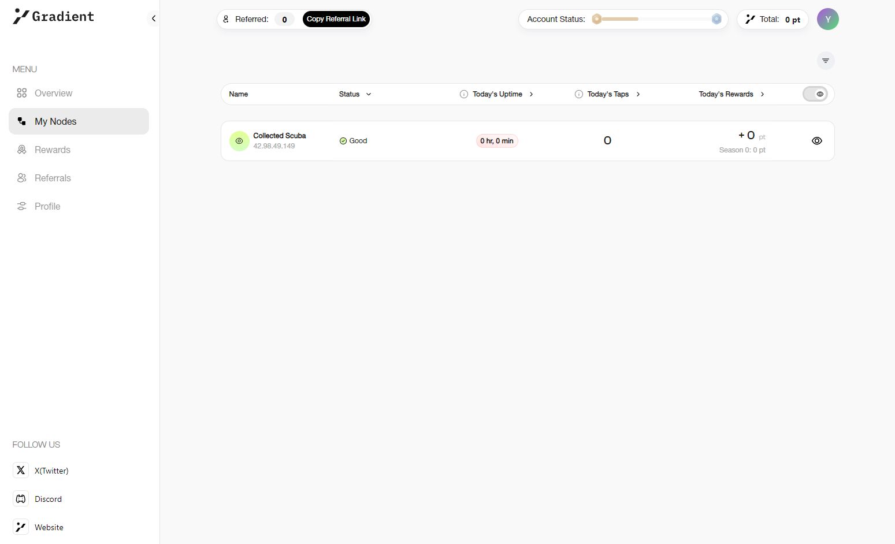<figcaption>
也可以点击My Nodes，查看节点状态
</figcaption></figure>

<figure>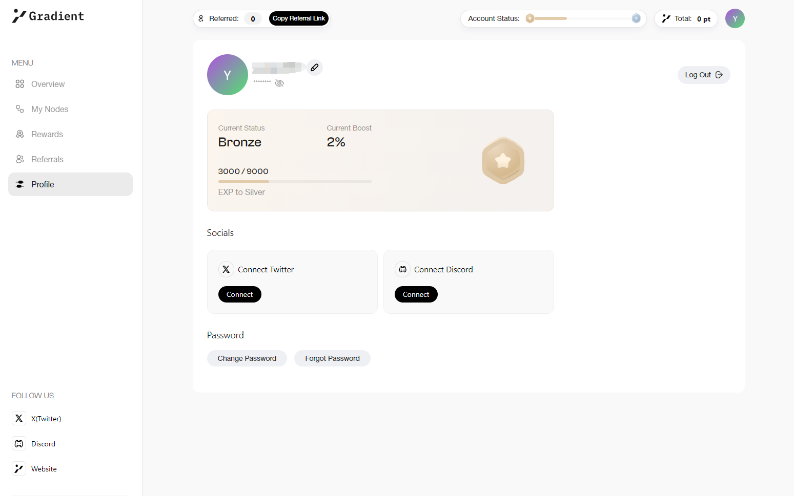<figcaption>
点击Profile,在这个页面也连接Discord和推特
</figcaption></figure>

配置浏览器完成之后

**注意：不要关闭浏览器里面的必要网页。**

结语

部署 Gradient Network就是这么简单！希望这篇指南对你有所帮助。

如果你有任何问题或需要进一步的指导，欢迎留言或私信我。加油！一起探索区块链的世界吧！ 🚀
