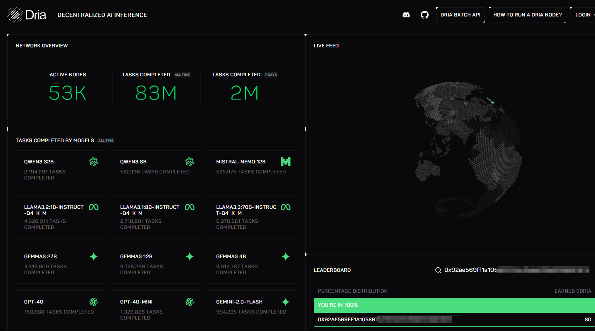

# Dria

<a href="https://docs.node-x.xyz/en/product-manual/one-click-deployment/launch-project/dria">English</a>

## 如何通過 Node-X 平台部署  Dria Compute 節點？

#### 1. 獲取 Node-X 賬號及部署節點

首先，你需要一個Node-X 賬號。如果你還沒有賬號，請前往 [Node-X 註冊頁面](https://node-x.xyz/)。註冊成功後，按照以下步驟購買並填寫資源信息部署節點,下面以0G Alignment node舉個例子：

<figure><figcaption></figcaption></figure>

<figure><figcaption></figcaption></figure>

<figure><figcaption></figcaption></figure>

#### 2. 等待服務與查看官方面板

購買成功後，Node-X 將為你部署 Dria Compute 節點。通常情況下，這個過程會在24小時內完成。你可以透過以下方式即時查看節點狀態：

1. 檢視節點狀態：\
   在 Node-X 平台的使用者面板中，你可以看到所有已購買的節點及其目前狀態。
2. 在官网查看实时收益：\
   部署完成后，我们会将生成的钱包私钥返回给您，然后您就可以使用钱包地址在官方面板查看节点运行的实时奖励情况，具体的激励措施请查看[官方激励机制](https://node-guide.dria.co/rewards)，可以使用[https://dria.co/edge-ai?w=](https://dria.co/edge-ai?w=)<钱包地址>进程查询，如下图：

<figure><figcaption></figcaption></figure>

## **結語**

透過 Node-X 平台部署Dria Compute 節點就是這麼簡單！希望這篇指南對你有幫助。

如果你有任何問題或需要進一步的指導，歡迎留言或私訊我。加油！一起探索區塊鏈的世界吧！ 🚀
