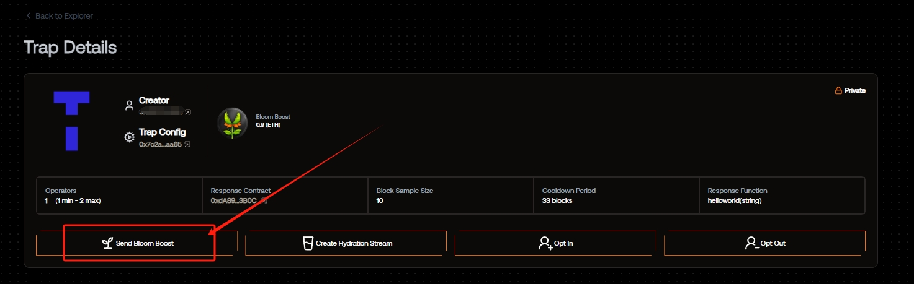
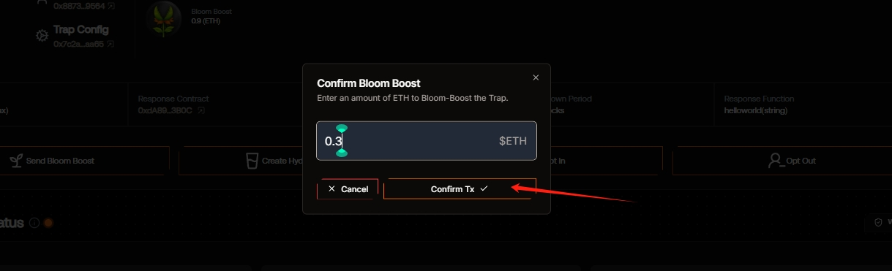
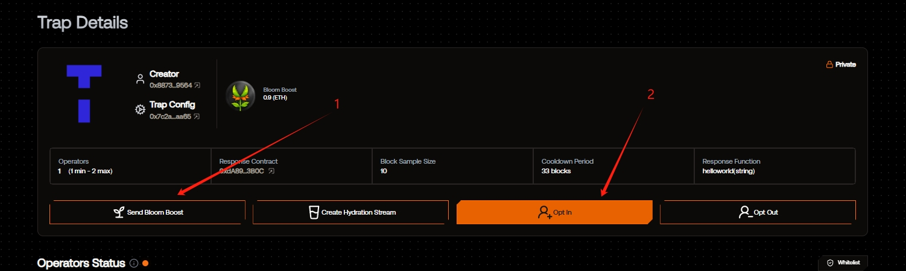
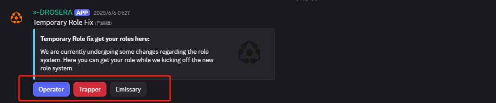

# Drosera

<a href="https://docs.node-x.xyz/en/product-manual/one-click-deployment/drosera">English</a>

#### 如何透過 Node-X 平台部署 Drosera 節點？

**注意：** Drosera 官方尚未對該節點發佈激勵規則，請用戶自行判斷風險。

**1. 獲取 Node-X 帳號及部署節點**\
首先，你需要一個 Node-X 帳號。如果你還沒有帳號，請前往[ Node-X 註冊頁面](https://node-x.xyz/#/home)註冊。

註冊成功後，按照以下步驟購買並上傳資源以部署節點，下面舉個例子：

<figure><figcaption></figcaption></figure>

<figure><figcaption></figcaption></figure>

<figure><figcaption></figcaption></figure>

<figure><figcaption></figcaption></figure>

### 1、填寫參數

1）需要填寫EVM錢包私鑰，錢包中需要在ETH Hoodi網路下有1個ETH,可以前往https://holesky-faucet.pk910.de/挖取或領取代幣。\
2）需要填寫私鑰對應的EVM錢包地址。\
3）需要填寫ETH\_Hoodi\_RPC,可以前往zan或infura,若未填寫則預設使用公共RPC\
4）獲取cadet角色，還需要上傳DC用戶名

#### 2、配合部署

我們在部署後您需要前往https://app.drosera.io/註冊操作者並且在網站存入至少0.3個ETH
\
進入網站後首先是連接上傳私鑰對應的錢包

<figure><figcaption>
连接钱包
</figcaption></figure>

<figure><figcaption>
点击选择Traps Owned
</figcaption></figure>

<figure><figcaption>
点击这个进去进行存入ETH
</figcaption></figure>

<figure><figcaption>
点击send Bloom Boost
</figcaption></figure>

<figure><figcaption>
存入至少0.3
</figcaption></figure>

<figure><figcaption>
存入成功后，点击Opt In
</figcaption></figure>

<figure><figcaption>
点击Simulate Tx，成功后还需要点击一次注册一个操作者，成功后会出现现类似于下方的格式
</figcaption></figure>

<figure><figcaption>
完成后告知我们一声，我们启动一下节点，这样就是部署成功了，但还是需要注意自己的余额是否充足
</figcaption></figure>

**2、**&#x89D2;色獲取<mark style="color:red;">**（**</mark><mark style="color:red;">這一步也很重要</mark><mark style="color:red;">**）**</mark>\
當看到上方這個介面時可以[前往DC](https://discord.gg/drosera)獲取Node Runner角色\
首先是前往-role-fix頻道取得操作者，捕獵者，使者角色

<figure><figcaption></figcaption></figure>

獲取成功後前往-poll-channel頻道填寫表單申請Node Runner角色

<figure><figcaption></figcaption></figure>

填寫完成就可以取得Node Runner角色啦！

#### 3. 等待服務與查看官方面板

購買成功後，Node-X 將為你部署 Drosera 節點。通常情況下，這個過程會在24小時內完成。你可以透過以下方式即時查看節點狀態：

1. 檢視節點狀態：\
   在 Node-X 平台的使用者面板中，你可以看到所有已購買的節點及其目前狀態。

## **結語**

透過 Node-X 平台部署 Drosera 節點就是這麼簡單！希望這篇指南對你有幫助。

如果你有任何問題或需要進一步的指導，歡迎留言或私訊我。加油！一起探索區塊鏈的世界吧！ 🚀
