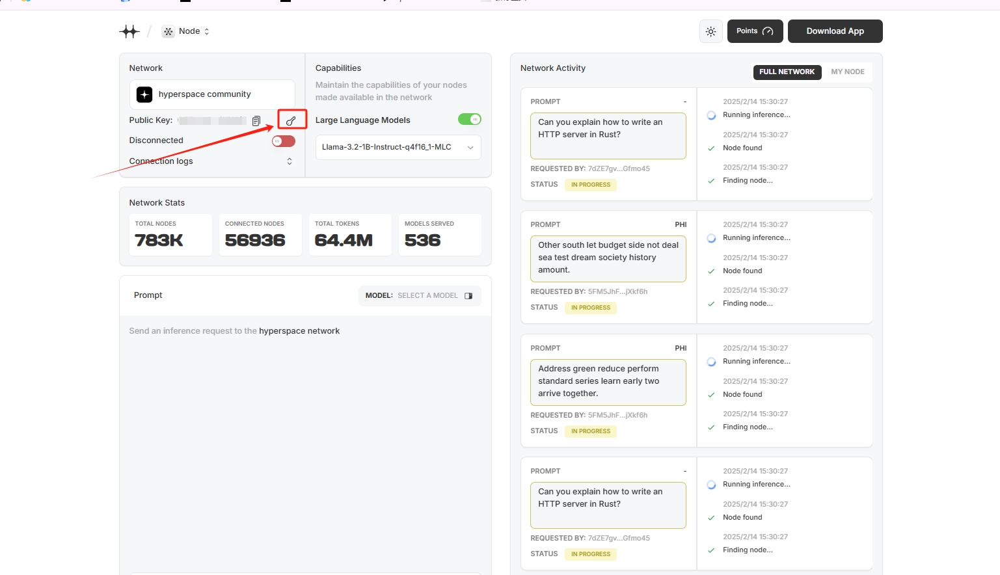
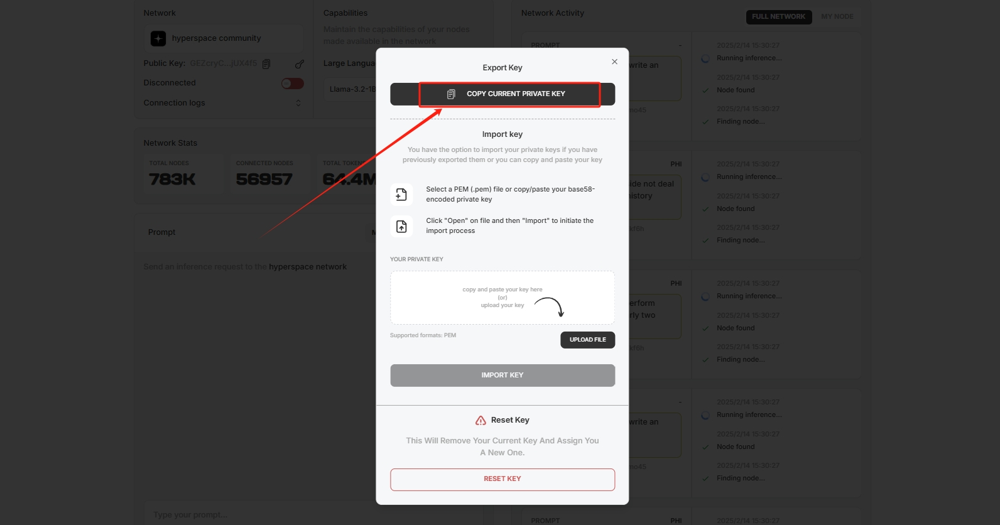

# Hyperspace

<a href="https://docs.node-x.xyz/en/product-manual/one-click-deployment/hyperspace">English</a>

## 如何透過 Node-X 平台部署  Hyperspace 節點？

#### 1.  獲取Node-X 賬號及部署節點

首先，你需要一個 Node-X 帳號。如果你還沒有帳號，請前往 [Node-X 註冊](https://node-x.xyz/)註冊。註冊成功後，按照以下步驟購買並填寫資源信息部署節點,下面以0G Alignment node舉個例子：

<figure><figcaption></figcaption></figure>

<figure><figcaption></figcaption></figure>

<figure><figcaption></figcaption></figure>

#### 2.填寫參數

* 獲取私鑰並填寫

[點擊這裡](https://node.hyper.space/)，前往獲取私鑰，然後前往購買並填寫該私鑰即可

<figure><figcaption>
点击标识位置的图标
</figcaption></figure>

<figure><figcaption>
复制私钥
</figcaption></figure>

#### 3.導入秘鑰

前往官網導入秘鑰，點擊鑰匙符號進入秘鑰導入，填入秘鑰點擊導入即可。

<figure><figcaption></figcaption></figure>

<figure><figcaption></figcaption></figure>

#### 4.查看節點信息

購買成功後，Node-X 將為你部署Hyperspace節點。通常情況下，這個過程會在24小時內完成。你可以透過以下方式即時查看節點狀態：\
檢視節點狀態：\
在 Node-X 平台的使用者面板中，你可以看到所有已購買的節點及其目前狀態。\
由於只能在終端查看運行積分，若想查看運行節分，可以聯繫管理員

#### 结语

透過 Node-X 平台部署Hyperspace節點就是這麼簡單！希望這篇指南對你有幫助。

如果你有任何問題或需要進一步的指導，歡迎留言或私訊我。加油！一起探索區塊鏈的世界吧！ 🚀
