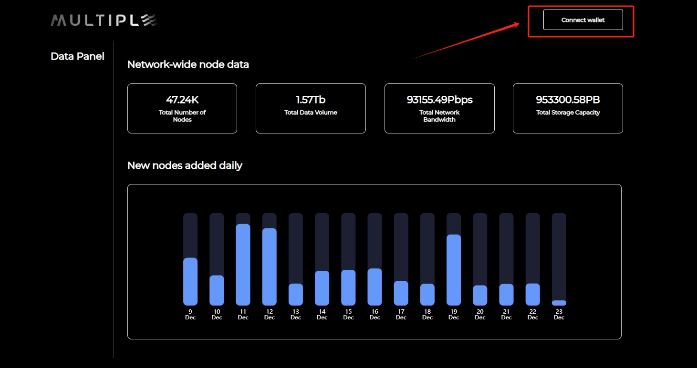
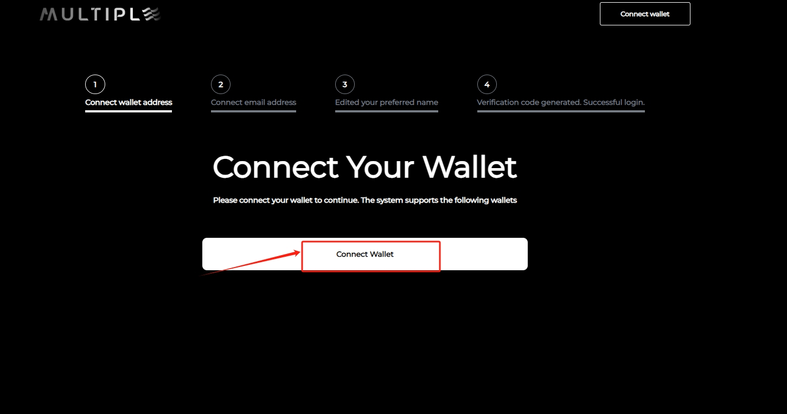
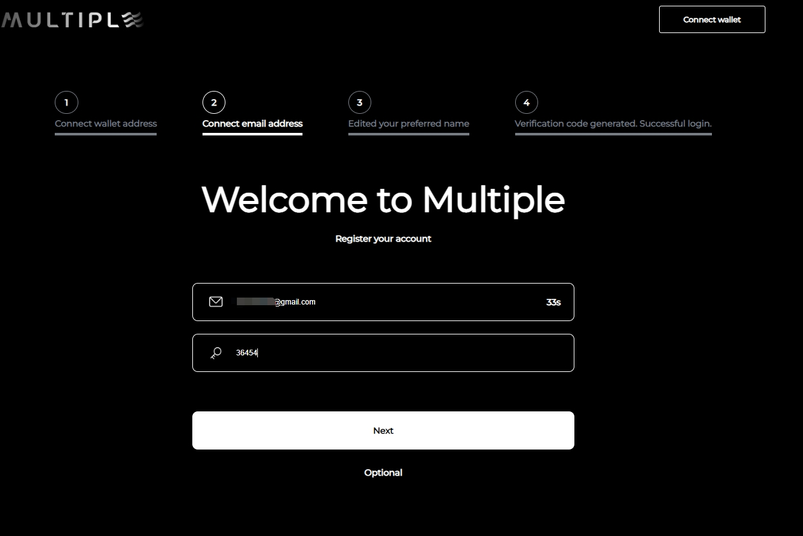
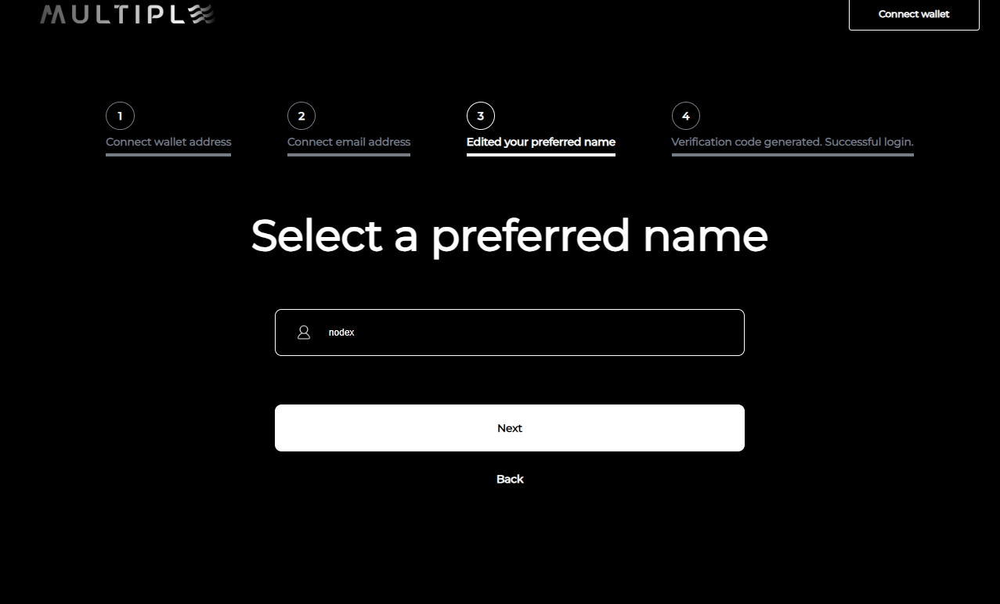
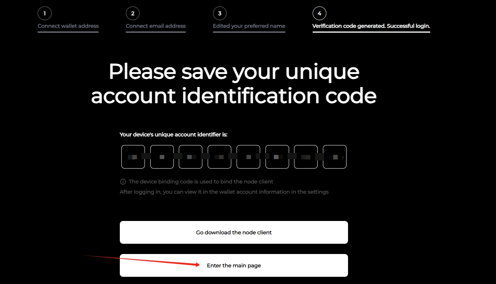
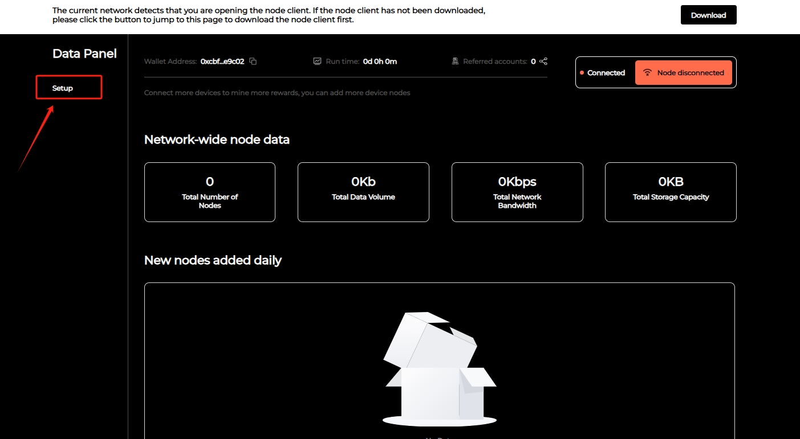
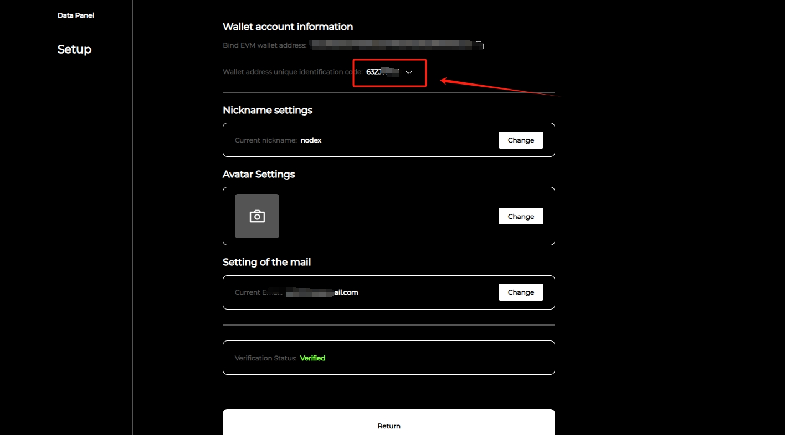
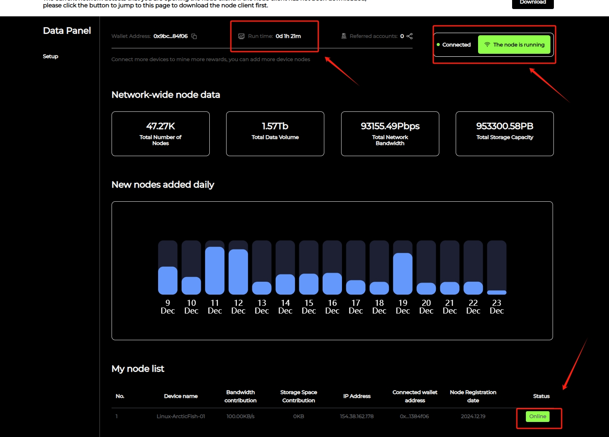

# Multiple Network

## 如何通过 Node-X 平台部署 Multiple 节点？

#### 1. 获取 Node-X 账号及资源

首先，你需要一个 Node-X 账号。如果你还没有账号，请前往 [Node-X 注册页面](https://node-x.xyz) 注册。注册成功后，按照以下步骤购买并部署节点所需的资源：

1. **充值账户**：\
   登录 Node-X 平台后，找到充值选项，为你的账户充值足够的金额。
2. **选择服务**：\
   Node-X 目前仅提供节点类型：**Multiple** 节点部署。
3. **购买资源**：\
   选择合适的节点类型，点击“部署”按钮。确认所有信息无误后，再次点击“确认”完成购买。

2.**完成注册并获取身份码**

[前往官网](https://www.app.multiple.cc/#/dataPanel),跟着下方的步骤获取身份码，填写到模版中并提交给我们。

<figure><figcaption>
连接钱包
</figcaption></figure>

<figure><figcaption>
连接钱包
</figcaption></figure>

<figure><figcaption>
使用邮箱注册
</figcaption></figure>

<figure><figcaption>
设置节点名称，可跳过
</figcaption></figure>

<figure><figcaption>
生成身份码
</figcaption></figure>

<figure><figcaption>
点击设置
</figcaption></figure>

<figure><figcaption>
在标识处获取身份码
</figcaption></figure>

#### 3. 等待服务与查看官方面板

购买成功后，Node-X 将为你部署 **Multiple** 节点。通常情况下，这个过程会在24小时内完成。你可以通过以下方式实时查看节点状态：

1. **查看节点状态**：\
   在 Node-X 平台的用户面板中，你可以看到所有已购买的节点及其当前状态。
2. **在官方面板查看状态**：

&#x20;      节点配置完成后，可以通过[官方面板](https://www.app.multiple.cc/#/dataPanel)  查询验证者状态，更新有延迟

<figure><figcaption>
这样就是正常运行啦！
</figcaption></figure>

#### 结语

通过 Node-X 平台部署Mletiple 节点就是这么简单！希望这篇指南对你有所帮助。

如果你有任何问题或需要进一步的指导，欢迎留言或私信我。加油！一起探索区块链的世界吧！ 🚀
