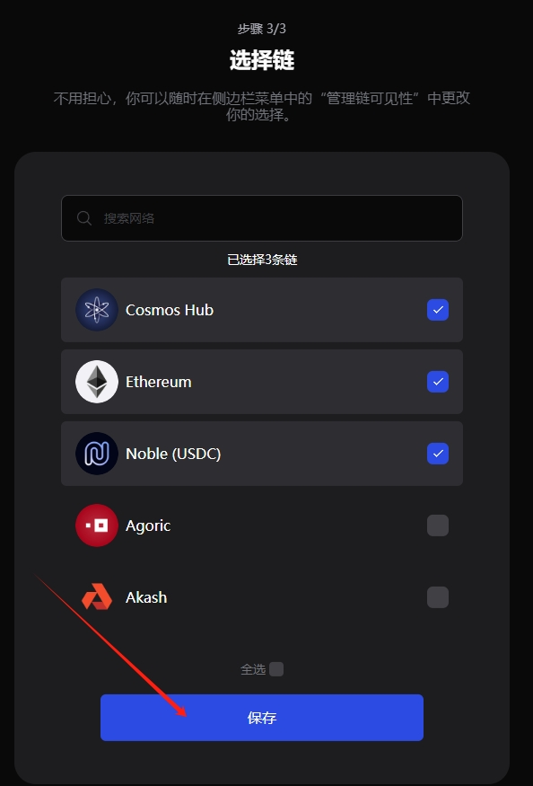
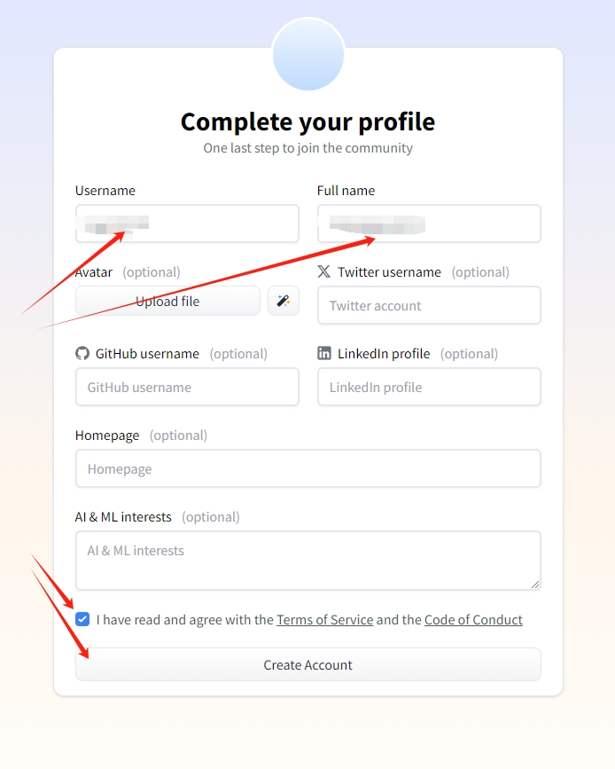
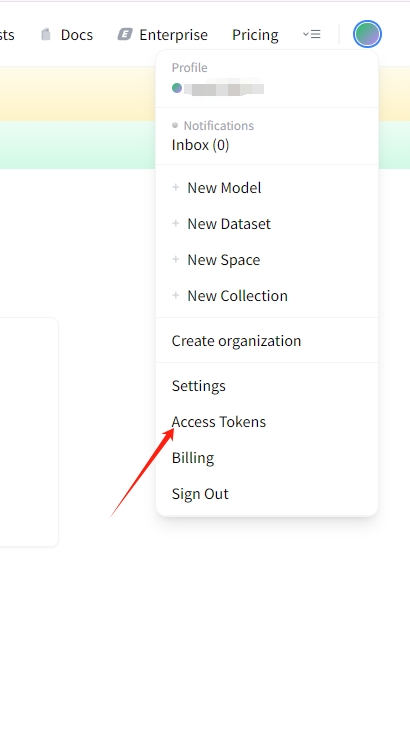

# Nesa

## 如何通过 Node-X 平台部署 Nesa节点？

#### 1. 获取 Node-X 账号及部署节点

首先，你需要一个 Node-X 账号。如果你还没有账号，请前往 [Node-X 注册页面](https://node-x.xyz) 注册。注册成功后，按照以下步骤购买并上传资源部署节点,下面举个例子：

<figure><figcaption>
选择需要部署的项目
</figcaption></figure>

<figure><figcaption>
点击部署
</figcaption></figure>

<figure><figcaption>
确认支付
</figcaption></figure>

<figure><figcaption>
点击上传信息
</figcaption></figure>

<figure><figcaption>
点击“添加”，上传对应的信息
</figcaption></figure>

### 下方是NESA节点所需的信息：

#### 1. 完成创建Leap钱包并提供Leap钱包私钥、邮箱地址以及**HuggingFace API KEY**

在购买资源后，你需要提供1个Leap钱包私钥、一个邮箱地址以及1个**HuggingFace API KEY**：

1. **创建Leap钱包**：\
   [前往这里](https://chromewebstore.google.com/detail/keplr/dmkamcknogkgcdfhhbddcghachkejeap)下载keplr插件，然后需要创建一个keplr钱包，创建成功之后，[前往这里](https://chromewebstore.google.com/detail/leap-cosmos-wallet/fcfcfllfndlomdhbehjjcoimbgofdncg?hl=zh-CN\&utm_source=ext_sidebar)下载Leap钱包插件，将保存的Keplr钱包的助记词导入Leap钱包插件并获取钱包私钥。

<figure><figcaption></figcaption></figure>

<figure><figcaption></figcaption></figure>

<figure><figcaption></figcaption></figure>

<figure><figcaption></figcaption></figure>

<figure><figcaption></figcaption></figure>

<figure><figcaption></figcaption></figure>

<figure><figcaption></figcaption></figure>

<figure><figcaption></figcaption></figure>

<figure><figcaption></figcaption></figure>

<figure><figcaption></figcaption></figure>

<figure><figcaption></figcaption></figure>

<figure><figcaption></figcaption></figure>

1. 到**HuggingFace**获取API KEY\
   [点击这里](https://huggingface.co/)前往**HuggingFace**注册为**HuggingFace**用户，然后获取API KEY。

<figure><figcaption></figcaption></figure>

<figure><figcaption></figcaption></figure>

<figure><figcaption></figcaption></figure>

<figure><figcaption></figcaption></figure>

<figure><figcaption></figcaption></figure>

<figure><figcaption></figcaption></figure>

<figure><figcaption></figcaption></figure>

<figure><figcaption></figcaption></figure>

<figure><figcaption></figcaption></figure>

<figure><figcaption></figcaption></figure>

<figure><figcaption></figcaption></figure>

<figure><figcaption></figcaption></figure>

1. **下载模板填写Leap钱包私钥、邮箱地址以及HuggingFace API KEY**：\
   下载模板填写Leap钱包**私钥、邮箱地址和HuggingFace API KEY**并上传，全程加密传输且不经过人工，安全可保证。
2. **发起聊天（可选）**：\
   在**我的订单**中找到聊天功能，点击发起聊天，并在聊天中提供相关信息。

#### 2. 等待服务与查看官方面板

购买成功后，Node-X 将为你部署节点。通常情况下，这个过程会在24小时内完成,完成后。你可以通过以下方式实时查看节点状态：

1. **查看节点状态**：\
   在 Node-X 平台的用户面板中，你可以看到所有已购买的节点及其当前状态。
2. **项目方面板查看**：\
   节点配置完成后我们会给你一个Node\_id，可以通过Node\_id在[https://node.nesa.ai ](https://node.nesa.ai)查询节点状态，更新有延迟。

#### 结语

通过 Node-X 平台部署Nesa节点就是这么简单！希望这篇指南对你有所帮助。

如果你有任何问题或需要进一步的指导，欢迎留言或私信我。加油！一起探索区块链的世界吧！ 🚀
