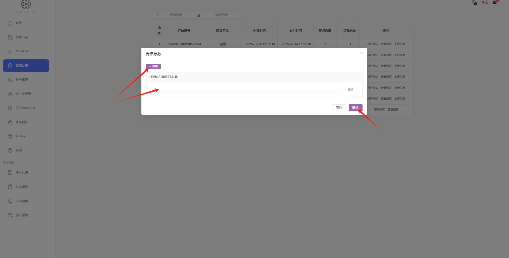
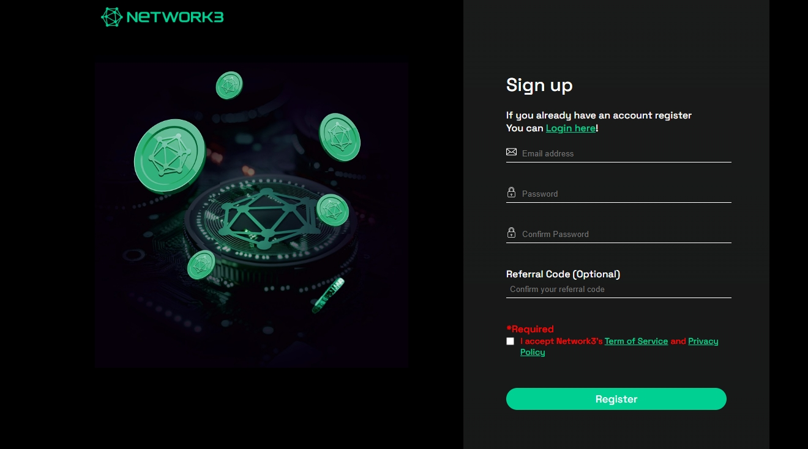
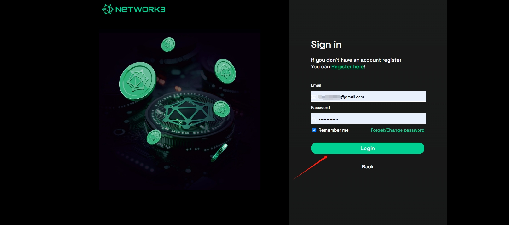

# NETWORK3

## 如何通过 Node-X 平台部署  NETWORK3 节点？

#### 1. 获取 Node-X 账号及部署节点

首先，你需要一个 Node-X 账号。如果你还没有账号，请前往 [Node-X 注册页面](https://node-x.xyz) 注册。注册成功后，按照以下步骤购买并上传资源部署节点,下面举个例子：

<figure><figcaption>
选择需要部署的项目
</figcaption></figure>

<figure><figcaption>
点击部署
</figcaption></figure>

<figure><figcaption>
确认支付
</figcaption></figure>

<figure><figcaption>
点击上传信息
</figcaption></figure>

<figure><figcaption>
点击“添加”，上传对应的信息
</figcaption></figure>

### 下方是NETWORK3节点所需的信息：

#### 2. 等待服务与查看官方面板

购买成功后，Node-X 将为你部署 **NETWORK3** 节点。通常情况下，这个过程会在24小时内完成。你可以通过以下方式实时查看节点状态：

1. **在官网完成注册和查看节点状态**：\
   在 Node-X 平台下单部署完成后，我们会为你提供运行的ip以及key,根据下方提示完成注册。

点击[这里](https://account.network3.ai/register_page)进行注册，邀请码：560592d5

<figure><figcaption>
输入注册所需信息完成注册
</figcaption></figure>

<figure><figcaption>
登录
</figcaption></figure>

<figure><figcaption>
在邮箱中点击链接，验证一下
</figcaption></figure>

<figure><figcaption>
这样就注册完成了
</figcaption></figure>

<figure><figcaption>
在提示的红色方框位置输入我们的IP
</figcaption></figure>

<figure><figcaption>
点击+号，连接节点
</figcaption></figure>

<figure><figcaption>
弹出输入框，输入我们提供的key
</figcaption></figure>

<figure><figcaption>
输入key点击确认
</figcaption></figure>

<figure><figcaption>
看My NETWORKs,这样就是在正常运行
</figcaption></figure>

#### 结语

通过 Node-X 平台部署 NETWORK3 节点就是这么简单！希望这篇指南对你有所帮助。

如果你有任何问题或需要进一步的指导，欢迎留言或私信我。加油！一起探索区块链的世界吧！ 🚀
