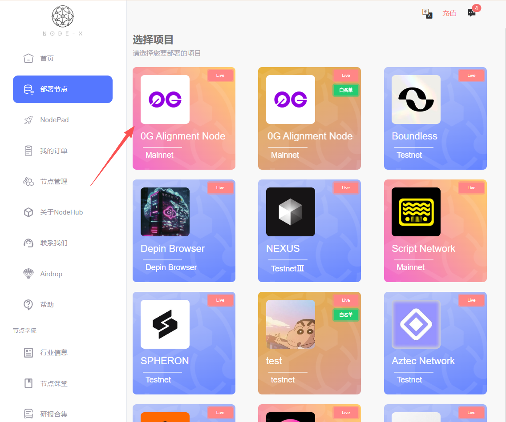
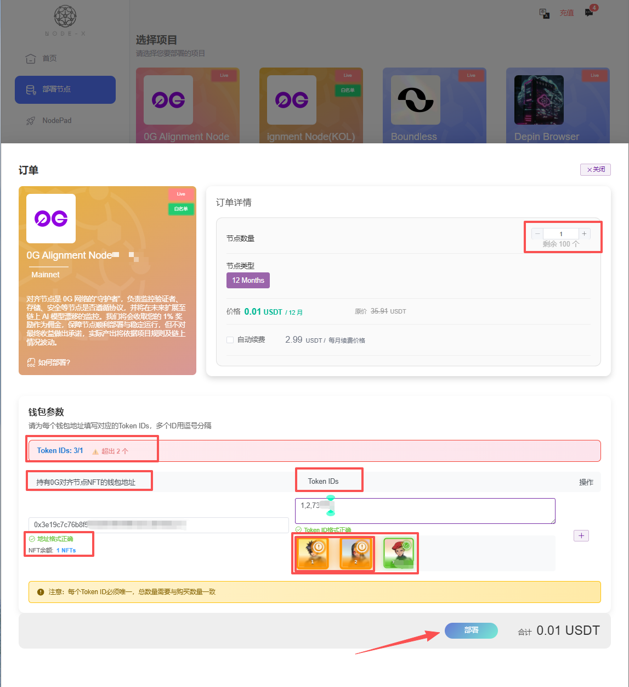

# Nexus

<a href="https://docs.node-x.xyz/en/product-manual/one-click-deployment/nexus">English</a>

## 如何透過 Node-X 平台部署 Nexus節點？

### 1.獲取Node-X賬號以及部署節點

&#x20;首先，你需要一個 Node-X 賬號。如果你還沒有賬號，請前往 Node-X註冊頁面 註冊。註冊成功後，按照以下步驟購買並上傳資源部署節點,下面是下單流程：

<figure><figcaption></figcaption></figure>

<figure><figcaption></figcaption></figure>

<figure><figcaption></figcaption></figure>

### 2. 等待服务与查看官方面板

購買成功後，Node-X 將為你部署 Nexus節點。通常情況下，這個過程會在24小時內完成，部署完成後，我們回通過訂單訊息的方式將唯一貢獻ID憑證發送給您(如果您在瀏覽器版本中已獲得prover id，並希望cli版本也通過此prover-id運行，可在綁定郵箱後點擊左下角prover id後方的複製按鈕並通過模板提交給我們)，請您妥善保管。你可以透過以下方式即時查看節點狀態：

1. **檢視節點狀態**：\
   在 Node-X 平台的使用者面板中，你可以看到所有已購買的節點及其目前狀態。

## **結語**

透過 Node-X 平台部署 Nexus 節點就是這麼簡單！希望這篇指南對你有幫助。

如果你有任何問題或需要進一步的指導，歡迎留言或私訊我。加油！一起探索區塊鏈的世界吧！！ 🚀
