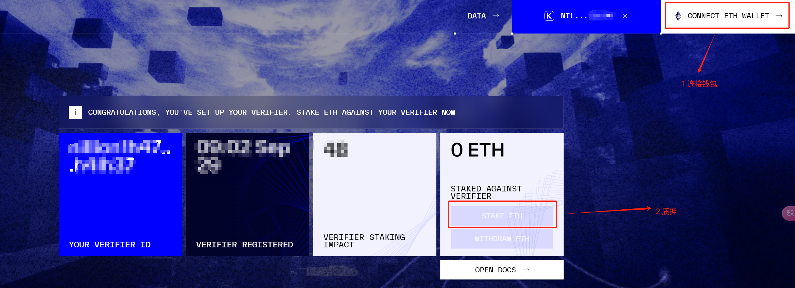

# Nillion

填写ID如何通过 Node-X 平台部署 Nillion节点？

#### 1. 获取 Node-X 账号及资源

首先，你需要一个 Node-X 账号。如果你还没有账号，请前往 [Node-X 注册页面](https://node-x.xyz) 注册。注册成功后，按照以下步骤购买并部署节点所需的资源：

1. **充值账户**：\
   登录 Node-X 平台后，找到充值选项，为你的账户充值足够的金额。
2. **选择服务**：\
   Node-X 目前仅提供**Verifier**部署。
3. **购买资源**：\
   选择合适的节点类型，点击“部署”按钮。确认所有信息无误后，再次点击“确认”完成购买。

#### 2. 发起聊天

在购买资源后，你需要及时与客服联系：

1.  **完成前期工作**：\
    [前往这里](https://verifier.nillion.com/verifier)<mark style="color:red;">**完成自己KEPLR钱包领水**</mark>，如图点击1、2完成钱包连接，按照弹出的界面完成领水

    <figure><figcaption>
完成步骤1、2
</figcaption></figure>
2.  <mark style="color:red;">**填写客服提供给你的ACCOUND ID 以及 PUBLIC KEY,点击按钮验证**</mark>：

    <figure><figcaption>
填写ID、KEY点击验证会调用KEPLR钱包合约，请提前领水
</figcaption></figure>
3.  <mark style="color:red;">**有条件的用户可以完成质押ETH**</mark>

    <figure><figcaption>
有条件可以质押ETH拿到奖励
</figcaption></figure>

#### 3. 等待服务与查看官方面板

完成所有步骤后，<mark style="color:red;">后续验证者节点的领水以及部署将有我们继续完成</mark>。通常情况下，这个过程会在24小时内完成。你可以通过以下方式实时查看节点状态：

1. **查看节点状态**：\
   在 Node-X 平台的用户面板中，你可以看到所有已购买的节点及其当前状态。
2. **项目方面板查看**：\
   节点配置完成后，可以通过[点击这里](https://verifier.nillion.com/verifier)查看。目前更新有一定延迟，使用主地址查询余额。

#### 结语

通过 Node-X 平台部署 Nillion 节点就是这么简单！希望这篇指南对你有所帮助。

如果你有任何问题或需要进一步的指导，欢迎留言或私信我。加油！一起探索区块链的世界吧！ 🚀
